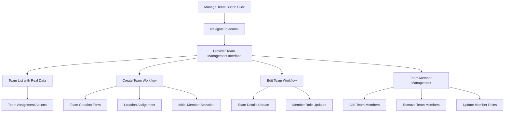
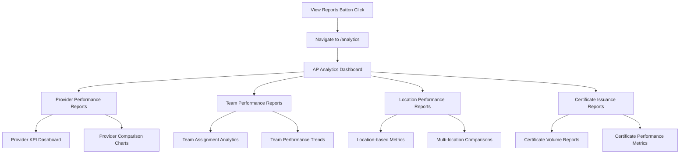
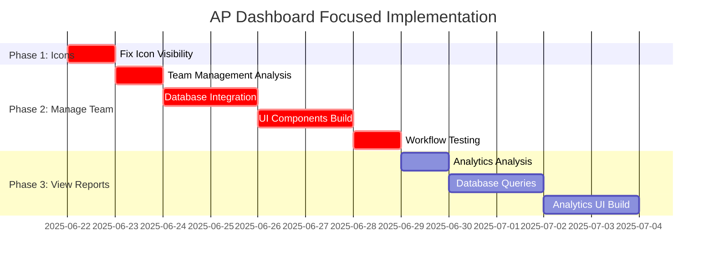

# **AP Dashboard Focused Implementation Plan**

## **🎯 Scope: Manage Team & View Reports Button Complete Implementation** 

**Focus Areas ONLY:**
1. **Fix Icon Visibility** - Restore missing icons in Overview tab action buttons
2. **Manage Team Button** - 100% functional workflow with real database integration  
3. **View Reports Button** - 100% functional analytics workflow with real database integration

**Explicitly OUT OF SCOPE:**
- ❌ Certificate Management (working as-is)
- ❌ Course Management (working as-is, routes to existing functionality)
- ❌ Other dashboard enhancements

---

## **📋 Phase 1: Icon Visibility Fix**
*Priority: Critical - 1 day*

### **1.1 Diagnose Icon Import Issue**
**Target File**: [`src/components/dashboard/ui/WorkingDashboardActionButton.tsx`](src/components/dashboard/ui/WorkingDashboardActionButton.tsx:26)

**Current Issue**: Action buttons show blank squares instead of icons

**Diagnosis Steps:**
1. Verify lucide-react icon imports in WorkingDashboardActionButton
2. Check icon prop passing from EnhancedProviderDashboard
3. Validate icon rendering in button component
4. Test all 4 action button icons: Calendar, Users, Award, ClipboardList

**Expected Outcome**: All action buttons display proper icons

---

## **📋 Phase 2: Manage Team Button - Complete Implementation**
*Priority: Critical - 5-6 days*

### **2.1 Current State Analysis**
- **Button**: Routes to [`/teams`](src/AppRoutes.tsx:101) → [`UnifiedTeams`](src/pages/UnifiedTeams.tsx) page
- **Current Issue**: Provider Team Management shows placeholder: *"Provider team creation form will be implemented here"*
- **Required**: 100% functional team management workflow with real database operations

### **2.2 Team Management Workflow Implementation**

### **2.3 Database Integration Requirements**

**Service Integration:**
- **Provider Relationship Service**: [`providerRelationshipService`](src/services/provider/ProviderRelationshipService.ts)
  - `getProviderTeamAssignments(providerId)` - Load existing assignments
  - `assignProviderToTeam(assignmentData)` - Create new assignments
  - `updateTeamAssignment(assignmentId, updates)` - Update assignments
  - `removeProviderFromTeam(providerId, teamId)` - Remove assignments
  - `getAvailableTeams(providerId)` - Load available teams for assignment

**Required Database Operations:**
1. **Team CRUD Operations**
   - Create new teams with provider context
   - Update team details and settings
   - Delete/deactivate teams
   - List teams with filtering by provider

2. **Team Member Management**
   - Add members to teams with role assignments
   - Update member roles and permissions
   - Remove members from teams
   - Bulk member operations

3. **Team Assignment Management**
   - Assign providers to teams with specific roles
   - Update assignment details (role, dates, oversight level)
   - Remove provider assignments
   - Track assignment history

### **2.4 UI/UX Components to Build**

**Core Components:**
1. **Team Management Dashboard**
   - Team list with search and filtering
   - Team creation button and workflow
   - Team statistics and metrics display

2. **Team Creation Wizard**
   - Multi-step team creation form
   - Location assignment interface
   - Initial member selection
   - Provider assignment settings

3. **Team Details Management**
   - Team information editing
   - Member list with role management
   - Assignment history tracking
   - Performance metrics display

4. **Member Management Interface**
   - Add/remove member dialogs
   - Role assignment dropdowns
   - Bulk member operations
   - Member search and filtering

**Expected Outcome**: Complete team management workflow with no placeholder content

---

## **📋 Phase 3: View Reports Button - Complete Implementation**
*Priority: Critical - 4-5 days*

### **3.1 Current State Analysis**
- **Button**: Routes to [`/analytics`](src/AppRoutes.tsx:208) → [`Analytics`](src/pages/Analytics.tsx) page
- **Current Issue**: Generic analytics page, not AP-specific reporting
- **Required**: 100% functional AP analytics with provider-specific reports and real data

### **3.2 AP Analytics Workflow Implementation**

### **3.3 Analytics Database Integration**

**Service Integration:**
- **Provider Relationship Service**: 
  - `getProviderLocationKPIs(providerId)` - Provider performance metrics
  - `getProviderTeamStatistics(providerId)` - Team-based analytics
  - `getProviderPerformanceMetrics(providerId)` - Comprehensive performance data

**Required Analytics Queries:**
1. **Provider Performance Analytics**
   - Certificates issued over time
   - Course delivery statistics
   - Team management effectiveness
   - Location performance comparison

2. **Team Performance Reports**
   - Team assignment success rates
   - Member performance within teams
   - Team productivity metrics
   - Assignment duration analysis

3. **Location-based Analytics**
   - Performance by location
   - Multi-location provider comparison
   - Location-specific team effectiveness
   - Geographic performance trends

4. **Certificate Issuance Reporting**
   - Certificate volume by provider
   - Certificate type distribution
   - Issuance timeline analysis
   - Quality metrics and compliance

### **3.4 Analytics UI/UX Components to Build**

**Core Dashboard Components:**
1. **AP Analytics Overview**
   - Provider-specific KPI cards
   - Performance trend charts
   - Quick action buttons for detailed reports

2. **Performance Reports Section**
   - Interactive charts and graphs
   - Date range filtering
   - Export functionality for reports
   - Drill-down capabilities

3. **Team Analytics Section**
   - Team assignment performance
   - Member productivity metrics
   - Team comparison tools
   - Assignment effectiveness tracking

4. **Location Analytics Section**
   - Location performance mapping
   - Multi-location comparison charts
   - Location-specific team metrics
   - Geographic trend analysis

**Expected Outcome**: Complete AP analytics dashboard with provider-specific reporting and real data integration

---

## **🔄 Implementation Timeline**

**Total Timeline: 10-12 business days (2-2.5 weeks)**

---

## **🎯 Success Criteria**

### **Icon Visibility:**
- ✅ All 4 action buttons display proper icons (Calendar, Users, Award, ClipboardList)
- ✅ Icons render consistently across different browsers and screen sizes

### **Manage Team Button:**
- ✅ No placeholder content - fully functional interface
- ✅ Complete team creation workflow with form validation
- ✅ Real-time team member management (add/remove/edit roles)
- ✅ Provider team assignment functionality with role management
- ✅ All CRUD operations connected to real database
- ✅ Professional loading states and error handling
- ✅ Team performance metrics display with live data

### **View Reports Button:**
- ✅ Provider-specific analytics dashboard (not generic)
- ✅ Real-time data integration with provider performance metrics
- ✅ Interactive charts and reports with filtering capabilities
- ✅ Export functionality for generated reports
- ✅ Team and location-based analytics
- ✅ Certificate issuance reporting with compliance metrics
- ✅ Drill-down capabilities for detailed analysis

---

## **🔧 Implementation Order**

1. **Day 1**: Fix icon visibility issue
2. **Days 2-7**: Complete Manage Team button implementation  
3. **Days 8-12**: Complete View Reports button implementation
4. **Final Testing**: End-to-end workflow validation

**Deliverable**: 100% functional Manage Team and View Reports workflows with real database integration, plus restored icon visibility.