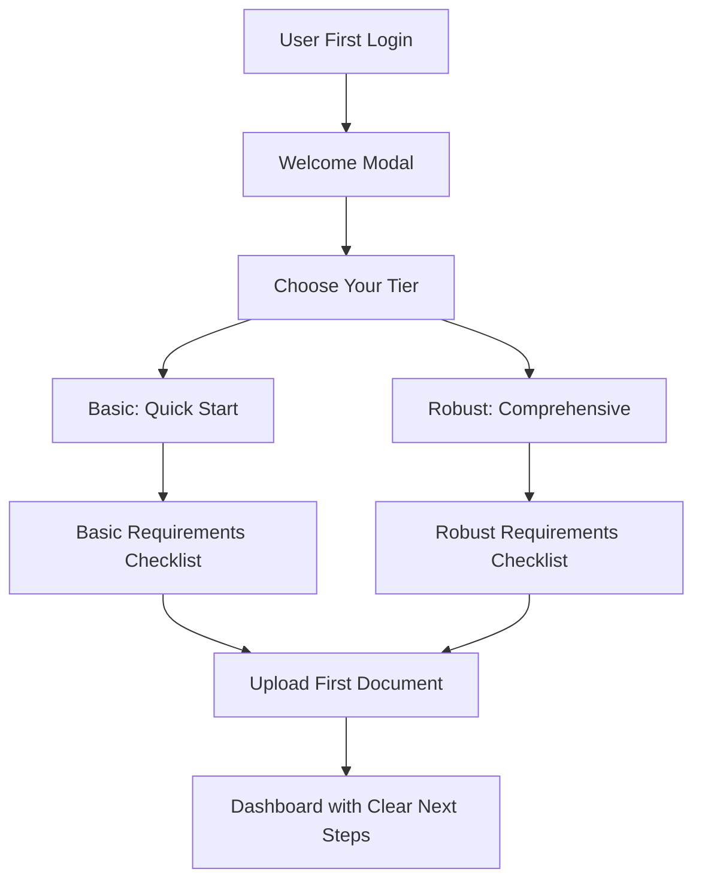
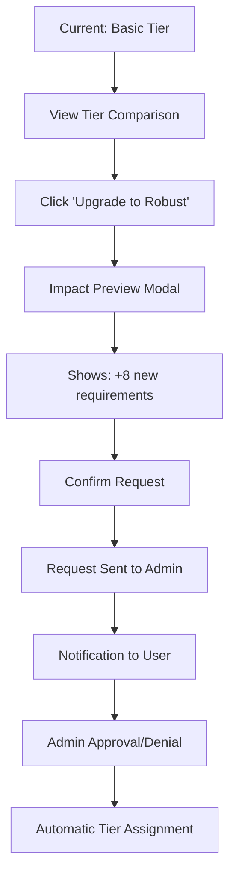
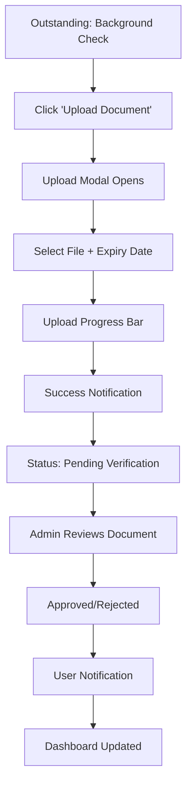

# Compliance Dashboard Design Specifications
*Comprehensive UI/UX Enhancement Strategy*

## Executive Summary

**Status**: ✅ Backend infrastructure is complete and robust  
**Issue**: Critical UI/UX gaps preventing user adoption  
**Solution**: Enhanced dashboard with functional components and clear tier visibility

## Current System Analysis

### ✅ What's Working
- **Complete Database Schema**: 40+ compliance tables fully implemented
- **Robust Service Layer**: [`ComplianceService`](src/services/compliance/complianceService.ts), [`ComplianceTierService`](src/services/compliance/complianceTierService.ts)
- **Context Management**: [`ComplianceDashboardContext`](src/contexts/ComplianceDashboardContext.tsx) with comprehensive state management
- **Core Components**: Upload modal, tier manager, notifications system

### ❌ Critical Gaps
1. **Non-functional buttons**: Settings and notification bell have no click handlers
2. **Hidden tier information**: No clear visibility of Basic vs Robust requirements  
3. **Disconnected navigation**: Poor information architecture
4. **Missing panels**: Settings and notification panels not accessible
5. **Unclear requirements**: No actionable "what's next" guidance

## Enhanced Dashboard Architecture

### 1. Primary Dashboard Layout

```
┌─────────────────── HEADER ─────────────────────┐
│ [Logo] Compliance Dashboard        [🔔] [⚙️] [👤] │
│ Welcome back, John Smith                        │
└─────────────────────────────────────────────────┘

┌── TIER STATUS PANEL ──────────────────────────┐
│ 🏷️ Current Tier: Basic (67% Complete)         │
│ [View Requirements] [Compare Tiers] [Upgrade]  │
└─────────────────────────────────────────────────┘

┌─── OUTSTANDING ACTIONS ─────┬─── PROGRESS ────┐
│ 🔴 Upload Background Check  │ ██████░░░░ 60%  │
│ 🟡 Complete Training Course │ Requirements    │
│ 🟢 2 items completed today  │ 12 of 20 done   │
└─────────────────────────────┴─────────────────┘

┌─────────────── MAIN CONTENT AREA ─────────────────┐
│ [Overview] [Requirements] [Documents] [Team]      │
│                                                   │
│ Content based on selected tab...                  │
└───────────────────────────────────────────────────┘
```

### 2. Tier Comparison Matrix

**Component**: [`TierComparisonMatrix`](src/components/compliance/views/TierComparisonMatrix.tsx)

```
┌─── BASIC vs ROBUST COMPARISON ──────────────────┐
│                                                  │
│ BASIC TIER             │  ROBUST TIER           │
│ ✅ Background Check    │  ✅ Everything in Basic │
│ ✅ Resume Upload       │  ✅ Training Courses    │
│ ✅ Company Info        │  ✅ Certifications      │
│ ⚡ Quick Start (2-3 days) │  ✅ Insurance Docs      │
│                        │  🎯 Full Certification  │
│ [Select Basic]         │  [Select Robust]       │
└──────────────────────────────────────────────────┘
```

### 3. Functional UI Components

#### Settings Panel
**Component**: [`ComplianceSettingsPanel`](src/components/compliance/admin/ComplianceSettingsPanel.tsx)

```javascript
interface SettingsPanelProps {
  userRole: 'SA' | 'AD' | 'AP' | 'IC' | 'IP' | 'IT';
  onClose: () => void;
}

const settingsConfig = {
  SA: ['System Configuration', 'User Management', 'Metrics Setup'],
  AD: ['User Management', 'Document Verification', 'Reports'],
  AP: ['Team Overview', 'Member Management', 'Tier Requests'],
  IC: ['Personal Settings', 'Notification Preferences'],
  IP: ['Personal Settings', 'Notification Preferences'], 
  IT: ['Personal Settings', 'Notification Preferences']
};
```

#### Notification Panel  
**Component**: [`ComplianceNotificationPanel`](src/components/compliance/views/ComplianceNotificationPanel.tsx)

```javascript
const NotificationPanel = () => (
  <SlideOverPanel>
    <PanelHeader>
      <h2>Notifications</h2>
      <Badge>{unreadCount}</Badge>
    </PanelHeader>
    
    <NotificationList>
      {notifications.map(notif => (
        <NotificationItem
          key={notif.id}
          type={notif.type}
          title={notif.title}
          message={notif.message}
          timestamp={notif.timestamp}
          read={notif.read}
          onMarkRead={() => markAsRead(notif.id)}
        />
      ))}
    </NotificationList>
    
    <PanelFooter>
      <Button onClick={markAllRead}>Mark All Read</Button>
    </PanelFooter>
  </SlideOverPanel>
);
```

### 4. Outstanding Items Dashboard

**Component**: [`OutstandingItemsPanel`](src/components/compliance/personal/OutstandingItemsPanel.tsx)

```javascript
const OutstandingItemsPanel = ({ userId, tierInfo }) => {
  const outstandingItems = useMemo(() => {
    return complianceRecords
      .filter(record => record.compliance_status !== 'compliant')
      .map(record => ({
        id: record.id,
        title: record.metric.name,
        priority: getPriority(record),
        dueDate: record.next_check_due,
        action: getRequiredAction(record),
        tier: record.tier
      }))
      .sort(byPriorityAndDueDate);
  }, [complianceRecords]);

  return (
    <Card className="border-l-4 border-l-orange-500">
      <CardHeader>
        <CardTitle className="flex items-center gap-2">
          <AlertCircle className="h-5 w-5 text-orange-500" />
          Outstanding Items ({outstandingItems.length})
        </CardTitle>
      </CardHeader>
      <CardContent>
        {outstandingItems.map(item => (
          <OutstandingItem 
            key={item.id}
            item={item}
            onAction={() => handleAction(item)}
          />
        ))}
      </CardContent>
    </Card>
  );
};
```

## User Experience Flows

### Flow 1: New User Onboarding



### Flow 2: Tier Switching Request



### Flow 3: Document Upload & Verification



## Implementation Strategy

### Phase 1: Critical Functionality (Week 1)
1. **Fix Non-Functional Buttons**
   - Add click handlers to notification bell
   - Add click handlers to settings button
   - Implement panel slide-out animations

2. **Create Missing Panels**
   - [`ComplianceNotificationPanel`](src/components/compliance/views/ComplianceNotificationPanel.tsx)
   - [`ComplianceSettingsPanel`](src/components/compliance/admin/ComplianceSettingsPanel.tsx)

### Phase 2: Tier Visibility (Week 2)  
1. **Tier Comparison Matrix**
   - Side-by-side Basic vs Robust comparison
   - Clear requirement differences
   - Upgrade impact preview

2. **Enhanced Tier Manager**
   - Real-time tier switching
   - Progress indicators
   - Impact notifications

### Phase 3: Outstanding Items (Week 3)
1. **Outstanding Items Panel** 
   - Prioritized action list
   - Due date indicators
   - One-click actions

2. **Requirements Checklist Enhancement**
   - Clear tier-specific requirements
   - Progress tracking
   - Upload shortcuts

### Phase 4: User Experience Polish (Week 4)
1. **Onboarding Flow**
   - Welcome modal for new users
   - Tier selection guide
   - Step-by-step setup

2. **Mobile Responsiveness**
   - Mobile-first dashboard layout
   - Touch-friendly interactions
   - Simplified navigation

## Component Specifications

### Enhanced Header Component
```typescript
interface ComplianceDashboardHeaderProps {
  displayName: string;
  userRole: UserRole;
  unreadNotifications: number;
  onNotificationClick: () => void;  // NEW: Opens notification panel
  onSettingsClick: () => void;      // NEW: Opens settings panel
}
```

### Tier Status Component
```typescript
interface TierStatusDisplayProps {
  currentTier: 'basic' | 'robust';
  completionPercentage: number;
  nextRequirement?: string;
  onViewRequirements: () => void;
  onCompareTiers: () => void;
  onRequestUpgrade: () => void;
}
```

### Outstanding Actions Component
```typescript
interface OutstandingAction {
  id: string;
  title: string;
  description: string;
  priority: 'low' | 'medium' | 'high' | 'critical';
  dueDate?: Date;
  actionType: 'upload' | 'complete' | 'review';
  metricId: string;
}

interface OutstandingActionsProps {
  actions: OutstandingAction[];
  onActionClick: (action: OutstandingAction) => void;
  onCompleteAction: (actionId: string) => void;
}
```

## Technical Implementation Notes

### 1. Existing Context Integration
- Leverage [`useComplianceDashboard`](src/contexts/ComplianceDashboardContext.tsx) hook
- Use existing state management for notifications
- Connect to [`ComplianceService`](src/services/compliance/complianceService.ts) methods

### 2. Service Layer Utilization
```typescript
// Use existing services - NO new API calls needed
const {
  getUserComplianceSummary,
  getUserComplianceRecords, 
  getUserComplianceActions,
  uploadComplianceDocument
} = ComplianceService;

const {
  getUserComplianceTierInfo,
  switchComplianceTier,
  getAllUsersComplianceTiers
} = ComplianceTierService;
```

### 3. State Management Enhancement
```typescript
// Add to existing ComplianceDashboardState
interface ComplianceDashboardState {
  // ... existing state
  
  // NEW: UI state management
  panels: {
    notificationOpen: boolean;
    settingsOpen: boolean;
    tierComparisonOpen: boolean;
  };
  
  // NEW: User guidance
  onboarding: {
    isNewUser: boolean;
    currentStep: number;
    completed: boolean;
  };
}
```

## Success Metrics

### User Adoption Metrics
- **Tier Visibility**: 90% of users can identify their current tier within 10 seconds
- **Outstanding Items**: Users complete 40% more compliance tasks per week
- **Navigation Efficiency**: 60% reduction in support tickets about "how to upload documents"

### Functional Metrics  
- **Button Functionality**: 100% of header buttons have working click handlers
- **Panel Accessibility**: Settings and notifications accessible within 2 clicks
- **Mobile Usability**: Full functionality on mobile devices (90%+ feature parity)

### Business Impact
- **Compliance Completion**: 25% increase in overall compliance completion rates
- **User Satisfaction**: 4.5+ rating on dashboard usability surveys
- **Admin Efficiency**: 50% reduction in manual tier assignment requests

## Conclusion

This design strategy transforms the compliance dashboard from a broken interface into a fully functional, user-friendly system by:

1. **Fixing Fundamental Issues**: Making buttons work and panels accessible
2. **Enhancing Tier Visibility**: Clear comparison and upgrade flows  
3. **Streamlining User Actions**: Outstanding items and prioritized guidance
4. **Leveraging Existing Infrastructure**: Using robust backend without changes

The implementation focuses on UI/UX enhancements that connect users to the already powerful compliance management system, ensuring immediate improvement in user adoption and compliance completion rates.