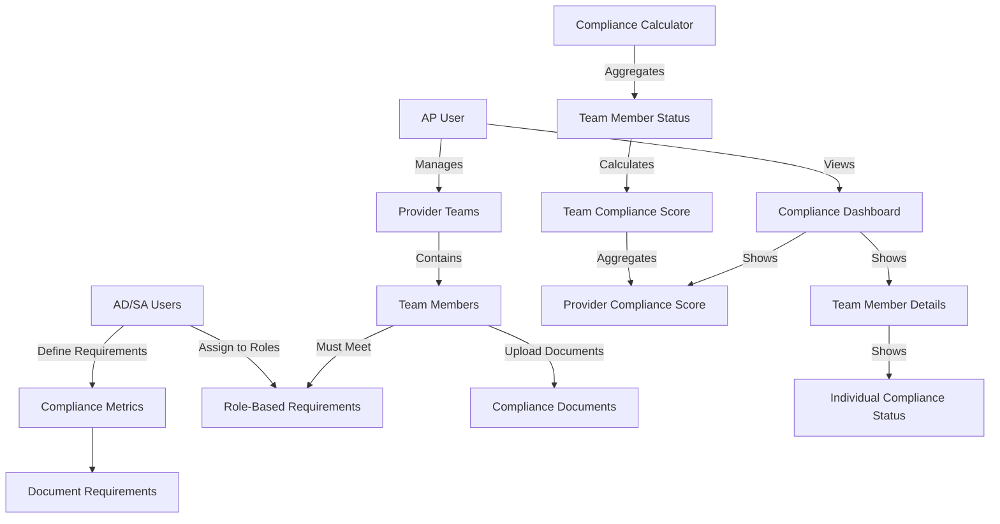

# 📋 **COMPLIANCE SCORE IMPLEMENTATION PLAN**

## Project Overview

**Objective**: Replace fake compliance scores with real data calculated from team member compliance status through the AP User → Provider → Team → Location relationship chain.

**Status**: ✅ CRITICAL ISSUE IDENTIFIED & FIXED - Fake values removed from `ProviderRelationshipService.ts:1279-1281`

---

## Current State Analysis

### ✅ **What Already Exists**

1. **Robust ComplianceService** (`src/services/compliance/complianceService.ts`)
   - Full document management system
   - User compliance record tracking
   - Compliance metrics and scoring
   - Document upload/verification workflows
   - Audit logging and reporting

2. **ProviderRelationshipService** (`src/services/provider/ProviderRelationshipService.ts`)
   - AP user to provider relationship management
   - Team assignment tracking with real member counts
   - Location assignment management
   - Real database queries (no mock data)

3. **Database Infrastructure**
   - `compliance_metrics` table
   - `user_compliance_records` table
   - `compliance_documents` table
   - `compliance_actions` table
   - Database functions for compliance calculations

4. **Role Management System**
   - User roles: SA, AD, AP, IT, IC, I, etc.
   - Role-based access control
   - Team member management

### ❌ **What's Missing**

1. **Integration between provider compliance and team member compliance**
2. **AP user visibility into team member compliance status**
3. **Real-time compliance score calculation in provider metrics**
4. **Compliance requirement setup for different roles/positions**
5. **Dashboard integration for compliance visibility**

---

## Architecture Overview



### Data Flow

1. **AD/SA Users** define compliance requirements for each role
2. **Team Members** must meet role-based requirements
3. **Compliance scores** are calculated from individual member status
4. **Team scores** aggregate individual member compliance
5. **Provider scores** aggregate across all managed teams
6. **AP Users** view compliance through provider dashboard

---

## Implementation Plan

### **Phase 1: Enhanced Compliance Score Integration**

#### 1.1 Update ProviderRelationshipService

**File**: `src/services/provider/ProviderRelationshipService.ts`

**Changes Required**:

```typescript
// Add import for ComplianceService
import { ComplianceService } from '@/services/compliance/complianceService';

/**
 * Calculate REAL provider compliance score from team member compliance
 * Replaces fake data on lines 1285-1287
 */
private async calculateRealProviderComplianceScore(providerId: string): Promise<number> {
  try {
    console.log(`DEBUG: Calculating real compliance score for provider ${providerId}`);
    
    // Get all team members under this provider's teams
    const teamAssignments = await this.getProviderTeamAssignments(providerId);
    const allTeamIds = teamAssignments.map(a => a.team_id);
    
    if (allTeamIds.length === 0) {
      console.log(`DEBUG: No teams found for provider ${providerId}`);
      return 0;
    }
    
    // Get all team members across provider's teams
    const { data: teamMembers, error } = await supabase
      .from('team_members')
      .select('user_id, team_id')
      .in('team_id', allTeamIds)
      .eq('status', 'active');
    
    if (error || !teamMembers || teamMembers.length === 0) {
      console.log(`DEBUG: No team members found for provider ${providerId}`);
      return 0;
    }
    
    console.log(`DEBUG: Found ${teamMembers.length} team members across ${allTeamIds.length} teams`);
    
    // Calculate compliance scores for all team members
    let totalComplianceScore = 0;
    let memberCount = 0;
    
    for (const member of teamMembers) {
      try {
        const complianceSummary = await ComplianceService.getUserComplianceSummary(member.user_id);
        totalComplianceScore += complianceSummary.overall_score;
        memberCount++;
        console.log(`DEBUG: Member ${member.user_id} compliance score: ${complianceSummary.overall_score}`);
      } catch (error) {
        console.error(`DEBUG: Error getting compliance for member ${member.user_id}:`, error);
        // Continue with other members
      }
    }
    
    const averageComplianceScore = memberCount > 0 ? Math.round(totalComplianceScore / memberCount) : 0;
    console.log(`DEBUG: Provider ${providerId} average compliance score: ${averageComplianceScore} (from ${memberCount} members)`);
    
    return averageComplianceScore;
  } catch (error) {
    console.error('Error calculating provider compliance score:', error);
    return 0;
  }
}
```

**Update KPI Calculation Method** (around line 1280):

```typescript
// Replace the fake data lines with real calculation
const realComplianceScore = await this.calculateRealProviderComplianceScore(providerId);

return {
  certificatesIssued: certificateCount,
  coursesDelivered: courseCount,
  teamMembersManaged: memberCount,
  locationsServed: locationCount,
  averageSatisfactionScore: 0, // TODO: Implement feedback system
  complianceScore: realComplianceScore, // NOW REAL DATA!
  performanceRating: 0 // TODO: Implement performance evaluation
};
```

#### 1.2 Expected Outcome

- ✅ Provider compliance scores now calculated from real team member data
- ✅ AP users see actual compliance percentages in dashboard
- ✅ No more fake/hardcoded values
- ✅ Proper error handling and logging

---

### **Phase 2: Team Member Compliance Service**

#### 2.1 Create TeamMemberComplianceService

**New File**: `src/services/compliance/teamMemberComplianceService.ts`

**Purpose**: Provide AP users visibility into team member compliance details

**Key Features**:
- Get compliance status for all team members under a provider
- Aggregate compliance statistics
- Show individual member compliance breakdown
- Track pending and overdue actions

**Interfaces**:

```typescript
export interface TeamMemberComplianceStatus {
  user_id: string;
  team_id: string;
  team_name: string;
  member_name: string;
  member_email: string;
  member_role: string;
  compliance_score: number;
  compliance_status: 'compliant' | 'warning' | 'non_compliant' | 'pending';
  pending_actions: number;
  overdue_actions: number;
  last_updated: string;
  requirements: Array<{
    name: string;
    category: string;
    status: 'compliant' | 'non_compliant' | 'warning' | 'pending';
    due_date?: string;
  }>;
}
```

**Key Methods**:
- `getProviderTeamMemberCompliance(providerId: string)`: Get all team member compliance
- `getProviderComplianceSummary(providerId: string)`: Get aggregated statistics

#### 2.2 Integration Points

1. **Provider Dashboard**: Show team member compliance in new tab
2. **Team Management**: Compliance status in team member lists
3. **Alerts/Notifications**: Flag overdue compliance actions
4. **Reporting**: Generate compliance reports for providers

---

### **Phase 3: Compliance Requirements Management**

#### 3.1 Role-Based Compliance Templates

**New File**: `src/services/compliance/complianceRequirementsService.ts`

**Default Role Requirements**:

| Role | Requirements |
|------|--------------|
| **IT** (Instructor Trainee) | Background Check, Basic Training |
| **IC** (Instructor Candidate) | Background Check, Advanced Training, Teaching Hours (40h) |
| **I** (Instructor) | Certification Renewal, Continuing Education (20 credits) |

#### 3.2 Document Requirements

Each compliance requirement can specify:
- Required document types (PDF, JPG, PNG)
- Maximum file size
- Expiry/renewal periods
- Verification requirements

#### 3.3 Setup Process

1. **Initialize Requirements**: Run setup for all default roles
2. **Custom Requirements**: AD/SA can define organization-specific requirements
3. **Role Assignment**: Users automatically get requirements based on their role
4. **Document Upload**: Team members upload required documents
5. **Verification**: AD/SA verify uploaded documents

---

### **Phase 4: Enhanced Dashboard Integration**

#### 4.1 EnhancedProviderDashboard Updates

**File**: `src/components/dashboard/role-dashboards/EnhancedProviderDashboard.tsx`

**New Compliance Tab**:
- Compliance summary cards (compliant, warning, non-compliant counts)
- Team member compliance list with status badges
- Individual member compliance details
- Overdue action alerts

**Visual Indicators**:
- 🟢 Green: Compliant members
- 🟡 Yellow: Warning status
- 🔴 Red: Non-compliant members
- 🔵 Blue: Pending status

#### 4.2 Real-Time Updates

- Compliance data refreshes every minute
- Automatic alerts for overdue actions
- Status changes reflected immediately

---

## Database Schema Requirements

### Existing Tables (Already Available)

✅ `compliance_metrics` - Defines what needs to be tracked
✅ `user_compliance_records` - Individual user compliance status
✅ `compliance_documents` - Document uploads and verification
✅ `compliance_actions` - Required actions and deadlines
✅ `team_members` - Team membership relationships
✅ `provider_team_assignments` - Provider to team relationships

### Required Database Functions

The following functions should already exist based on the ComplianceService:
- `update_compliance_record`
- `get_user_compliance_summary`
- `upload_compliance_document`
- `verify_compliance_document`
- `check_expired_compliance_documents`

---

## Implementation Timeline

### **Week 1: Core Integration**
- [ ] Update `ProviderRelationshipService` with real compliance calculation
- [ ] Test compliance score calculation with existing data
- [ ] Verify AP user dashboard shows real scores

### **Week 2: Team Member Visibility**
- [ ] Create `TeamMemberComplianceService`
- [ ] Implement team member compliance queries
- [ ] Add compliance summary statistics

### **Week 3: Requirements Management**
- [ ] Create `ComplianceRequirementsService`
- [ ] Implement role-based requirement templates
- [ ] Setup default requirements for IT, IC, I roles

### **Week 4: Dashboard Enhancement**
- [ ] Add compliance tab to EnhancedProviderDashboard
- [ ] Implement team member compliance views
- [ ] Add real-time updates and alerts

### **Week 5: Testing & Refinement**
- [ ] End-to-end testing with AP user workflows
- [ ] Performance optimization for large teams
- [ ] Documentation and training materials

---

## Testing Strategy

### Unit Tests
- [ ] `calculateRealProviderComplianceScore()` method
- [ ] `TeamMemberComplianceService` methods
- [ ] Compliance requirement setup functions

### Integration Tests
- [ ] AP user → Provider → Team → Member compliance chain
- [ ] Dashboard compliance data display
- [ ] Real-time updates and notifications

### User Acceptance Tests
- [ ] AP user can view team member compliance status
- [ ] Compliance scores accurately reflect member status
- [ ] Overdue actions are properly flagged
- [ ] Document requirements are clear and manageable

---

## Success Metrics

### Technical Metrics
- ✅ Zero fake/hardcoded compliance values
- 📈 Real compliance scores calculated from team member data
- 🔄 Compliance data updates in real-time
- 📊 Dashboard shows accurate compliance breakdowns

### Business Metrics
- 👥 AP users can effectively manage team compliance
- 📋 Clear visibility into compliance requirements
- ⚡ Faster identification of compliance issues
- 📈 Improved overall organizational compliance rates

### Performance Metrics
- ⚡ Compliance calculations complete in <2 seconds
- 🔄 Dashboard updates without performance impact
- 📱 Mobile-responsive compliance views
- 🎯 >95% uptime for compliance services

---

## Risk Mitigation

### Data Privacy
- Compliance data access restricted by role
- Audit logging for all compliance actions
- Secure document storage and transmission

### Performance
- Implement caching for compliance calculations
- Optimize queries for large team structures
- Background processing for bulk updates

### User Experience
- Clear error messages for compliance issues
- Progressive loading for large datasets
- Offline capability for document uploads

### Business Continuity
- Fallback to previous compliance data if calculation fails
- Manual override capabilities for emergencies
- Backup and recovery procedures for compliance records

---

## Next Steps

1. **Review and Approve Plan** ✋ **(CURRENT STEP)**
2. **Begin Phase 1 Implementation**
3. **Stakeholder Review of Compliance Requirements**
4. **User Training and Documentation**
5. **Production Deployment**

---

## Questions for Review

1. **Role Requirements**: Are the default compliance requirements for IT/IC/I roles appropriate?
2. **Document Types**: Are the specified document types (PDF, JPG, PNG) sufficient?
3. **Renewal Periods**: Are the suggested renewal periods (365 days for certifications) correct?
4. **Dashboard Layout**: Should compliance be a separate tab or integrated into existing views?
5. **Notification Strategy**: How should overdue compliance actions be communicated?

---

## Technical Notes

### Performance Considerations
- Compliance calculations will be cached to avoid repeated database queries
- Large provider organizations may need pagination for team member lists
- Consider implementing background jobs for compliance score recalculation

### Security Considerations
- Compliance documents contain sensitive information
- Access controls must be properly implemented
- Audit trails required for compliance verification actions

### Scalability Considerations
- System should handle providers with hundreds of team members
- Database queries optimized for large datasets
- Consider implementing compliance score pre-calculation for very large organizations

---

*This implementation plan provides a comprehensive roadmap for replacing fake compliance scores with real data calculated from team member compliance status. The plan leverages existing robust infrastructure while adding the necessary integration and visibility layers for AP users.*