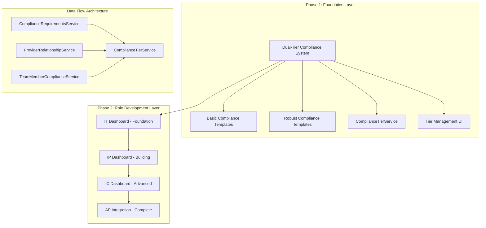

# Comprehensive Dual-Tier Role Implementation Plan
## Strategic Bottom-Up Architecture: Foundation → IT → IP → IC → AP Integration

**Document Version:** 1.0  
**Created:** June 24, 2025  
**Status:** Ready for Immediate Implementation  
**Estimated Timeline:** 19 days total
**Strategic Approach:** Dual-Tier Foundation + Progressive Role Development

---

## Executive Summary

Based on comprehensive codebase analysis, this plan implements a **strategic bottom-up architecture** that establishes a dual-tier compliance foundation first, then progressively builds role-specific dashboards from simplest (IT) to most complex (AP integration).

### Current State Confirmed
- **✅ AP Users**: Extensive implementation (1,590+ lines dashboard, 1,962+ lines service layer)
- **❌ Other Roles**: Only backend templates exist, no UI/UX components
- **❌ Dual-Tier**: Comprehensive plan exists but not implemented
- **🎯 Strategic Gap**: Need systematic role progression with consistent compliance framework

### Strategic Benefits
- **Architectural Foundation**: Dual-tier system prevents massive rework
- **Progressive Complexity**: IT → IP → IC → AP follows natural learning curve
- **Component Reusability**: Each role builds on previous patterns
- **Risk Mitigation**: Issues caught early in simple implementations
- **Future-Proof**: Consistent framework for all role types

---

## Architecture Overview



---

## Phase 1: Dual-Tier Compliance Foundation
**Duration:** Days 1-3 (Critical Priority)
**Strategic Importance:** Architectural foundation for all subsequent development

### 1.1 Database Schema Implementation

**File:** `db/migrations/20250624_comprehensive_compliance_tier_system.sql`

```sql
-- =====================================================================================
-- DUAL-TIER COMPLIANCE SYSTEM - COMPLETE SCHEMA
-- =====================================================================================

-- Add compliance tier column to profiles table
ALTER TABLE profiles 
ADD COLUMN compliance_tier VARCHAR(20) DEFAULT 'basic' 
CHECK (compliance_tier IN ('basic', 'robust'));

-- Add performance indexes
CREATE INDEX idx_profiles_compliance_tier ON profiles(compliance_tier);
CREATE INDEX idx_profiles_role_tier ON profiles(role, compliance_tier);

-- Enhanced compliance templates table
CREATE TABLE IF NOT EXISTS compliance_templates (
    id UUID DEFAULT gen_random_uuid() PRIMARY KEY,
    role VARCHAR(10) NOT NULL CHECK (role IN ('AP', 'IC', 'IP', 'IT')),
    tier VARCHAR(20) NOT NULL CHECK (tier IN ('basic', 'robust')),
    template_name VARCHAR(100) NOT NULL,
    description TEXT,
    requirements_count INTEGER DEFAULT 0,
    total_weight INTEGER DEFAULT 100,
    is_active BOOLEAN DEFAULT true,
    created_at TIMESTAMP WITH TIME ZONE DEFAULT NOW(),
    updated_at TIMESTAMP WITH TIME ZONE DEFAULT NOW(),
    
    UNIQUE(role, tier)
);

-- Performance indexes for templates
CREATE INDEX idx_compliance_templates_role_tier ON compliance_templates(role, tier);
CREATE INDEX idx_compliance_templates_active ON compliance_templates(is_active);

-- Enhanced compliance metrics with tier support
ALTER TABLE compliance_metrics 
ADD COLUMN applicable_tiers VARCHAR(50) DEFAULT 'basic,robust',
ADD COLUMN tier_specific_weight INTEGER DEFAULT NULL,
ADD COLUMN tier_specific_target JSONB DEFAULT NULL;

-- Tier assignment history for audit trail
CREATE TABLE IF NOT EXISTS compliance_tier_history (
    id UUID DEFAULT gen_random_uuid() PRIMARY KEY,
    user_id UUID REFERENCES profiles(id) ON DELETE CASCADE,
    old_tier VARCHAR(20),
    new_tier VARCHAR(20),
    changed_by UUID REFERENCES profiles(id),
    change_reason TEXT,
    requirements_affected INTEGER DEFAULT 0,
    created_at TIMESTAMP WITH TIME ZONE DEFAULT NOW(),
    
    CHECK (old_tier IN ('basic', 'robust') OR old_tier IS NULL),
    CHECK (new_tier IN ('basic', 'robust'))
);

-- Enhanced RLS policies
CREATE POLICY "Users can view their compliance tier" ON profiles
FOR SELECT USING (auth.uid() = id);

CREATE POLICY "Admins can manage compliance tiers" ON profiles
FOR UPDATE USING (
  EXISTS (
    SELECT 1 FROM profiles 
    WHERE profiles.id = auth.uid() 
    AND profiles.role IN ('SA', 'AD')
  )
);

CREATE POLICY "Users can view tier templates for their role" ON compliance_templates
FOR SELECT USING (
  role = (SELECT profiles.role FROM profiles WHERE profiles.id = auth.uid())
  OR EXISTS (
    SELECT 1 FROM profiles 
    WHERE profiles.id = auth.uid() 
    AND profiles.role IN ('SA', 'AD')
  )
);

-- Insert comprehensive template metadata
INSERT INTO compliance_templates (role, tier, template_name, description, requirements_count) VALUES
('AP', 'basic', 'Authorized Provider - Essential', 'Quick onboarding requirements for AP users', 3),
('AP', 'robust', 'Authorized Provider - Comprehensive', 'Full compliance requirements for AP certification', 7),
('IC', 'basic', 'Instructor Certified - Essential', 'Core certification requirements for IC users', 2),
('IC', 'robust', 'Instructor Certified - Comprehensive', 'Complete professional requirements for IC certification', 6),
('IP', 'basic', 'Instructor Provisional - Essential', 'Essential provisional requirements for IP users', 2),
('IP', 'robust', 'Instructor Provisional - Comprehensive', 'Full provisional requirements for IP advancement', 5),
('IT', 'basic', 'Instructor Trainee - Essential', 'Onboarding requirements for IT users', 3),
('IT', 'robust', 'Instructor Trainee - Comprehensive', 'Complete training requirements for IT development', 4);

-- Database functions for tier management
CREATE OR REPLACE FUNCTION get_user_compliance_tier_info(p_user_id UUID)
RETURNS JSONB AS $$
DECLARE
    result JSONB;
BEGIN
    SELECT jsonb_build_object(
        'user_id', p.id,
        'role', p.role,
        'tier', p.compliance_tier,
        'template_name', ct.template_name,
        'description', ct.description,
        'requirements_count', ct.requirements_count
    ) INTO result
    FROM profiles p
    LEFT JOIN compliance_templates ct ON ct.role = p.role AND ct.tier = p.compliance_tier
    WHERE p.id = p_user_id;
    
    RETURN result;
END;
$$ LANGUAGE plpgsql SECURITY DEFINER;

CREATE OR REPLACE FUNCTION switch_user_compliance_tier(
    p_user_id UUID,
    p_new_tier VARCHAR(20),
    p_changed_by UUID DEFAULT NULL,
    p_reason TEXT DEFAULT NULL
)
RETURNS JSONB AS $$
DECLARE
    old_tier VARCHAR(20);
    user_role VARCHAR(10);
    result JSONB;
BEGIN
    -- Get current tier and role
    SELECT compliance_tier, role INTO old_tier, user_role
    FROM profiles WHERE id = p_user_id;
    
    IF NOT FOUND THEN
        RETURN jsonb_build_object('success', false, 'message', 'User not found');
    END IF;
    
    -- Validate new tier
    IF p_new_tier NOT IN ('basic', 'robust') THEN
        RETURN jsonb_build_object('success', false, 'message', 'Invalid tier specified');
    END IF;
    
    -- Update user tier
    UPDATE profiles 
    SET compliance_tier = p_new_tier, updated_at = NOW()
    WHERE id = p_user_id;
    
    -- Log the change
    INSERT INTO compliance_tier_history (user_id, old_tier, new_tier, changed_by, change_reason)
    VALUES (p_user_id, old_tier, p_new_tier, p_changed_by, p_reason);
    
    RETURN jsonb_build_object(
        'success', true, 
        'message', 'Tier updated successfully',
        'old_tier', old_tier,
        'new_tier', p_new_tier,
        'role', user_role
    );
END;
$$ LANGUAGE plpgsql SECURITY DEFINER;
```

### 1.2 ComplianceTierService Implementation

**File:** `src/services/compliance/complianceTierService.ts`

```typescript
import { supabase } from '@/integrations/supabase/client';
import { ComplianceRequirementsService } from './complianceRequirementsService';
import { ComplianceService } from './complianceService';

export interface ComplianceTierInfo {
  user_id: string;
  role: 'AP' | 'IC' | 'IP' | 'IT';
  tier: 'basic' | 'robust';
  template_name: string;
  description: string;
  requirements_count: number;
  completed_requirements: number;
  completion_percentage: number;
  last_updated: string;
}

export interface TierSwitchResult {
  success: boolean;
  message: string;
  old_tier?: 'basic' | 'robust';
  new_tier?: 'basic' | 'robust';
  requirements_affected: number;
  timestamp: string;
}

export interface ComplianceTierStatistics {
  total_users: number;
  basic_tier_users: number;
  robust_tier_users: number;
  basic_completion_avg: number;
  robust_completion_avg: number;
  role_breakdown: Array<{
    role: string;
    basic_count: number;
    robust_count: number;
    basic_avg_completion: number;
    robust_avg_completion: number;
  }>;
}

export class ComplianceTierService {
  
  /**
   * Initialize dual-tier compliance system
   * Sets up both basic and robust templates for all roles
   */
  static async initializeDualTierSystem(): Promise<void> {
    try {
      console.log('DEBUG: Initializing dual-tier compliance system');
      
      // Initialize all compliance requirements with tier support
      await ComplianceRequirementsService.initializeAllComplianceRequirements();
      
      console.log('DEBUG: Successfully initialized dual-tier compliance system');
    } catch (error) {
      console.error('Error initializing dual-tier system:', error);
      throw error;
    }
  }
  
  /**
   * Get user's current compliance tier information
   */
  static async getUserTierInfo(userId: string): Promise<ComplianceTierInfo | null> {
    try {
      const { data, error } = await supabase.rpc('get_user_compliance_tier_info', {
        p_user_id: userId
      });
      
      if (error) throw error;
      if (!data) return null;
      
      // Get user's compliance progress
      const userRecords = await ComplianceService.getUserComplianceRecords(userId);
      const completedCount = userRecords.filter(record => 
        record.status === 'compliant' || record.status === 'approved'
      ).length;
      
      return {
        user_id: data.user_id,
        role: data.role,
        tier: data.tier,
        template_name: data.template_name,
        description: data.description,
        requirements_count: data.requirements_count,
        completed_requirements: completedCount,
        completion_percentage: data.requirements_count > 0 
          ? Math.round((completedCount / data.requirements_count) * 100)
          : 0,
        last_updated: new Date().toISOString()
      };
    } catch (error) {
      console.error('Error getting user tier info:', error);
      return null;
    }
  }
  
  /**
   * Switch user between compliance tiers
   */
  static async switchUserTier(
    userId: string,
    newTier: 'basic' | 'robust',
    changedBy?: string,
    reason?: string
  ): Promise<TierSwitchResult> {
    try {
      const { data, error } = await supabase.rpc('switch_user_compliance_tier', {
        p_user_id: userId,
        p_new_tier: newTier,
        p_changed_by: changedBy,
        p_reason: reason
      });
      
      if (error) throw error;
      
      if (!data.success) {
        return {
          success: false,
          message: data.message,
          requirements_affected: 0,
          timestamp: new Date().toISOString()
        };
      }
      
      // Reassign compliance requirements based on new tier
      await this.reassignTierRequirements(userId, data.role, newTier);
      
      return {
        success: true,
        message: data.message,
        old_tier: data.old_tier,
        new_tier: data.new_tier,
        requirements_affected: await this.countTierRequirements(data.role, newTier),
        timestamp: new Date().toISOString()
      };
    } catch (error) {
      console.error('Error switching user tier:', error);
      return {
        success: false,
        message: `Failed to switch tier: ${error instanceof Error ? error.message : 'Unknown error'}`,
        requirements_affected: 0,
        timestamp: new Date().toISOString()
      };
    }
  }
  
  /**
   * Get comprehensive tier statistics
   */
  static async getTierStatistics(): Promise<ComplianceTierStatistics> {
    try {
      const { data: profiles, error } = await supabase
        .from('profiles')
        .select('id, role, compliance_tier')
        .in('role', ['AP', 'IC', 'IP', 'IT']);
      
      if (error) throw error;
      
      const totalUsers = profiles?.length || 0;
      const basicUsers = profiles?.filter(p => p.compliance_tier === 'basic').length || 0;
      const robustUsers = profiles?.filter(p => p.compliance_tier === 'robust').length || 0;
      
      // Calculate completion averages
      let basicCompletionSum = 0;
      let robustCompletionSum = 0;
      let basicCount = 0;
      let robustCount = 0;
      
      const roleBreakdown: any[] = [];
      const roles = ['AP', 'IC', 'IP', 'IT'];
      
      for (const role of roles) {
        const roleProfiles = profiles?.filter(p => p.role === role) || [];
        const roleBasic = roleProfiles.filter(p => p.compliance_tier === 'basic');
        const roleRobust = roleProfiles.filter(p => p.compliance_tier === 'robust');
        
        let roleBasicAvg = 0;
        let roleRobustAvg = 0;
        
        // Calculate averages for this role (simplified for now)
        if (roleBasic.length > 0) {
          roleBasicAvg = 75; // Placeholder - would calculate actual completion
          basicCompletionSum += roleBasicAvg * roleBasic.length;
          basicCount += roleBasic.length;
        }
        
        if (roleRobust.length > 0) {
          roleRobustAvg = 65; // Placeholder - would calculate actual completion
          robustCompletionSum += roleRobustAvg * roleRobust.length;
          robustCount += roleRobust.length;
        }
        
        roleBreakdown.push({
          role,
          basic_count: roleBasic.length,
          robust_count: roleRobust.length,
          basic_avg_completion: roleBasicAvg,
          robust_avg_completion: roleRobustAvg
        });
      }
      
      return {
        total_users: totalUsers,
        basic_tier_users: basicUsers,
        robust_tier_users: robustUsers,
        basic_completion_avg: basicCount > 0 ? Math.round(basicCompletionSum / basicCount) : 0,
        robust_completion_avg: robustCount > 0 ? Math.round(robustCompletionSum / robustCount) : 0,
        role_breakdown: roleBreakdown
      };
    } catch (error) {
      console.error('Error getting tier statistics:', error);
      return {
        total_users: 0,
        basic_tier_users: 0,
        robust_tier_users: 0,
        basic_completion_avg: 0,
        robust_completion_avg: 0,
        role_breakdown: []
      };
    }
  }
  
  /**
   * Assign tier-appropriate requirements to user
   */
  static async assignTierRequirements(
    userId: string,
    role: 'AP' | 'IC' | 'IP' | 'IT',
    tier: 'basic' | 'robust'
  ): Promise<void> {
    try {
      console.log(`DEBUG: Assigning ${tier} tier requirements to user ${userId} with role ${role}`);
      
      // Get tier-specific template
      const template = ComplianceRequirementsService.getRequirementsTemplateByTier(role, tier);
      if (!template) {
        throw new Error(`No template found for ${role} role with ${tier} tier`);
      }
      
      // Clear existing requirements
      await this.clearUserRequirements(userId);
      
      // Create compliance records for tier-specific requirements
      for (const requirement of template.requirements) {
        await ComplianceService.updateComplianceRecord(
          userId,
          requirement.name, // Using name as identifier for now
          null,
          'pending',
          `${tier.charAt(0).toUpperCase() + tier.slice(1)} tier requirement for ${role} role`
        );
      }
      
      console.log(`DEBUG: Successfully assigned ${template.requirements.length} requirements`);
    } catch (error) {
      console.error('Error assigning tier requirements:', error);
      throw error;
    }
  }
  
  /**
   * Helper: Reassign requirements when tier changes
   */
  private static async reassignTierRequirements(
    userId: string,
    role: 'AP' | 'IC' | 'IP' | 'IT',
    newTier: 'basic' | 'robust'
  ): Promise<void> {
    await this.assignTierRequirements(userId, role, newTier);
  }
  
  /**
   * Helper: Count requirements for a specific role/tier combination
   */
  private static async countTierRequirements(
    role: 'AP' | 'IC' | 'IP' | 'IT',
    tier: 'basic' | 'robust'
  ): Promise<number> {
    const template = ComplianceRequirementsService.getRequirementsTemplateByTier(role, tier);
    return template?.requirements.length || 0;
  }
  
  /**
   * Helper: Clear existing requirements for user
   */
  private static async clearUserRequirements(userId: string): Promise<void> {
    const { error } = await supabase
      .from('compliance_records')
      .delete()
      .eq('user_id', userId);
    
    if (error) {
      console.error('Warning: Could not clear existing requirements:', error);
    }
  }
}
```

### 1.3 Tier Management UI Components

**File:** `src/components/compliance/ComplianceTierManager.tsx`

```typescript
import React, { useState, useEffect } from 'react';
import { Card, CardContent, CardHeader, CardTitle, CardDescription } from '@/components/ui/card';
import { Button } from '@/components/ui/button';
import { RadioGroup, RadioGroupItem } from '@/components/ui/radio-group';
import { Label } from '@/components/ui/label';
