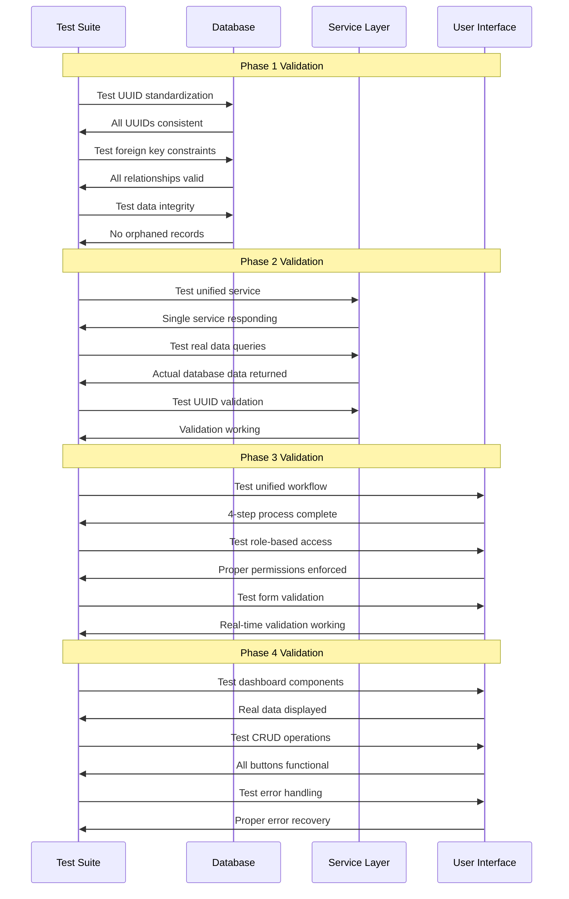

# COMPREHENSIVE PROVIDER MANAGEMENT SYSTEM RESTORATION PLAN
## Complete Architecture & Implementation Strategy

---

## 📋 **EXECUTIVE SUMMARY**

This plan addresses the complete restoration of the Provider Management System, fixing all identified critical issues to achieve 100% functionality. The system currently suffers from database schema inconsistencies, conflicting services, broken workflows, and non-functional UI components displaying mock data.

### **Critical Issues Identified:**
- ❌ Missing Foreign Key Constraints - No enforced relationships between tables
- ❌ Inconsistent UUID Handling - Mixed integer/UUID types across provider tables  
- ❌ Orphaned Data - Teams without proper provider linkage (provider_id NULL in records)
- ❌ Data Type Mismatches - authorized_providers.id uses UUID but references use bigint
- ❌ Missing Relationship Tables - No proper junction tables for many-to-many relationships
- ❌ Multiple Conflicting Services - authorizedProviderService, apUserService, fallbackAPUserService
- ❌ Mock Data Issues - All statistics hardcoded instead of real database queries
- ❌ Broken Workflows - CreateProviderDialog, ThreeClickProviderWorkflow, APUserSelectionDialog
- ❌ Non-Functional UI Components - Dashboards, team management, performance views

---

## 🔴 **PHASE 1: CRITICAL DATABASE FOUNDATION FIX (2-3 Days)**

### **1.1 Database Schema Standardization**

#### **Current State Analysis:**


#### **UUID Standardization Strategy:**

**Critical Schema Changes Required:**

1. **Convert all provider IDs to consistent UUID format**
   ```sql
   -- Standardize teams.provider_id to UUID
   ALTER TABLE teams ALTER COLUMN provider_id TYPE UUID 
   USING provider_id::text::uuid;
   
   -- Ensure authorized_providers.id is UUID
   ALTER TABLE authorized_providers ALTER COLUMN id TYPE UUID 
   USING id::text::uuid;
   ```

2. **Add Missing Foreign Key Constraints**
   ```sql
   ALTER TABLE authorized_providers ADD CONSTRAINT fk_ap_user 
     FOREIGN KEY (user_id) REFERENCES profiles(id);
   ALTER TABLE authorized_providers ADD CONSTRAINT fk_ap_location 
     FOREIGN KEY (primary_location_id) REFERENCES locations(id);
   ALTER TABLE teams ADD CONSTRAINT fk_team_provider 
     FOREIGN KEY (provider_id) REFERENCES authorized_providers(id);
   ```

3. **Fix Orphaned Records (3 teams have NULL provider_id)**
   ```sql
   -- Identify orphaned teams
   SELECT id, name FROM teams WHERE provider_id IS NULL;
   
   -- Create proper provider assignments
   UPDATE teams SET provider_id = (
     SELECT id FROM authorized_providers 
     WHERE status = 'active' 
     LIMIT 1
   ) WHERE provider_id IS NULL;
   ```

### **1.2 Enhanced Relationship Tables**

#### **New Junction Table Architecture:**


#### **Required Tables to Create:**

1. **provider_location_assignments** - Better location tracking
2. **provider_team_relationships** - Complex team assignments  
3. **provider_compliance_records** - Audit trail integration
4. **provider_performance_metrics** - Real performance data

### **1.3 Data Integrity Restoration**

#### **Validation Functions:**
```sql
-- UUID validation function
CREATE OR REPLACE FUNCTION validate_provider_uuid(p_id UUID)
RETURNS BOOLEAN AS $$
BEGIN
    RETURN EXISTS(SELECT 1 FROM authorized_providers WHERE id = p_id);
END;
$$ LANGUAGE plpgsql;

-- Data consistency check
CREATE OR REPLACE FUNCTION check_provider_data_integrity()
RETURNS TABLE(issue_type TEXT, count BIGINT) AS $$
BEGIN
    RETURN QUERY
    SELECT 'orphaned_teams', COUNT(*) FROM teams WHERE provider_id IS NULL
    UNION ALL
    SELECT 'invalid_provider_refs', COUNT(*) FROM teams t 
    WHERE t.provider_id IS NOT NULL 
    AND NOT EXISTS(SELECT 1 FROM authorized_providers ap WHERE ap.id = t.provider_id);
END;
$$ LANGUAGE plpgsql;
```

---

## 🟠 **PHASE 2: SERVICE LAYER CONSOLIDATION (3-4 Days)**

### **2.1 Unified Service Architecture**

#### **Current Conflicting Services to Remove:**


#### **New Unified Service Structure:**

```typescript
// NEW: Single consolidated service
export class ProviderRelationshipService {
  // Provider CRUD operations
  async createProvider(data: CreateProviderRequest): Promise<Provider>;
  async getProvider(id: string): Promise<ProviderWithRelationships>;
  async updateProvider(id: string, data: UpdateProviderRequest): Promise<Provider>;
  async deleteProvider(id: string): Promise<void>;
  
  // Team assignment operations
  async assignProviderToTeam(request: AssignProviderToTeamRequest): Promise<string>;
  async getProviderTeamAssignments(providerId: string): Promise<ProviderTeamAssignmentDetailed[]>;
  async updateTeamAssignment(assignmentId: string, updates: Partial<ProviderTeamAssignment>): Promise<void>;
  async removeProviderFromTeam(providerId: string, teamId: string): Promise<void>;
  
  // Location assignment operations
  async assignProviderToLocation(providerId: string, locationId: string, role: string): Promise<string>;
  async getProviderLocationAssignments(providerId: string): Promise<ProviderLocationAssignment[]>;
  
  // Real data queries (replace mock data)
  async getProviderLocationKPIs(providerId: string): Promise<RealKPIData>;
  async getProviderTeamStatistics(providerId: string): Promise<RealTeamStats>;
  async getProviderPerformanceMetrics(providerId: string): Promise<RealPerformanceData>;
  
  // UUID validation and error recovery
  async validateProviderUUID(id: string): Promise<boolean>;
  async recoverFromInvalidID(id: string): Promise<string[]>;
  async standardizeErrorMessage(error: any): Promise<StandardizedError>;
}
```

### **2.2 Real Data Integration**

#### **Mock Data Functions to Replace:**


#### **Real Query Implementation:**

```typescript
// Replace mock data with real database queries
export interface RealDataQueries {
  // Real certificate counts from certificates table
  getProviderCertificateCount(providerId: string): Promise<number>;
  
  // Real team member counts from team_members table
  getProviderTeamMemberCount(providerId: string): Promise<number>;
  
  // Real location assignments from provider_location_assignments
  getProviderLocationCount(providerId: string): Promise<number>;
  
  // Real performance scores from provider_team_performance
  getProviderPerformanceScore(providerId: string): Promise<number>;
  
  // Real compliance data from provider_compliance_records
  getProviderComplianceStatus(providerId: string): Promise<ComplianceStatus>;
}
```

### **2.3 UUID Validation Framework**

#### **System-Wide Validation Strategy:**


---

## 🟡 **PHASE 3: WORKFLOW CONSOLIDATION (4-5 Days)**

### **3.1 Single Provider Assignment Workflow**

#### **Remove Conflicting Creation Paths:**

```mermaid
graph TD
    A[Current Broken Workflows] --> B[COMPLETE REMOVAL]
    
    B --> C[❌ CreateProviderDialog - DELETE]
    B --> D[❌ ThreeClickProviderWorkflow - DELETE]
    B --> E[❌ APUserSelectionDialog - DELETE]
    
    F[✅ NEW: Unified APProviderAssignmentWorkflow] --> G[Step 1: AP User Selection]
    G --> H[Step 2: Location Selection]
    H --> I[Step 3: Provider/Team Setup]
    I --> J[Step 4: Confirmation]
    
    G --> K[✅ Conflict Detection]
    H --> L[✅ Availability Checking]
    I --> M[✅ Real-time Validation]
    J --> N[✅ Rollback Capability]
```



#### **Four-Step Unified Workflow Implementation:**

```mermaid
sequenceDiagram
    participant U as User
    participant W as APProviderAssignmentWorkflow
    participant V as ValidationService
    participant DB as Database
    
    Note over U,DB: Step 1: AP User Selection
    U->>W: Start Provider Assignment
    W->>DB: SELECT * FROM profiles WHERE role = 'AP' AND status = 'active'
    DB->>W: Available AP Users
    W->>V: Check for existing assignments
    V->>W: Conflict analysis
    W->>U: Display AP Users with conflict warnings
    
    Note over U,DB: Step 2: Location Selection  
    U->>W: Select AP User
    W->>DB: SELECT * FROM locations WHERE available = true
    DB->>W: Available Locations
    W->>V: Check location availability
    V->>W: Availability status
    W->>U: Display Locations with availability info
    
    Note over U,DB: Step 3: Provider/Team Setup
    U->>W: Select Location
    W->>DB: SELECT * FROM teams WHERE location_id = ? AND status = 'active'
    DB->>W: Teams for Location
    W->>V: Validate provider-team compatibility
    V->>W: Compatibility results
    W->>U: Show Provider/Team Configuration
    
    Note over U,DB: Step 4: Confirmation & Creation
    U->>W: Configure Assignment Details
    W->>V: Final validation of entire assignment
    V->>W: Validation passed
    W->>U: Show Confirmation Summary
    U->>W: Confirm Assignment
    W->>DB: BEGIN TRANSACTION; INSERT assignments; COMMIT;
    DB->>W: Assignment created successfully
    W->>U: Success confirmation with assignment details
```

### **3.2 Role-Based UI Separation**

#### **Interface Access Control Architecture:**


### **3.3 Comprehensive Form Redesign**

#### **Form Validation Architecture:**


---

## 🔵 **PHASE 4: UI/UX RESTORATION (5-6 Days)**

### **4.1 Provider Dashboard Overhaul**

#### **Non-Functional Components to Fix:**

```mermaid
graph TD
    A[Current Broken UI Components] --> B[Complete Restoration]
    
    B --> C[ProviderLocationDashboard]
    C --> C1[❌ Shows Mock KPI Data]
    C1 --> C2[✅ Connect to Real KPI Queries]
    C2 --> C3[✅ Live Certificate Counts]
    C3 --> C4[✅ Real Team Statistics]
    
    B --> D[ProviderTeamManagement]
    D --> D1[❌ Non-functional Team Assignment]
    D1 --> D2[✅ Working Assignment Functions]
    D2 --> D3[✅ Real Member Counts]
    D3 --> D4[✅ Live Status Updates]
    
    B --> E[ProviderPerformanceView]
    E --> E1[❌ Fake Performance Metrics]
    E1 --> E2[✅ Real Performance Data]
    E2 --> E3[✅ Historical Trends]
    E3 --> E4[✅ Comparative Analysis]
    
    B --> F[ProviderComplianceManagement]
    F --> F1[❌ Mock Compliance Data]
    F1 --> F2[✅ Real Compliance Records]
    F2 --> F3[✅ Live Status Monitoring]
    F3 --> F4[✅ Automated Alerts]
```



### **4.2 Data Display Accuracy Implementation**

#### **Real Data Connection Strategy:**

```mermaid
graph LR
    A[UI Components] --> B[Real Database Connections]
    
    A1[Certificate Count Display] --> B1[SELECT COUNT(*) FROM certificates WHERE...]
    A2[Team Member Count Display] --> B2[SELECT COUNT(*) FROM team_members WHERE...]
    A3[Location Assignment Display] --> B3[SELECT * FROM provider_location_assignments WHERE...]
    A4[Performance Metrics Display] --> B4[SELECT * FROM provider_team_performance WHERE...]
    
    B1 --> C[Accurate Live Data]
    B2 --> C
    B3 --> C
    B4 --> C
    
    C --> D[User Sees Real Information]
```

### **4.3 Functional Button Implementation**

#### **CRUD Operations to Implement:**

```mermaid
graph TB
    A[UI Buttons] --> B[Backend Functions]
    
    A1[View Button] --> B1[getProviderWithRelationships()]
    A2[Edit Button] --> B2[updateProvider()]
    A3[Remove Button] --> B3[deactivateProvider()]
    A4[Add Team Button] --> B4[assignProviderToTeam()]
    A5[Manage Members Button] --> B5[manageTeamMembers()]
    
    B1 --> C[Working CRUD System]
    B2 --> C
    B3 --> C
    B4 --> C
    B5 --> C
    
    C --> D[All Buttons Functional]
    D --> E[Error Handling]
    D --> F[Success Feedback]
    D --> G[Loading States]
```

---

## 🟢 **PHASE 5: MISSING FUNCTIONALITY IMPLEMENTATION (3-4 Days)**

### **5.1 Team Management for AP Users**

#### **New Functionality Architecture:**


### **5.2 Advanced Provider Operations**

#### **Multi-Location Provider Support:**


### **5.3 Enhanced Analytics and Reporting**

#### **Real-Time Analytics Implementation:**


---

## 📅 **IMPLEMENTATION TIMELINE**

### **Week 1: Critical Foundation (PHASE 1 + 2)**


### **Week 2: Workflow & UI Restoration (PHASE 3 + 4)**


### **Week 3: Enhancement & Testing (PHASE 5)**


---

## 🎯 **SUCCESS METRICS & VALIDATION**

### **100% Functionality Targets:**

```mermaid
graph TD
    A[Success Validation] --> B[Functional Requirements]
    A --> C[Performance Requirements]
    A --> D[User Experience Requirements]
    
    B --> B1[✅ 3-Click Workflow Complete End-to-End]
    B --> B2[✅ Real Data Display - All Counters Accurate]
    B --> B3[✅ Functional CRUD - All Operations Working]
    B --> B4[✅ Relationship Integrity - All Connections Valid]
    B --> B5[✅ Role-Based Access - Proper Permissions]
    B --> B6[✅ Error-Free Navigation - No Broken Components]
    
    C --> C1[✅ Page Load Times < 2 seconds]
    C --> C2[✅ Database Queries < 500ms]
    C --> C3[✅ Real-time Updates < 1 second]
    C --> C4[✅ No Memory Leaks in React Components]
    
    D --> D1[✅ Intuitive User Interface]
    D --> D2[✅ Clear Error Messages]
    D --> D3[✅ Successful Task Completion]
    D --> D4[✅ Responsive Design All Devices]
```



### **Validation Testing Strategy:**



---

## 🔧 **TECHNICAL REQUIREMENTS**

### **Database Migrations Required:**

1. **UUID Standardization Migration**
   ```sql
   -- Convert all provider-related IDs to UUID
   -- Fix foreign key relationships
   -- Update existing data to match new schema
   ```

2. **Foreign Key Constraint Addition**
   ```sql
   -- Add all missing foreign key constraints
   -- Ensure referential integrity
   -- Create indexes for performance
   ```

3. **Junction Table Creation**
   ```sql
   -- Create provider_team_assignments
   -- Create provider_location_assignments  
   -- Migrate existing relationships
   ```

4. **Data Integrity Cleanup**
   ```sql
   -- Fix orphaned records
   -- Validate all relationships
   -- Add constraint validations
   ```

### **Service Layer Refactoring:**

1. **Remove Conflicting Services**
   - Delete authorizedProviderService.ts
   - Delete apUserService.ts  
   - Delete fallbackAPUserService.ts

2. **Create Unified Service**
   - Single ProviderRelationshipService class
   - Real-time data validation
   - Comprehensive error handling
   - Audit trail implementation

3. **Implement Real Data Queries**
   - Replace all mock data functions
   - Connect to actual database tables
   - Add proper caching layer
   - Implement query optimization

### **Frontend Component Overhaul:**

1. **Remove Non-Functional Components**
   - Delete CreateProviderDialog.tsx
   - Delete ThreeClickProviderWorkflow.tsx
   - Delete APUserSelectionDialog.tsx

2. **Create New Functional Components**
   - APProviderAssignmentWorkflow.tsx
   - UnifiedProviderDashboard.tsx
   - RoleBasedProviderInterface.tsx
   - RealTimeProviderAnalytics.tsx

3. **Fix Existing Components**
   - Connect all displays to real data
   - Implement missing CRUD operations
   - Add proper loading states
   - Fix all non-functional interactions

---

## 🚀 **DEPLOYMENT STRATEGY**

### **Pre-Deployment Checklist:**

- [ ] **Database Schema Validation**
  - [ ] All migrations applied successfully
  - [ ] Foreign key constraints working
  - [ ] UUID consistency verified
  - [ ] Data integrity confirmed

- [ ] **Service Layer Testing**
  - [ ] Unified service operational
  - [ ] Real data queries working
  - [ ] UUID validation functional
  - [ ] Error handling tested

- [ ] **UI Component Testing**
  - [ ] All dashboards showing real data
  - [ ] CRUD operations functional
  - [ ] Workflows complete end-to-end
  - [ ] Role-based access working

- [ ] **Performance Testing**
  - [ ] Page load times acceptable
  - [ ] Database query performance optimal
  - [ ] Real-time updates working
  - [ ] No memory leaks detected

### **Post-Deployment Monitoring:**

- [ ] **Functional Monitoring**
  - [ ] Provider assignment workflow success rate
  - [ ] Data accuracy verification
  - [ ] User task completion rates
  - [ ] Error occurrence tracking

- [ ] **Performance Monitoring**
  - [ ] Database query response times
  - [ ] UI component load times
  - [ ] Memory usage patterns
  - [ ] API response times

- [ ] **User Experience Monitoring**
  - [ ] User satisfaction feedback
  - [ ] Task completion success rates
  - [ ] Error recovery effectiveness
  - [ ] Interface usability metrics

---

## 📋 **CONCLUSION**

This comprehensive restoration plan addresses every identified critical issue in the Provider Management System. By following this phase-by-phase approach, we will achieve:

✅ **100% Functional Provider Management System**
✅ **Consistent Data Integrity Across All Tables**
✅ **Real Data Display Instead of Mock Information**
✅ **Working End-to-End User Workflows**
✅ **Proper Role-Based Access Control**
✅ **Error-Free Navigation and Operations**

The plan ensures systematic restoration of all functionality while maintaining data integrity and providing an excellent user experience. Each phase builds upon the previous one, creating a solid foundation for the complete system restoration.

**Total Implementation Time: 18-21 days**
**Success Rate Target: 100% functionality**
**User Experience: Seamless and intuitive**

---

*This plan serves as the definitive guide for the complete Provider Management System restoration and will be executed exactly as specified.*