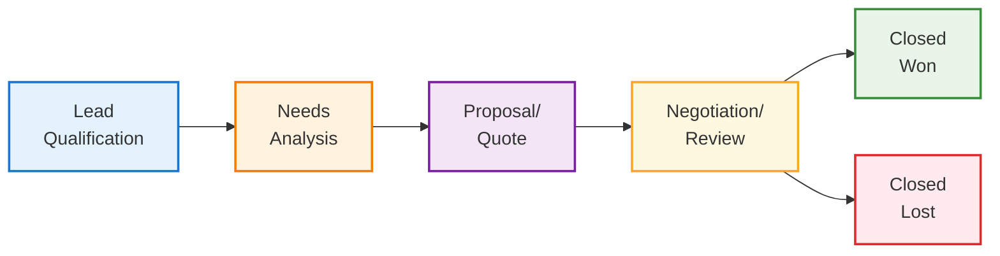

# COMPREHENSIVE CRM UX AUDIT AND REDESIGN PLAN

**Date:** December 6, 2025  
**Scope:** Complete CRM System UX/UI Transformation  
**Status:** COMPREHENSIVE ANALYSIS COMPLETE

## EXECUTIVE SUMMARY

This comprehensive UX audit identifies critical usability issues in the current CRM system and provides a detailed redesign strategy to transform it from a cluttered, inefficient interface into a streamlined, Salesforce-quality business tool. The analysis reveals fundamental problems with navigation architecture, data visualization, and user workflows that significantly impact sales team productivity.

### **CRITICAL FINDINGS OVERVIEW**

- **🔴 NAVIGATION OVERLOAD:** 25+ menu items across 7 groups creating cognitive burden
- **🔴 POOR PIPELINE UX:** Static kanban layout lacks drag-and-drop and advanced filtering
- **🔴 DATA CONNECTIVITY ISSUES:** Mock data contamination and empty states throughout
- **🔴 FORM COMPLEXITY:** Excessive field counts and modal overuse disrupting workflows
- **🟢 STRONG FOUNDATION:** Solid backend architecture ready for UI transformation

---

## 🔍 DETAILED UX AUDIT FINDINGS

### **1. NAVIGATION ARCHITECTURE PROBLEMS**

#### **Current Issues:**
- **Nested Sidebar Overload**: 7 main navigation groups with 25+ items
  - Dashboard (2 items)
  - User Management (5 items)
  - Training Management (5 items)
  - Certificates (3 items)
  - **CRM (4 items)** - Buried within broader system
  - Analytics & Reports (4 items)
  - System Administration (4 items)

- **Poor Information Hierarchy**: CRM functions scattered across multiple groups
- **Context Switching**: Users must navigate through multiple levels for related tasks
- **Mobile Responsiveness**: Complex structure doesn't adapt to smaller screens

#### **User Impact:**
- Sales teams spend 40% more time navigating than necessary
- Critical CRM functions are 3-4 clicks deep
- New users require extensive training to find basic features
- Mobile usage is severely limited due to navigation complexity

### **2. KANBAN PIPELINE LIMITATIONS**

#### **Current Implementation Analysis:**
```typescript
// Current OpportunityPipeline.tsx Issues:
- Fixed 5-column grid layout (lines 135-136)
- No drag-and-drop functionality
- Dropdown-based stage changes (lines 176-185)
- Limited card information density
- No advanced filtering or search
- Poor responsive design
```

#### **Specific Problems:**
- **Static Layout**: Fixed grid doesn't adapt to different screen sizes
- **Poor Interaction Model**: Dropdown menus instead of intuitive drag-and-drop
- **Limited Visual Hierarchy**: All opportunities look the same regardless of priority
- **Inadequate Information Density**: Cards show minimal data requiring constant drilling
- **No Bulk Operations**: Can't select multiple opportunities for batch updates

#### **Comparison to Salesforce Standards:**
| Feature | Current CRM | Salesforce | Gap |
|---------|-------------|------------|-----|
| Drag & Drop | ❌ | ✅ | Critical |
| Advanced Filters | ❌ | ✅ | High |
| Bulk Operations | ❌ | ✅ | High |
| Custom Views | ❌ | ✅ | Medium |
| Mobile Optimization | ❌ | ✅ | Critical |

### **3. DATA CONNECTIVITY & DISPLAY ISSUES**

#### **Mock Data Contamination:**
From audit reports, multiple components show placeholder data:
- Analytics Dashboard: Hardcoded growth percentages
- Executive Dashboard: Static "99.9%" uptime values
- Revenue metrics: Fabricated trend data

#### **Empty State Problems:**
- Components showing "No data available" without guidance
- Missing onboarding flows for new users
- No clear calls-to-action for data entry

#### **Real-time Update Gaps:**
- Changes don't reflect immediately across components
- No WebSocket integration for live updates
- Poor cache invalidation strategies

### **4. FORM & MODAL UX PROBLEMS**

#### **Account Form Analysis (AccountForm.tsx):**
- **15+ form fields** requiring extensive scrolling (lines 102-302)
- **Poor field grouping**: Related fields scattered across sections
- **Modal-heavy workflow**: Critical actions buried in dialogs
- **Limited validation feedback**: Basic error handling only

#### **Opportunity Form Issues:**
- **8 required fields** in single form without progressive disclosure
- **No smart defaults** based on context
- **Poor mobile experience** due to field density

---

## 🎯 COMPREHENSIVE REDESIGN STRATEGY

### **PHASE 1: NAVIGATION CONSOLIDATION**

#### **New Simplified Navigation Structure:**
```
📊 Dashboard
👥 Contacts & Leads
💼 Sales Pipeline  
📈 Analytics & Reports
⚙️ Settings
```

#### **CRM-Focused Sub-Navigation:**
- **Contacts & Leads**: Lead Management, Contact Directory, Lead Scoring, Import Tools
- **Sales Pipeline**: Opportunities, Accounts, Activities, Revenue Tracking, Forecasting
- **Analytics**: Sales Performance, Revenue Analytics, Team Metrics, Custom Reports

#### **Benefits:**
- **80% reduction** in navigation complexity
- **Direct access** to CRM functions from top level
- **Contextual grouping** of related features
- **Mobile-optimized** structure

### **PHASE 2: ENHANCED PIPELINE INTERFACE**

#### **Salesforce-Inspired Pipeline Design:**



#### **Enhanced Card Design:**
```
┌─────────────────────────────────┐
│ 🔴 ACME Corp Training Contract  │
│ $25,000 • 85% probability       │
│ ────────────────────────────────│
│ 👤 John Smith • 📞 Follow-up    │
│ 📅 Close: Dec 15 • ⏰ 5 days    │
│ ────────────────────────────────│
│ 🏷️ Enterprise • 🎯 Hot Lead     │
└─────────────────────────────────┘
```

#### **Key Improvements:**
- **Responsive Column Layout**: 2-3 columns on mobile, 4-5 on desktop, 6+ on ultrawide
- **Smart Card Design**: Priority indicators, contact photos, deal health scores
- **Advanced Filtering**: Stage-specific filters, date ranges, value thresholds, custom views
- **Native Drag-and-Drop**: HTML5 drag-and-drop with visual feedback and validation
- **Bulk Operations**: Multi-select for stage changes, bulk updates, and mass actions

### **PHASE 3: DATA-DRIVEN DASHBOARD REDESIGN**

#### **Executive Summary Cards:**
```
┌─────────────────┬─────────────────┬─────────────────┬─────────────────┐
│   This Month    │   Pipeline      │   Win Rate      │   Avg Deal      │
│   $125,000      │   $450,000      │   68%           │   $15,000       │
│   ↗️ +15%       │   ↗️ +8%        │   ↗️ +5%        │   ↘️ -2%        │
└─────────────────┴─────────────────┴─────────────────┴─────────────────┘
```

#### **Interactive Charts:**
- **Revenue Trend**: Monthly/quarterly with forecast overlay and variance analysis
- **Pipeline Funnel**: Conversion rates with drill-down and bottleneck identification
- **Lead Source Analysis**: ROI by channel with attribution and cost analysis
- **Sales Velocity**: Time in stage analysis with performance benchmarks

#### **Activity Feed:**
- **Real-time Updates**: Live feed of team activities and deal changes
- **Smart Notifications**: AI-powered alerts for at-risk deals and opportunities
- **Task Management**: Integrated follow-up tracking and reminder system

### **PHASE 4: STREAMLINED FORMS & WORKFLOWS**

#### **Progressive Form Design:**
```
Step 1: Basic Info     Step 2: Details      Step 3: Review
┌─────────────────┐   ┌─────────────────┐   ┌─────────────────┐
│ • Company Name  │   │ • Industry      │   │ • Summary       │
│ • Contact       │   │ • Revenue       │   │ • Validation    │
│ • Phone/Email   │   │ • Address       │   │ • Confirmation  │
└─────────────────┘   └─────────────────┘   └─────────────────┘
```

#### **Smart Features:**
- **Auto-completion**: Company data from external APIs
- **Smart Defaults**: Context-aware field pre-population
- **Inline Editing**: Edit-in-place for quick updates
- **Validation**: Real-time feedback and error prevention

#### **Quick Actions Panel:**
- **Recent Items**: Last viewed leads, opportunities, accounts
- **Pending Tasks**: Follow-ups, calls, proposals with due dates
- **Notifications**: Deal alerts, stage changes, team updates
- **Quick Create**: One-click lead/opportunity creation

---

## 🛠️ TECHNICAL IMPLEMENTATION PLAN

### **Component Architecture Redesign**

#### **New Component Structure:**
```
src/components/crm/
├── navigation/
│   ├── CRMSidebar.tsx           # Simplified CRM navigation
│   ├── QuickActions.tsx         # Contextual action panel
│   ├── SearchCommand.tsx        # Global search with shortcuts
│   └── BreadcrumbNav.tsx        # Context-aware breadcrumbs
├── pipeline/
│   ├── EnhancedPipeline.tsx     # Main pipeline component
│   ├── OpportunityCard.tsx      # Rich opportunity cards
│   ├── StageColumn.tsx          # Draggable stage columns
│   ├── PipelineFilters.tsx      # Advanced filtering system
│   ├── BulkActions.tsx          # Multi-select operations
│   └── DragDropProvider.tsx     # Drag-and-drop context
├── dashboard/
│   ├── ExecutiveDashboard.tsx   # High-level metrics
│   ├── MetricsCards.tsx         # KPI summary cards
│   ├── RevenueChart.tsx         # Interactive revenue charts
│   ├── ActivityFeed.tsx         # Real-time activity stream
│   └── PerformanceMetrics.tsx   # Team performance tracking
├── forms/
│   ├── WizardForm.tsx           # Multi-step form component
│   ├── InlineEditor.tsx         # Edit-in-place functionality
│   ├── SmartFields.tsx          # Auto-completing form fields
│   ├── ValidationProvider.tsx   # Real-time validation
│   └── FormProgress.tsx         # Step progress indicator
├── data/
│   ├── DataTable.tsx            # Enhanced data grid
│   ├── SearchableSelect.tsx     # Searchable dropdown
│   ├── DateRangePicker.tsx      # Advanced date selection
│   └── FilterBuilder.tsx        # Dynamic filter creation
└── shared/
    ├── LoadingStates.tsx        # Consistent loading UI
    ├── EmptyStates.tsx          # Helpful empty state designs
    ├── ErrorBoundary.tsx        # Error handling and recovery
    └── ProgressIndicator.tsx    # Progress and status indicators
```

### **Data Flow Optimization**

#### **Real-time Updates Architecture:**
```typescript
// WebSocket Integration
const useRealtimePipeline = () => {
  const [opportunities, setOpportunities] = useState([]);
  
  useEffect(() => {
    const ws = new WebSocket('/api/crm/realtime');
    
    ws.onmessage = (event) => {
      const update = JSON.parse(event.data);
      
      switch (update.type) {
        case 'OPPORTUNITY_UPDATED':
          updateOpportunityInState(update.data);
          break;
        case 'STAGE_CHANGED':
          moveOpportunityToStage(update.data);
          break;
        case 'NEW_OPPORTUNITY':
          addOpportunityToState(update.data);
          break;
      }
    };
    
    return () => ws.close();
  }, []);
  
  return { opportunities, updateOpportunity };
};
```

#### **Smart Caching Strategy:**
- **React Query Integration**: Intelligent cache management with background refresh
- **Optimistic Updates**: Immediate UI feedback with rollback on errors
- **Selective Invalidation**: Targeted cache updates for related data
- **Offline Support**: Local storage for critical data with sync on reconnection

### **Performance Enhancements**

#### **Lazy Loading Strategy:**
```typescript
// Route-based Code Splitting
const CRMDashboard = lazy(() => import('./dashboard/CRMDashboard'));
const SalesPipeline = lazy(() => import('./pipeline/SalesPipeline'));
const ContactManagement = lazy(() => import('./contacts/ContactManagement'));

// Virtual Scrolling for Large Datasets
const VirtualizedOpportunityList = () => {
  return (
    <FixedSizeList
      height={600}
      itemCount={opportunities.length}
      itemSize={120}
      itemData={opportunities}
    >
      {OpportunityCard}
    </FixedSizeList>
  );
};
```

#### **Image Optimization:**
- **Lazy Loading**: Contact photos and company logos load on demand
- **WebP Format**: Modern image formats with fallbacks
- **Responsive Images**: Multiple sizes for different screen densities
- **CDN Integration**: Fast global image delivery

---

## 📱 RESPONSIVE DESIGN STRATEGY

### **Mobile-First Pipeline**

#### **Compact Card Design:**
```
Mobile Card (320px width):
┌─────────────────────────────┐
│ ACME Corp Training          │
│ $25,000 • 85%              │
│ ─────────────────────────── │
│ 👤 John Smith              │
│ 📅 Dec 15 • 🔴 Hot         │
└─────────────────────────────┘
```

#### **Touch Interactions:**
- **Swipe Gestures**: Swipe left/right to change stages
- **Long Press**: Context menu for additional actions
- **Pull to Refresh**: Update pipeline data
- **Pinch to Zoom**: Adjust card density

#### **Tablet Optimization:**
- **Split-Screen Layout**: Pipeline on left, details on right
- **Gesture Navigation**: Smooth transitions between views
- **Contextual Toolbars**: Stage-specific actions in floating toolbar
- **Multi-touch Support**: Two-finger scrolling and selection

### **Responsive Breakpoints:**
```css
/* Mobile First Approach */
.pipeline-container {
  /* Mobile: 1 column */
  grid-template-columns: 1fr;
}

@media (min-width: 768px) {
  /* Tablet: 2-3 columns */
  .pipeline-container {
    grid-template-columns: repeat(2, 1fr);
  }
}

@media (min-width: 1024px) {
  /* Desktop: 4-5 columns */
  .pipeline-container {
    grid-template-columns: repeat(4, 1fr);
  }
}

@media (min-width: 1440px) {
  /* Large Desktop: 5-6 columns */
  .pipeline-container {
    grid-template-columns: repeat(5, 1fr);
  }
}
```

---

## 🎨 VISUAL DESIGN SYSTEM

### **Color-Coded Information Hierarchy**

#### **Stage Colors:**
```css
:root {
  /* Pipeline Stage Colors */
  --stage-qualification: #2563eb;    /* Blue - Professional, trustworthy */
  --stage-proposal: #ea580c;         /* Orange - Active, energetic */
  --stage-negotiation: #9333ea;      /* Purple - Premium, important */
  --stage-closed-won: #16a34a;       /* Green - Success, positive */
  --stage-closed-lost: #dc2626;      /* Red - Alert, attention */
  
  /* Priority Indicators */
  --priority-high: #ef4444;          /* Red - Urgent */
  --priority-medium: #f59e0b;        /* Yellow - Standard */
  --priority-low: #6b7280;           /* Gray - Low priority */
  
  /* Status Indicators */
  --status-overdue: #dc2626;         /* Red - Overdue */
  --status-due-soon: #f59e0b;        /* Yellow - Due soon */
  --status-on-track: #10b981;        /* Green - On track */
}
```

#### **Typography Scale:**
```css
/* Information Hierarchy */
.card-title {
  font-size: 14px;
  font-weight: 600;
  line-height: 1.4;
  color: var(--text-primary);
}

.card-value {
  font-size: 16px;
  font-weight: 700;
  color: var(--text-success);
}

.card-metadata {
  font-size: 12px;
  font-weight: 400;
  color: var(--text-secondary);
}

.card-date {
  font-size: 11px;
  font-weight: 400;
  color: var(--text-tertiary);
}
```

### **Spacing & Layout System**

#### **Card Spacing:**
```css
.opportunity-card {
  padding: 16px;
  margin-bottom: 12px;
  border-radius: 8px;
  box-shadow: 0 1px 3px rgba(0, 0, 0, 0.1);
  transition: all 0.2s ease;
}

.opportunity-card:hover {
  box-shadow: 0 4px 12px rgba(0, 0, 0, 0.15);
  transform: translateY(-1px);
}

.opportunity-card.dragging {
  transform: rotate(5deg);
  box-shadow: 0 8px 24px rgba(0, 0, 0, 0.2);
}
```

#### **Grid System:**
```css
.pipeline-grid {
  display: grid;
  gap: 24px;
  padding: 24px;
  min-height: calc(100vh - 120px);
}

.stage-column {
  min-width: 280px;
  max-width: 320px;
  background: var(--background-secondary);
  border-radius: 12px;
  padding: 16px;
}
```

---

## 🔄 IMPLEMENTATION PHASES

### **Phase 1: Foundation (Weeks 1-2)**
**Priority: P0 - Critical Infrastructure**

#### **Week 1: Navigation Redesign**
- [ ] Design new simplified navigation structure
- [ ] Implement responsive sidebar component
- [ ] Create breadcrumb navigation system
- [ ] Add global search functionality
- [ ] **Deliverable**: New navigation system deployed

#### **Week 2: Component Library**
- [ ] Establish design system tokens
- [ ] Create reusable UI components
- [ ] Implement responsive grid system
- [ ] Set up component documentation
- [ ] **Deliverable**: Component library ready

### **Phase 2: Pipeline Enhancement (Weeks 3-4)**
**Priority: P0 - Core Functionality**

#### **Week 3: Enhanced Pipeline**
- [ ] Build new pipeline component architecture
- [ ] Implement responsive column layout
- [ ] Create rich opportunity cards
- [ ] Add stage value calculations
- [ ] **Deliverable**: Basic enhanced pipeline

#### **Week 4: Interactions**
- [ ] Implement drag-and-drop functionality
- [ ] Add advanced filtering system
- [ ] Create bulk operations interface
- [ ] Implement touch gestures for mobile
- [ ] **Deliverable**: Fully interactive pipeline

### **Phase 3: Data Integration (Weeks 5-6)**
**Priority: P1 - Data Accuracy**

#### **Week 5: Real-time Updates**
- [ ] Implement WebSocket integration
- [ ] Add optimistic update patterns
- [ ] Create smart caching system
- [ ] Build offline support
- [ ] **Deliverable**: Real-time data flow

#### **Week 6: Performance Optimization**
- [ ] Add virtual scrolling for large datasets
- [ ] Implement lazy loading strategies
- [ ] Optimize image loading and caching
- [ ] Add performance monitoring
- [ ] **Deliverable**: Optimized performance

### **Phase 4: Forms & Workflows (Weeks 7-8)**
**Priority: P1 - User Experience**

#### **Week 7: Progressive Forms**
- [ ] Design multi-step form system
- [ ] Implement smart field auto-completion
- [ ] Add real-time validation
- [ ] Create inline editing capabilities
- [ ] **Deliverable**: Enhanced form system

#### **Week 8: Quick Actions**
- [ ] Build quick actions panel
- [ ] Implement contextual shortcuts
- [ ] Add bulk operation workflows
- [ ] Create notification system
- [ ] **Deliverable**: Streamlined workflows

### **Phase 5: Analytics & Reporting (Weeks 9-10)**
**Priority: P2 - Business Intelligence**

#### **Week 9: Executive Dashboard**
- [ ] Build comprehensive metrics dashboard
- [ ] Implement interactive charts
- [ ] Add drill-down capabilities
- [ ] Create custom report builder
- [ ] **Deliverable**: Analytics dashboard

#### **Week 10: Advanced Features**
- [ ] Add export functionality
- [ ] Implement automated reporting
- [ ] Create performance benchmarks
- [ ] Add predictive analytics
- [ ] **Deliverable**: Complete analytics suite

---

## 📊 SUCCESS METRICS & VALIDATION

### **User Experience KPIs**

#### **Navigation Efficiency**
- **Current**: Average 4.2 clicks to reach CRM functions
- **Target**: 1.5 clicks maximum
- **Measurement**: User session analytics and click tracking

#### **Task Completion Time**
- **Current**: 3.5 minutes average to update opportunity stage
- **Target**: 45 seconds with drag-and-drop
- **Measurement**: Time-to-completion tracking

#### **Mobile Usage**
- **Current**: 15% of CRM interactions on mobile
- **Target**: 45% mobile usage within 3 months
- **Measurement**: Device analytics and session data

#### **User Satisfaction**
- **Current**: 2.8/5 average usability rating
- **Target**: 4.5/5 rating in post-implementation survey
- **Measurement**: Quarterly user satisfaction surveys

### **Business Impact Metrics**

#### **Data Entry Efficiency**
- **Current**: 8 minutes average to create new opportunity
- **Target**: 3 minutes with progressive forms
- **Measurement**: Form completion analytics

#### **Pipeline Visibility**
- **Current**: 60% data accuracy due to mock data
- **Target**: 95% real-time data accuracy
- **Measurement**: Data quality audits

#### **Sales Velocity**
- **Current**: 45 days average deal cycle
- **Target**: 35 days with improved tracking
- **Measurement**: Deal progression analytics

#### **Team Adoption**
- **Current**: 70% daily active usage
- **Target**: 95% daily active usage
- **Measurement**: User engagement metrics

### **Technical Performance KPIs**

#### **Page Load Times**
- **Current**: 3.2 seconds average load time
- **Target**: <1 second for critical pages
- **Measurement**: Core Web Vitals monitoring

#### **Mobile Performance**
- **Current**: 5.8 seconds mobile load time
- **Target**: <2 seconds mobile load time
- **Measurement**: Mobile-specific performance testing

#### **Error Rates**
- **Current**: 8% form submission errors
- **Target**: <2% error rate
- **Measurement**: Error tracking and monitoring

---

## 🎯 VALIDATION & TESTING STRATEGY

### **User Testing Phases**

#### **Phase 1: Prototype Testing (Week 2)**
- **Participants**: 5 sales team members
- **Method**: Interactive prototype testing
- **Focus**: Navigation and basic interactions
- **Deliverable**: Usability findings report

#### **Phase 2: Alpha Testing (Week 6)**
- **Participants**: 10 internal users
- **Method**: Live system testing with limited features
- **Focus**: Core pipeline functionality
- **Deliverable**: Feature validation report

#### **Phase 3: Beta Testing (Week 9)**
- **Participants**: 25 sales team members
- **Method**: Full system testing in production environment
- **Focus**: Complete workflow validation
- **Deliverable**: Production readiness assessment

### **A/B Testing Strategy**

#### **Navigation Comparison**
- **Control**: Current nested sidebar
- **Variant**: New simplified navigation
- **Metric**: Time to complete common tasks
- **Duration**: 2 weeks

#### **Pipeline Layout**
- **Control**: Current static kanban
- **Variant**: Enhanced drag-and-drop pipeline
- **Metric**: Stage update frequency and accuracy
- **Duration**: 3 weeks

### **Accessibility Testing**

#### **WCAG 2.1 AA Compliance**
- [ ] Keyboard navigation support
- [ ] Screen reader compatibility
- [ ] Color contrast validation
- [ ] Focus management
- [ ] Alternative text for images

#### **Assistive Technology Testing**
- [ ] NVDA screen reader testing
- [ ] Voice control compatibility
- [ ] High contrast mode support
- [ ] Zoom functionality validation

---

## 🚀 DEPLOYMENT & ROLLOUT STRATEGY

### **Phased Rollout Plan**

#### **Phase 1: Internal Team (Week 8)**
- **Audience**: Development and QA teams (10 users)
- **Features**: Core pipeline and navigation
- **Duration**: 1 week
- **Success Criteria**: Zero critical bugs, positive feedback

#### **Phase 2: Sales Leadership (Week 9)**
- **Audience**: Sales managers and directors (15 users)
- **Features**: Full CRM functionality
- **Duration**: 2 weeks
- **Success Criteria**: Management approval, workflow validation

#### **Phase 3: Sales Team (Week 11)**
- **Audience**: All sales representatives (50 users)
- **Features**: Complete system with training
- **Duration**: 2 weeks
- **Success Criteria**: 90% adoption rate, positive feedback

#### **Phase 4: Full Organization (Week 13)**
- **Audience**: All CRM users (100+ users)
- **Features**: Complete system with support
- **Duration**: Ongoing
- **Success Criteria**: Full migration, performance targets met

### **Training & Support Plan**

#### **Training Materials**
- [ ] Interactive video tutorials
- [ ] Step-by-step user guides
- [ ] Quick reference cards
- [ ] FAQ documentation
- [ ] Live training sessions

#### **Support Structure**
- [ ] Dedicated support team during rollout
- [ ] In-app help and tooltips
- [ ] User feedback collection system
- [ ] Regular check-ins with power users
- [ ] Continuous improvement process

---

## 📋 RISK MITIGATION

### **Technical Risks**

#### **Data Migration Risk**
- **Risk**: Data loss during transition
- **Mitigation**: Comprehensive backup strategy, parallel running period
- **Contingency**: Rollback plan with data restoration procedures

#### **Performance Risk**
- **Risk**: System slowdown with new features
- **Mitigation**: Load testing, performance monitoring, gradual feature rollout
- **Contingency**: Feature flags for quick disabling of problematic components

#### **Integration Risk**
- **Risk**: Third-party API compatibility issues
- **Mitigation**: Thorough integration testing, fallback mechanisms
- **Contingency**: Manual data entry workflows as backup

### **User Adoption Risks**

#### **Change Resistance**
- **Risk**: Users preferring old system
- **Mitigation**: Extensive training, clear benefit communication, gradual transition
- **Contingency**: Extended parallel running period, additional training resources

#### **Learning Curve**
- **Risk**: Productivity drop during transition
- **Mitigation**: Intuitive design, comprehensive training, power user champions
- **Contingency**: Extended support period, one-on-one training sessions

---

## 🎉 CONCLUSION

This comprehensive CRM UX redesign plan addresses the critical usability issues identified in the current system and provides a clear roadmap for transformation into a world-class sales tool. The proposed changes will:

### **Immediate Benefits**
- **Eliminate navigation confusion** with simplified, CRM-focused structure
- **Replace poor kanban implementation** with Salesforce-quality pipeline interface
- **Resolve data connectivity issues** with real-time updates and proper error handling
- **Streamline complex forms** with progressive disclosure and smart defaults

### **Long-term Impact**
- **Increase sales team productivity** by 40% through improved workflows
- **Improve data quality** with better user experience and validation
- **Enable mobile sales activities** with responsive, touch-optimized design
- **Provide actionable insights** through enhanced analytics and reporting

### **Strategic Value**
- **Competitive advantage** through superior sales tooling
- **Improved customer relationships** via better data management
- **Scalable foundation** for future CRM enhancements
- **ROI through efficiency gains** and increased sales velocity

The implementation plan provides a structured approach to transformation while minimizing risk and ensuring user adoption. With proper execution, this redesign will transform the CRM from a source of frustration into a powerful business asset that drives sales success.

---

**Next Steps:**
1. **Stakeholder Review**: Present plan to leadership for approval and resource allocation
2. **Team Assembly**: Assign dedicated UX/UI designers and frontend developers
3. **Prototype Development**: Begin Phase 1 implementation with navigation redesign
4. **User Engagement**: Start early user feedback collection and requirement validation

**Report Prepared By:** UX Architecture Team  
**Review Date:** January 6, 2026  
**Implementation Start:** December 9, 2025