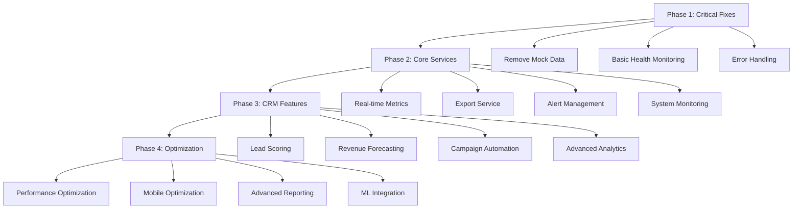
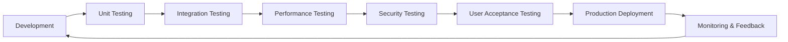
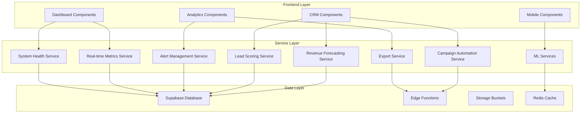
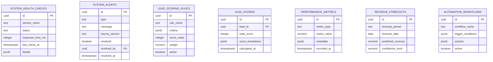

# COMPREHENSIVE DASHBOARD IMPLEMENTATION PLAN

**Date:** December 6, 2025  
**Project:** Enterprise CRM & Certification Management System  
**Timeline:** 3-6 Months (24 Weeks)  
**Status:** READY FOR IMPLEMENTATION

## 🎯 IMPLEMENTATION OVERVIEW

Based on the comprehensive dashboard audit report, this plan addresses critical mock data contamination, implements missing backend services, and builds advanced features over a phased approach.

### **System Strengths Identified:**
- ✅ **47 backend services** already implemented
- ✅ **Robust role-based access control** 
- ✅ **Secure team-scoped data architecture**
- ✅ **Comprehensive Supabase integration**
- ✅ **Well-structured component hierarchy**

### **Critical Issues to Address:**
- 🔴 **12+ hardcoded mock data instances** in analytics dashboards
- 🟡 **6+ missing backend services** for system monitoring and exports
- ⚪ **8+ placeholder implementations** requiring complete development

---

## 📋 PHASE 1: CRITICAL FIXES (Weeks 1-2)
**Priority:** P0 - Production Blocking Issues  
**Total Effort:** 36-46 hours

### **1.1 Mock Data Elimination** 
**Effort:** 16-20 hours | **Team:** Senior Frontend Developer

#### **Critical Files to Fix:**

**[`src/hooks/useReportingAnalytics.ts`](src/hooks/useReportingAnalytics.ts:207)**
```typescript
// REMOVE THESE HARDCODED VALUES:
- Line 207: monthlyGrowth: 12.5 → Calculate from real data
- Line 210: utilizationRate: 75 → Calculate from instructor workload
- Lines 223-231: Replace fabricated alert system
```

**[`src/components/analytics/ExecutiveDashboard.tsx`](src/components/analytics/ExecutiveDashboard.tsx:164)**
```typescript
// REMOVE HARDCODED UPTIME:
- Line 164: "System Uptime: 99.9%" → Connect to health service
```

**[`src/components/analytics/AdvancedAnalyticsDashboard.tsx`](src/components/analytics/AdvancedAnalyticsDashboard.tsx:186)**
```typescript
// REMOVE ALL HARDCODED PERCENTAGES:
- Line 186: "+12% from last month" → Calculate real trends
- Line 199: "+3% from last month" → Calculate real instructor growth
- Line 216: "+5% from last month" → Calculate real compliance growth
- Lines 227,229: "Issues Detected: 3", "-2 from last week" → Real data
```

#### **Implementation Tasks:**

**1. Create Trend Calculation Service**
```typescript
// src/services/analytics/trendCalculationService.ts
export class TrendCalculationService {
  static async calculateMonthlyGrowth(metric: string, timeRange: number): Promise<number>
  static async calculateUtilizationRate(instructorIds?: string[]): Promise<number>
  static async calculateComplianceGrowth(timeRange: number): Promise<number>
  static async calculateTrendPercentage(current: number, previous: number): Promise<string>
}
```

**2. Update Analytics Hooks**
- Replace hardcoded values with service calls
- Add proper error handling for missing data
- Implement fallback values with clear indicators

### **1.2 Basic System Health Monitoring**
**Effort:** 12-16 hours | **Team:** Backend Developer + DevOps

#### **Database Schema:**
```sql
-- New migration: 20250607_system_monitoring.sql
CREATE TABLE system_health_checks (
  id UUID PRIMARY KEY DEFAULT gen_random_uuid(),
  service_name TEXT NOT NULL,
  status TEXT NOT NULL CHECK (status IN ('HEALTHY', 'WARNING', 'CRITICAL')),
  response_time_ms INTEGER,
  last_check_at TIMESTAMPTZ DEFAULT NOW(),
  details JSONB,
  created_at TIMESTAMPTZ DEFAULT NOW()
);

CREATE TABLE system_alerts (
  id UUID PRIMARY KEY DEFAULT gen_random_uuid(),
  type TEXT NOT NULL CHECK (type IN ('INFO', 'WARNING', 'ERROR', 'CRITICAL')),
  message TEXT NOT NULL,
  source_service TEXT,
  resolved BOOLEAN DEFAULT FALSE,
  resolved_by UUID REFERENCES profiles(id),
  resolved_at TIMESTAMPTZ,
  created_at TIMESTAMPTZ DEFAULT NOW()
);

-- Create indexes for performance
CREATE INDEX idx_system_health_checks_service ON system_health_checks(service_name);
CREATE INDEX idx_system_health_checks_status ON system_health_checks(status);
CREATE INDEX idx_system_alerts_resolved ON system_alerts(resolved);
CREATE INDEX idx_system_alerts_type ON system_alerts(type);
```

#### **Backend Service:**
```typescript
// src/services/monitoring/systemHealthService.ts
export class SystemHealthService {
  static async checkDatabaseHealth(): Promise<HealthCheck>
  static async checkSupabaseServices(): Promise<HealthCheck>
  static async checkEdgeFunctions(): Promise<HealthCheck>
  static async getSystemOverview(): Promise<SystemHealth>
  static async createAlert(alert: CreateAlertRequest): Promise<SystemAlert>
  static async resolveAlert(alertId: string, userId: string): Promise<void>
  static async getActiveAlerts(): Promise<SystemAlert[]>
  static async getSystemUptime(): Promise<number>
}
```

### **1.3 Error Handling Enhancement**
**Effort:** 8-10 hours | **Team:** Frontend Developer

#### **Implementation Areas:**
- Add proper loading states for all dashboard components
- Implement graceful degradation when services are unavailable
- Add user-friendly error messages with retry mechanisms
- Create error boundary components for dashboard sections

#### **Error Handling Components:**
```typescript
// src/components/common/DashboardErrorBoundary.tsx
// src/components/common/ServiceUnavailableMessage.tsx
// src/hooks/useErrorRecovery.ts
```

---

## 🔧 PHASE 2: CORE BACKEND SERVICES (Weeks 3-8)
**Priority:** P1 - Core Functionality  
**Total Effort:** 130-165 hours

### **2.1 Real-time Metrics Service** 
**Effort:** 30-40 hours | **Team:** Backend Developer

#### **Service Implementation:**
```typescript
// src/services/analytics/realTimeMetricsService.ts
export class RealTimeMetricsService {
  static async getSystemMetrics(): Promise<SystemMetrics>
  static async getUserActivityMetrics(): Promise<UserActivity>
  static async getCertificateMetrics(): Promise<CertificateMetrics>
  static async getPerformanceMetrics(): Promise<PerformanceMetrics>
  static async getInstructorUtilization(): Promise<InstructorUtilization>
  
  // WebSocket integration for real-time updates
  static subscribeToMetrics(callback: (metrics: any) => void): () => void
  static unsubscribeFromMetrics(subscriptionId: string): void
}
```

#### **Database Enhancements:**
```sql
-- Performance metrics tracking
CREATE TABLE performance_metrics (
  id UUID PRIMARY KEY DEFAULT gen_random_uuid(),
  metric_type TEXT NOT NULL,
  metric_value NUMERIC NOT NULL,
  metadata JSONB,
  recorded_at TIMESTAMPTZ DEFAULT NOW(),
  recorded_by UUID REFERENCES profiles(id)
);

-- Real-time activity tracking
CREATE TABLE user_activity_logs (
  id UUID PRIMARY KEY DEFAULT gen_random_uuid(),
  user_id UUID REFERENCES profiles(id),
  action TEXT NOT NULL,
  resource_type TEXT,
  resource_id TEXT,
  ip_address INET,
  user_agent TEXT,
  timestamp TIMESTAMPTZ DEFAULT NOW()
);

-- System performance tracking
CREATE TABLE system_performance_logs (
  id UUID PRIMARY KEY DEFAULT gen_random_uuid(),
  endpoint TEXT NOT NULL,
  response_time_ms INTEGER NOT NULL,
  status_code INTEGER,
  error_message TEXT,
  timestamp TIMESTAMPTZ DEFAULT NOW()
);
```

### **2.2 Export and Report Generation Service**
**Effort:** 35-45 hours | **Team:** Full-Stack Developer

#### **Service Implementation:**
```typescript
// src/services/reports/exportService.ts
export class ExportService {
  static async exportAnalyticsData(params: ExportParams): Promise<ExportResult>
  static async generatePDFReport(reportType: string, data: any): Promise<Buffer>
  static async generateExcelReport(reportType: string, data: any): Promise<Buffer>
  static async generateCSVReport(reportType: string, data: any): Promise<string>
  static async scheduleReport(schedule: ReportSchedule): Promise<ScheduledReport>
  static async getScheduledReports(userId: string): Promise<ScheduledReport[]>
  static async cancelScheduledReport(reportId: string): Promise<void>
}
```

#### **Supabase Edge Function:**
```typescript
// supabase/functions/generate-reports/index.ts
export default async function generateReports(req: Request) {
  // Handle PDF/Excel generation using libraries like jsPDF, ExcelJS
  // Support multiple report formats
  // Implement email delivery for scheduled reports
  // Add report caching for large datasets
  // Include data validation and sanitization
}
```

#### **Report Types to Support:**
- Executive Dashboard Summary
- Instructor Performance Reports
- Certificate Analytics Reports
- Compliance Reports
- CRM Analytics Reports
- Custom Data Exports

### **2.3 Alert Management System**
**Effort:** 25-30 hours | **Team:** Backend Developer

#### **Features:**
- Real-time alert generation based on system thresholds
- Alert escalation workflows
- Notification delivery (email, in-app, SMS)
- Alert resolution tracking and analytics
- Alert templates and customization

#### **Service Implementation:**
```typescript
// src/services/monitoring/alertManagementService.ts
export class AlertManagementService {
  static async createAlert(alert: CreateAlertRequest): Promise<SystemAlert>
  static async resolveAlert(alertId: string, userId: string, notes?: string): Promise<void>
  static async escalateAlert(alertId: string): Promise<void>
  static async getAlertHistory(filters: AlertFilters): Promise<SystemAlert[]>
  static async configureAlertThresholds(config: AlertThresholds): Promise<void>
  static async getAlertStatistics(): Promise<AlertStatistics>
}
```

#### **Integration Points:**
```typescript
// Connect to existing notification system
// src/services/notifications/alertNotificationService.ts
export class AlertNotificationService extends WorkflowNotificationService {
  static async processSystemAlert(alert: SystemAlert): Promise<void>
  static async escalateUnresolvedAlerts(): Promise<void>
  static async sendAlertDigest(userId: string): Promise<void>
  static async configureNotificationPreferences(userId: string, prefs: NotificationPreferences): Promise<void>
}
```

### **2.4 Advanced System Monitoring**
**Effort:** 40-50 hours | **Team:** Backend Developer + DevOps

#### **Monitoring Capabilities:**
- Database performance monitoring
- API response time tracking
- User session analytics
- Resource utilization monitoring
- Automated health checks with configurable thresholds
- Service dependency mapping

#### **Implementation Components:**
```typescript
// src/services/monitoring/systemMonitoringService.ts
export class SystemMonitoringService {
  static async monitorDatabasePerformance(): Promise<DatabaseMetrics>
  static async monitorAPIPerformance(): Promise<APIMetrics>
  static async monitorUserSessions(): Promise<SessionMetrics>
  static async monitorResourceUtilization(): Promise<ResourceMetrics>
  static async runHealthChecks(): Promise<HealthCheckResults>
  static async getServiceDependencies(): Promise<ServiceDependencyMap>
}
```

#### **Dashboard Integration:**
```typescript
// Update existing dashboards to use real monitoring data
// src/components/analytics/ExecutiveDashboard.tsx
// src/components/dashboard/role-dashboards/SystemAdminDashboard.tsx
// src/components/monitoring/SystemHealthDashboard.tsx (new)
```

---

## 🚀 PHASE 3: CRM ADVANCED FEATURES (Weeks 9-16)
**Priority:** P2 - Feature Completeness  
**Total Effort:** 130-170 hours

### **3.1 Lead Scoring Engine**
**Effort:** 40-50 hours | **Team:** Backend Developer + Business Analyst

#### **Database Schema:**
```sql
-- Enhanced lead scoring tables
CREATE TABLE lead_scoring_rules (
  id UUID PRIMARY KEY DEFAULT gen_random_uuid(),
  rule_name TEXT NOT NULL,
  rule_description TEXT,
  criteria JSONB NOT NULL,
  score_value INTEGER NOT NULL,
  weight NUMERIC DEFAULT 1.0,
  active BOOLEAN DEFAULT TRUE,
  created_by UUID REFERENCES profiles(id),
  updated_by UUID REFERENCES profiles(id),
  created_at TIMESTAMPTZ DEFAULT NOW(),
  updated_at TIMESTAMPTZ DEFAULT NOW()
);

CREATE TABLE lead_scores (
  id UUID PRIMARY KEY DEFAULT gen_random_uuid(),
  lead_id UUID REFERENCES crm_leads(id),
  total_score INTEGER NOT NULL,
  score_breakdown JSONB,
  calculated_at TIMESTAMPTZ DEFAULT NOW(),
  calculated_by_rule_version INTEGER
);

CREATE TABLE lead_score_history (
  id UUID PRIMARY KEY DEFAULT gen_random_uuid(),
  lead_id UUID REFERENCES crm_leads(id),
  previous_score INTEGER,
  new_score INTEGER,
  score_change_reason TEXT,
  changed_at TIMESTAMPTZ DEFAULT NOW()
);
```

#### **Service Enhancement:**
```typescript
// Enhance existing src/services/crm/leadScoringService.ts
export class LeadScoringService {
  static async calculateLeadScore(leadId: string): Promise<LeadScore>
  static async updateScoringRules(rules: ScoringRule[]): Promise<void>
  static async getLeadsByScore(minScore?: number, maxScore?: number): Promise<ScoredLead[]>
  static async recalculateAllScores(): Promise<BatchScoreResult>
  static async getScoreHistory(leadId: string): Promise<ScoreHistory[]>
  static async validateScoringRules(rules: ScoringRule[]): Promise<ValidationResult>
  static async exportScoringReport(): Promise<ScoringReport>
}
```

#### **Scoring Criteria:**
- Company size and industry
- Engagement level (email opens, website visits)
- Budget and timeline indicators
- Geographic location
- Previous interaction history
- Referral source quality

### **3.2 Revenue Forecasting System**
**Effort:** 35-45 hours | **Team:** Data Engineer + Backend Developer

#### **Database Schema:**
```sql
CREATE TABLE revenue_forecasts (
  id UUID PRIMARY KEY DEFAULT gen_random_uuid(),
  forecast_period TEXT NOT NULL, -- 'monthly', 'quarterly', 'yearly'
  forecast_date DATE NOT NULL,
  predicted_revenue NUMERIC NOT NULL,
  confidence_level NUMERIC, -- 0-100
  methodology TEXT,
  input_parameters JSONB,
  created_at TIMESTAMPTZ DEFAULT NOW()
);

CREATE TABLE revenue_actuals (
  id UUID PRIMARY KEY DEFAULT gen_random_uuid(),
  period_date DATE NOT NULL,
  actual_revenue NUMERIC NOT NULL,
  variance_from_forecast NUMERIC,
  recorded_at TIMESTAMPTZ DEFAULT NOW()
);
```

#### **Service Implementation:**
```typescript
// src/services/crm/revenueForecastingService.ts
export class RevenueForecastingService {
  static async generateForecast(timeRange: string, methodology?: string): Promise<RevenueForecast>
  static async getHistoricalTrends(periods: number): Promise<RevenueTrend[]>
  static async updateForecastModels(): Promise<ModelUpdateResult>
  static async getOpportunityProbabilities(): Promise<OpportunityForecast[]>
  static async calculateForecastAccuracy(): Promise<AccuracyMetrics>
  static async getSeasonalAdjustments(): Promise<SeasonalFactors>
  static async exportForecastReport(format: string): Promise<ForecastReport>
}
```

#### **Machine Learning Integration:**
- Implement basic linear regression for trend analysis
- Use historical conversion data for probability calculations
- Add seasonal adjustment factors
- Include external economic indicators
- Implement confidence intervals

### **3.3 Campaign Automation Engine**
**Effort:** 30-40 hours | **Team:** Full-Stack Developer

#### **Database Schema:**
```sql
CREATE TABLE automation_workflows (
  id UUID PRIMARY KEY DEFAULT gen_random_uuid(),
  workflow_name TEXT NOT NULL,
  workflow_description TEXT,
  trigger_conditions JSONB NOT NULL,
  actions JSONB NOT NULL,
  active BOOLEAN DEFAULT TRUE,
  created_by UUID REFERENCES profiles(id),
  created_at TIMESTAMPTZ DEFAULT NOW()
);

CREATE TABLE workflow_executions (
  id UUID PRIMARY KEY DEFAULT gen_random_uuid(),
  workflow_id UUID REFERENCES automation_workflows(id),
  lead_id UUID REFERENCES crm_leads(id),
  execution_status TEXT CHECK (execution_status IN ('pending', 'running', 'completed', 'failed')),
  execution_log JSONB,
  started_at TIMESTAMPTZ DEFAULT NOW(),
  completed_at TIMESTAMPTZ
);
```

#### **Service Implementation:**
```typescript
// Enhance src/services/crm/emailCampaignService.ts
export class CampaignAutomationService extends EmailCampaignService {
  static async createAutomationWorkflow(workflow: AutomationWorkflow): Promise<void>
  static async triggerCampaign(triggerId: string, leadId: string): Promise<void>
  static async optimizeCampaignPerformance(campaignId: string): Promise<OptimizationResult>
  static async getWorkflowAnalytics(workflowId: string): Promise<WorkflowAnalytics>
  static async pauseWorkflow(workflowId: string): Promise<void>
  static async resumeWorkflow(workflowId: string): Promise<void>
  static async cloneWorkflow(workflowId: string, newName: string): Promise<AutomationWorkflow>
}
```

#### **Automation Features:**
- Automated email campaign triggers
- Lead nurturing workflows
- Campaign performance optimization
- A/B testing framework
- Behavioral trigger campaigns
- Lead lifecycle automation

### **3.4 Advanced Analytics Dashboard**
**Effort:** 25-35 hours | **Team:** Frontend Developer

#### **Enhanced Components:**
```typescript
// src/components/crm/analytics/AdvancedCRMAnalytics.tsx
// src/components/crm/analytics/RevenueTrackingWidget.tsx
// src/components/crm/analytics/ConversionFunnelChart.tsx
// src/components/crm/analytics/CampaignROIAnalytics.tsx
// src/components/crm/analytics/PredictiveAnalyticsWidget.tsx
```

#### **Features:**
- Real-time revenue tracking
- Lead conversion funnel visualization
- Campaign ROI analytics
- Predictive analytics widgets
- Custom dashboard builder
- Interactive data exploration

---

## 📊 PHASE 4: OPTIMIZATION & ADVANCED FEATURES (Weeks 17-24)
**Priority:** P3 - Performance & Enhancement  
**Total Effort:** 155-195 hours

### **4.1 Performance Optimization**
**Effort:** 30-40 hours | **Team:** Full-Stack Developer + DevOps

#### **Optimization Areas:**
- Database query optimization and indexing
- Frontend bundle optimization and code splitting
- Caching strategy enhancement (Redis integration)
- API response time improvements
- Image and asset optimization
- CDN implementation for static assets

#### **Performance Targets:**
- Dashboard load times under 2 seconds
- API response times under 500ms
- Database query times under 100ms
- 95% uptime SLA

### **4.2 Mobile Optimization**
**Effort:** 40-50 hours | **Team:** Frontend Developer

#### **Responsive Enhancements:**
- Mobile-first dashboard layouts
- Touch-optimized interactions
- Progressive Web App features
- Offline capability for critical functions
- Mobile-specific navigation patterns
- Responsive data visualization

#### **Mobile Features:**
```typescript
// src/components/mobile/MobileDashboard.tsx
// src/components/mobile/MobileAnalytics.tsx
// src/components/mobile/MobileCRM.tsx
// src/hooks/useMobileOptimization.ts
```

### **4.3 Advanced Reporting Features**
**Effort:** 35-45 hours | **Team:** Full-Stack Developer

#### **Features:**
- Custom report builder with drag-and-drop interface
- Scheduled report delivery via email
- Interactive data visualization with drill-down
- Report sharing and collaboration
- Report templates and presets
- Advanced filtering and grouping

#### **Implementation:**
```typescript
// src/components/reports/CustomReportBuilder.tsx
// src/components/reports/ReportScheduler.tsx
// src/components/reports/InteractiveCharts.tsx
// src/services/reports/customReportService.ts
```

### **4.4 Machine Learning Integration**
**Effort:** 50-60 hours | **Team:** Data Engineer + Backend Developer

#### **ML Capabilities:**
- Predictive lead scoring using historical data
- Customer churn prediction models
- Automated insights generation
- Anomaly detection for system metrics
- Natural language query processing
- Recommendation engine for actions

#### **Implementation:**
```typescript
// src/services/ml/predictiveAnalyticsService.ts
// src/services/ml/anomalyDetectionService.ts
// src/services/ml/recommendationEngine.ts
// src/components/analytics/PredictiveInsights.tsx
```

---

## 🔄 IMPLEMENTATION WORKFLOW

### **Development Process Flow:**


### **Quality Assurance Strategy:**


### **Deployment Strategy:**
- **Blue-Green Deployment** for zero-downtime releases
- **Feature Flags** for gradual rollout
- **Database Migrations** with rollback capability
- **Automated Testing** in CI/CD pipeline
- **Performance Monitoring** post-deployment

---

## 📈 SUCCESS METRICS & VALIDATION

### **Phase 1 Success Criteria:**
- [ ] Zero hardcoded values in production dashboards
- [ ] Basic system health monitoring operational
- [ ] All dashboard components handle errors gracefully
- [ ] Performance baseline established
- [ ] User feedback on improved reliability

### **Phase 2 Success Criteria:**
- [ ] Real-time metrics updating every 30 seconds
- [ ] Export functionality working for all report types
- [ ] Alert system generating and resolving alerts
- [ ] System monitoring covering all critical services
- [ ] 99.5% system uptime achieved

### **Phase 3 Success Criteria:**
- [ ] Lead scoring engine processing all leads
- [ ] Revenue forecasting accuracy within 15%
- [ ] Campaign automation workflows operational
- [ ] Advanced analytics providing actionable insights
- [ ] CRM user adoption increased by 25%

### **Phase 4 Success Criteria:**
- [ ] Dashboard load times under 2 seconds
- [ ] Mobile responsiveness across all devices
- [ ] Custom reports generating successfully
- [ ] ML models providing accurate predictions
- [ ] Overall system performance improved by 40%

---

## 🛠️ TECHNICAL ARCHITECTURE

### **Service Layer Architecture:**


### **Database Schema Evolution:**


---

## 📅 TIMELINE & RESOURCE ALLOCATION

### **Team Requirements:**
| Role | Phases | Estimated Hours |
|------|--------|----------------|
| **Senior Frontend Developer** | 1, 3, 4 | 120-140 hours |
| **Backend Developer** | 1, 2, 3 | 150-180 hours |
| **Full-Stack Developer** | 2, 3, 4 | 100-130 hours |
| **DevOps Engineer** | 1, 2, 4 | 80-100 hours |
| **Data Engineer** | 3, 4 | 85-105 hours |
| **Business Analyst** | 3 | 40-50 hours |

### **Critical Path Dependencies:**
1. **Phase 1** must complete before **Phase 2** begins
2. **System Health Service** required for **Real-time Metrics**
3. **Export Service** dependencies on **Report Generation**
4. **Lead Scoring** required for **Revenue Forecasting**
5. **Campaign Automation** depends on **Lead Scoring**

### **Risk Mitigation Strategies:**
- **Parallel Development:** Non-dependent features developed simultaneously
- **Incremental Deployment:** Each phase deployed independently
- **Rollback Strategy:** Maintain backward compatibility throughout
- **Testing Strategy:** Comprehensive testing at each phase boundary
- **Documentation:** Maintain up-to-date technical documentation
- **Knowledge Transfer:** Cross-training team members on critical components

### **Budget Considerations:**
- **Development Team:** $150,000 - $200,000 (based on team size and duration)
- **Infrastructure:** $5,000 - $10,000 (additional Supabase resources, monitoring tools)
- **Third-party Services:** $2,000 - $5,000 (ML APIs, monitoring services)
- **Testing & QA:** $15,000 - $25,000 (automated testing tools, performance testing)

---

## 🔍 MONITORING & MAINTENANCE

### **Ongoing Monitoring:**
- **Weekly:** Dashboard performance metrics and error rates
- **Monthly:** Audit for new mock data introduction and validate data accuracy
- **Quarterly:** Comprehensive security review and technology stack updates
- **Annually:** Full system architecture review and optimization planning

### **Maintenance Tasks:**
- Regular database optimization and cleanup
- Security patches and dependency updates
- Performance tuning based on usage patterns
- User feedback integration and feature enhancements
- Backup and disaster recovery testing

### **Success Tracking:**
- **KPI Dashboard:** Track implementation progress and success metrics
- **User Satisfaction Surveys:** Regular feedback collection
- **Performance Benchmarks:** Continuous monitoring of system performance
- **Business Impact Metrics:** Measure ROI and business value delivered

---

## 📞 CONCLUSION

This comprehensive implementation plan addresses all critical issues identified in the dashboard audit while building toward a robust, scalable enterprise system. The phased approach ensures:

- **Immediate Value:** Critical fixes in Phase 1 provide immediate production stability
- **Continuous Delivery:** Each phase delivers tangible business value
- **Risk Management:** Incremental approach minimizes implementation risks
- **Scalability:** Architecture supports future growth and enhancements
- **Maintainability:** Well-documented, tested, and monitored system

### **Expected Outcomes:**
- **Production-Ready Dashboards** with real data and proper error handling
- **Comprehensive Monitoring** with real-time alerts and health checks
- **Advanced CRM Capabilities** with lead scoring and revenue forecasting
- **Optimized Performance** with mobile support and advanced features
- **Scalable Architecture** ready for future enhancements

### **Next Steps:**
1. **Team Assembly:** Assign team members to specific phases
2. **Environment Setup:** Prepare development and staging environments
3. **Phase 1 Kickoff:** Begin with critical mock data elimination
4. **Regular Reviews:** Weekly progress reviews and monthly milestone assessments
5. **Stakeholder Communication:** Regular updates to leadership and users

---

**Document Prepared By:** Technical Architecture Team  
**Next Review Date:** Weekly during implementation  
**Distribution:** Development Team, Product Management, QA Team, Leadership Team

**Version:** 1.0  
**Last Updated:** December 6, 2025