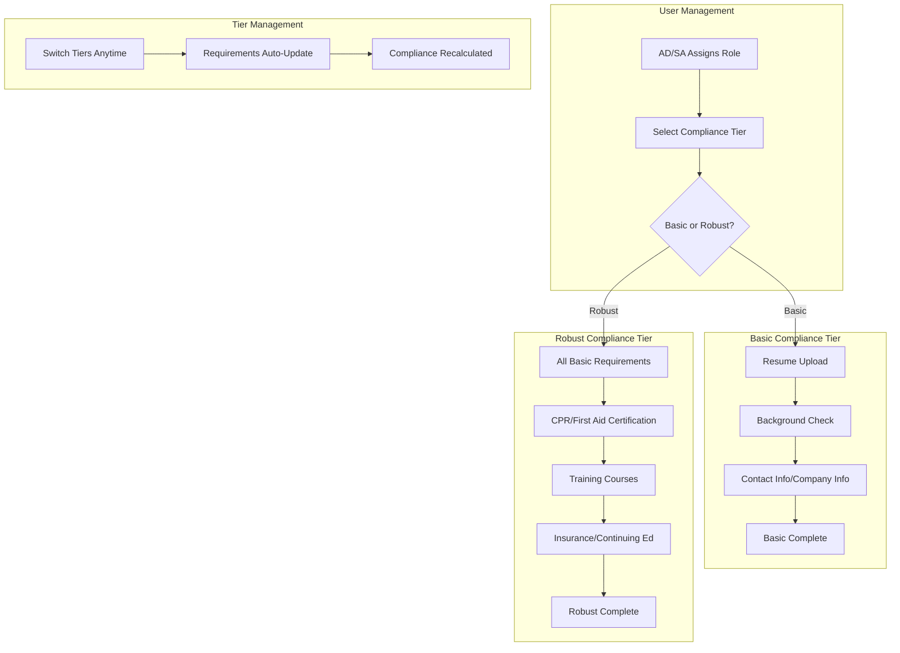
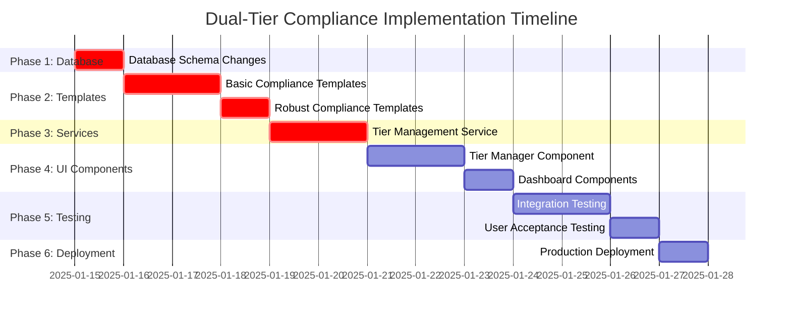

# Dual-Tier Compliance Implementation Plan
## Basic vs Robust Compliance Strategy - Full Implementation Guide

**Document Version:** 1.0  
**Created:** June 23, 2025  
**Status:** Ready for Implementation  
**Estimated Timeline:** 12 days

---

## Executive Summary

This plan implements a flexible dual-tier compliance system allowing administrators to assign either **Basic Compliance** (document requirements only) or **Robust Compliance** (current comprehensive + document requirements) on a user-by-user basis.

### Key Features
- **Basic Tier**: Resume, background check, basic company info (quick onboarding)
- **Robust Tier**: All current requirements + new document requirements (full certification)
- **User-Level Control**: AD/SA can switch tiers per user
- **Seamless Integration**: Works with existing user management workflow

---

## Architecture Overview



---

## Implementation Phases

### **Phase 1: Database Schema Enhancement (Priority: Critical)**
**Duration:** 1 day

#### **Step 1.1: Add Compliance Tier Tracking**
**New File:** `db/migrations/20250624_add_compliance_tier_support.sql`

```sql
-- Add compliance tier column to profiles table
ALTER TABLE profiles 
ADD COLUMN compliance_tier VARCHAR(20) DEFAULT 'basic' 
CHECK (compliance_tier IN ('basic', 'robust'));

-- Add index for performance
CREATE INDEX idx_profiles_compliance_tier ON profiles(compliance_tier);

-- Add metadata for compliance templates
CREATE TABLE IF NOT EXISTS compliance_templates (
    id UUID DEFAULT gen_random_uuid() PRIMARY KEY,
    role VARCHAR(10) NOT NULL,
    tier VARCHAR(20) NOT NULL,
    template_name VARCHAR(100) NOT NULL,
    description TEXT,
    is_active BOOLEAN DEFAULT true,
    created_at TIMESTAMP WITH TIME ZONE DEFAULT NOW(),
    updated_at TIMESTAMP WITH TIME ZONE DEFAULT NOW(),
    
    UNIQUE(role, tier)
);

-- Create index for template lookups
CREATE INDEX idx_compliance_templates_role_tier ON compliance_templates(role, tier);

-- Add tier information to compliance_metrics if needed
ALTER TABLE compliance_metrics 
ADD COLUMN applicable_tiers VARCHAR(50) DEFAULT 'basic,robust';

-- Update RLS policies if needed
CREATE POLICY "Users can view their compliance tier" ON profiles
FOR SELECT USING (auth.uid() = id);

CREATE POLICY "Admins can manage compliance tiers" ON profiles
FOR UPDATE USING (
  EXISTS (
    SELECT 1 FROM profiles 
    WHERE profiles.id = auth.uid() 
    AND profiles.role IN ('SA', 'AD')
  )
);
```

#### **Step 1.2: Initialize Template Metadata**
```sql
-- Insert basic template metadata
INSERT INTO compliance_templates (role, tier, template_name, description) VALUES
('AP', 'basic', 'Authorized Provider - Basic', 'Essential onboarding requirements'),
('AP', 'robust', 'Authorized Provider - Comprehensive', 'Full compliance requirements'),
('IC', 'basic', 'Instructor Certified - Basic', 'Essential certification requirements'),
('IC', 'robust', 'Instructor Certified - Comprehensive', 'Full professional requirements'),
('IP', 'basic', 'Instructor Provisional - Basic', 'Essential provisional requirements'),
('IP', 'robust', 'Instructor Provisional - Comprehensive', 'Full provisional requirements'),
('IT', 'basic', 'Instructor Trainee - Basic', 'Essential onboarding requirements'),
('IT', 'robust', 'Instructor Trainee - Comprehensive', 'Full training requirements');
```

### **Phase 2: Dual Compliance Templates (Priority: Critical)**
**Duration:** 3 days  
**Files Modified:** [`src/services/compliance/complianceRequirementsService.ts`](src/services/compliance/complianceRequirementsService.ts)

#### **Step 2.1: Create Basic Compliance Templates**
Add to [`complianceRequirementsService.ts`](src/services/compliance/complianceRequirementsService.ts):

```typescript
// Basic Compliance Templates (Document Requirements Only)
const BASIC_COMPLIANCE_TEMPLATES: Record<string, RoleComplianceTemplate> = {
  'AP_BASIC': {
    role: 'AP',
    tier: 'basic',
    role_name: 'Authorized Provider - Basic',
    description: 'Essential onboarding requirements for Authorized Providers',
    requirements: [
      {
        name: 'Resume Upload',
        description: 'Current resume demonstrating business experience',
        category: 'documentation',
        measurement_type: 'boolean',
        target_value: true,
        weight: 20,
        is_required: true,
        document_requirements: {
          required_file_types: ['PDF', 'DOC', 'DOCX'],
          max_file_size_mb: 5,
          requires_expiry_date: false,
          description: 'Upload current resume with business experience'
        }
      },
      {
        name: 'Background Check',
        description: 'Current background check clearance',
        category: 'background_check',
        measurement_type: 'boolean',
        target_value: true,
        weight: 50,
        is_required: true,
        renewal_period_days: 1095, // 3 years
        document_requirements: {
          required_file_types: ['PDF'],
          max_file_size_mb: 5,
          requires_expiry_date: true,
          auto_expire_days: 1095,
          description: 'Upload current background check report'
        }
      },
      {
        name: 'Company Information Form',
        description: 'Basic company information and contact details',
        category: 'documentation',
        measurement_type: 'boolean',
        target_value: true,
        weight: 30,
        is_required: true,
        document_requirements: {
          required_file_types: ['PDF', 'DOC', 'DOCX'],
          max_file_size_mb: 5,
          requires_expiry_date: false,
          description: 'Complete basic company information form'
        }
      }
    ]
  },

  'IC_BASIC': {
    role: 'IC',
    tier: 'basic',
    role_name: 'Instructor Certified - Basic',
    description: 'Essential requirements for certified instructors',
    requirements: [
      {
        name: 'Resume Upload',
        description: 'Current resume demonstrating teaching experience',
        category: 'documentation',
        measurement_type: 'boolean',
        target_value: true,
        weight: 30,
        is_required: true,
        document_requirements: {
          required_file_types: ['PDF', 'DOC', 'DOCX'],
          max_file_size_mb: 5,
          requires_expiry_date: false,
          description: 'Upload current resume with teaching experience'
        }
      },
      {
        name: 'Background Check',
        description: 'Current background check clearance',
        category: 'background_check',
        measurement_type: 'boolean',
        target_value: true,
        weight: 70,
        is_required: true,
        renewal_period_days: 1095, // 3 years
        document_requirements: {
          required_file_types: ['PDF'],
          max_file_size_mb: 5,
          requires_expiry_date: true,
          auto_expire_days: 1095,
          description: 'Upload current background check report'
        }
      }
    ]
  },

  'IP_BASIC': {
    role: 'IP',
    tier: 'basic',
    role_name: 'Instructor Provisional - Basic',
    description: 'Essential requirements for provisional instructors',
    requirements: [
      {
        name: 'Resume Upload',
        description: 'Current resume demonstrating relevant experience',
        category: 'documentation',
        measurement_type: 'boolean',
        target_value: true,
        weight: 30,
        is_required: true,
        document_requirements: {
          required_file_types: ['PDF', 'DOC', 'DOCX'],
          max_file_size_mb: 5,
          requires_expiry_date: false,
          description: 'Upload current resume with relevant experience'
        }
      },
      {
        name: 'Background Check',
        description: 'Current background check clearance',
        category: 'background_check',
        measurement_type: 'boolean',
        target_value: true,
        weight: 70,
        is_required: true,
        renewal_period_days: 1095, // 3 years
        document_requirements: {
          required_file_types: ['PDF'],
          max_file_size_mb: 5,
          requires_expiry_date: true,
          auto_expire_days: 1095,
          description: 'Upload current background check report'
        }
      }
    ]
  },

  'IT_BASIC': {
    role: 'IT',
    tier: 'basic',
    role_name: 'Instructor Trainee - Basic',
    description: 'Essential onboarding requirements for instructor trainees',
    requirements: [
      {
        name: 'Resume Upload',
        description: 'Current resume demonstrating relevant experience',
        category: 'documentation',
        measurement_type: 'boolean',
        target_value: true,
        weight: 25,
        is_required: true,
        document_requirements: {
          required_file_types: ['PDF', 'DOC', 'DOCX'],
          max_file_size_mb: 5,
          requires_expiry_date: false,
          description: 'Upload current resume with relevant experience'
        }
      },
      {
        name: 'Contact Information Verification',
        description: 'Verified contact details including emergency contact',
        category: 'documentation',
        measurement_type: 'boolean',
        target_value: true,
        weight: 25,
        is_required: true,
        document_requirements: {
          required_file_types: ['PDF', 'JPG', 'PNG'],
          max_file_size_mb: 2,
          requires_expiry_date: false,
          description: 'Upload verification of contact information'
        }
      },
      {
        name: 'Background Check',
        description: 'Current background check clearance',
        category: 'background_check',
        measurement_type: 'boolean',
        target_value: true,
        weight: 50,
        is_required: true,
        renewal_period_days: 1095, // 3 years
        document_requirements: {
          required_file_types: ['PDF'],
          max_file_size_mb: 5,
          requires_expiry_date: true,
          auto_expire_days: 1095,
          description: 'Upload current background check report'
        }
      }
    ]
  }
};
```

#### **Step 2.2: Create Robust Compliance Templates**
Add to [`complianceRequirementsService.ts`](src/services/compliance/complianceRequirementsService.ts):

```typescript
// Robust Compliance Templates (Current + Document Requirements)
const ROBUST_COMPLIANCE_TEMPLATES: Record<string, RoleComplianceTemplate> = {
  'AP_ROBUST': {
    role: 'AP',
    tier: 'robust',
    role_name: 'Authorized Provider - Comprehensive',
    description: 'Full compliance requirements for Authorized Providers',
    requirements: [
      // NEW DOCUMENT REQUIREMENTS
      {
        name: 'Resume Upload',
        description: 'Current resume demonstrating business experience',
        category: 'documentation',
        measurement_type: 'boolean',
        target_value: true,
        weight: 5,
        is_required: true,
        document_requirements: {
          required_file_types: ['PDF', 'DOC', 'DOCX'],
          max_file_size_mb: 5,
          requires_expiry_date: false,
          description: 'Upload current resume with business experience'
        }
      },
      {
        name: 'Company Information Form',
        description: 'Detailed company information and contact details',
        category: 'documentation',
        measurement_type: 'boolean',
        target_value: true,
        weight: 5,
        is_required: true,
        document_requirements: {
          required_file_types: ['PDF', 'DOC', 'DOCX'],
          max_file_size_mb: 5,
          requires_expiry_date: false,
          description: 'Complete detailed company information form'
        }
      },
      
      // ALL EXISTING REQUIREMENTS (adjusted weights)
      {
        name: 'Provider Authorization Certificate',
        description: 'Valid authorization certificate from regulatory body',
        category: 'certification',
        measurement_type: 'boolean',
        target_value: true,
        weight: 22, // Reduced from 25
        is_required: true,
        renewal_period_days: 365,
        document_requirements: {
          required_file_types: ['PDF', 'JPG', 'PNG'],
          max_file_size_mb: 10,
          requires_expiry_date: true,
          auto_expire_days: 365,
          description: 'Upload current provider authorization certificate'
        }
      },
      {
        name: 'Liability Insurance',
        description: 'Current liability insurance coverage',
        category: 'documentation',
        measurement_type: 'boolean',
        target_value: true,
        weight: 18, // Reduced from 20
        is_required: true,
        renewal_period_days: 365,
        document_requirements: {
          required_file_types: ['PDF'],
          max_file_size_mb: 5,
          requires_expiry_date: true,
          auto_expire_days: 365,
          description: 'Upload current liability insurance policy'
        }
      },
      {
        name: 'Background Check',
        description: 'Current background check clearance',
        category: 'background_check',
        measurement_type: 'boolean',
        target_value: true,
        weight: 18, // Reduced from 20
        is_required: true,
        renewal_period_days: 1095, // 3 years
        document_requirements: {
          required_file_types: ['PDF'],
          max_file_size_mb: 5,
          requires_expiry_date: true,
          auto_expire_days: 1095,
          description: 'Upload current background check report'
        }
      },
      {
        name: 'Provider Training Completion',
        description: 'Completion of provider training program',
        category: 'training',
        measurement_type: 'boolean',
        target_value: true,
        weight: 13, // Reduced from 15
        is_required: true,
        document_requirements: {
          required_file_types: ['PDF'],
          max_file_size_mb: 5,
          requires_expiry_date: false,
          description: 'Upload provider training completion certificate'
        }
      },
      {
        name: 'Annual Provider Report',
        description: 'Annual compliance and performance report',
        category: 'documentation',
        measurement_type: 'boolean',
        target_value: true,
        weight: 9, // Reduced from 10
        is_required: true,
        renewal_period_days: 365,
        document_requirements: {
          required_file_types: ['PDF'],
          max_file_size_mb: 10,
          requires_expiry_date: false,
          description: 'Upload annual provider compliance report'
        }
      },
      {
        name: 'Continuing Education Credits',
        description: 'Annual continuing education requirements',
        category: 'continuing_education',
        measurement_type: 'numeric',
        target_value: 20,
        weight: 10, // Same as before
        is_required: true,
        renewal_period_days: 365,
        document_requirements: {
          required_file_types: ['PDF'],
          max_file_size_mb: 5,
          requires_expiry_date: false,
          description: 'Upload continuing education certificates'
        }
      }
    ]
  },

  'IC_ROBUST': {
    role: 'IC',
    tier: 'robust',
    role_name: 'Instructor Certified - Comprehensive',
    description: 'Full compliance requirements for Instructor Certified',
    requirements: [
      // NEW DOCUMENT REQUIREMENT
      {
        name: 'Resume Upload',
        description: 'Updated resume demonstrating continued professional development',
        category: 'documentation',
        measurement_type: 'boolean',
        target_value: true,
        weight: 5,
        is_required: true,
        renewal_period_days: 365,
        document_requirements: {
          required_file_types: ['PDF', 'DOC', 'DOCX'],
          max_file_size_mb: 5,
          requires_expiry_date: false,
          description: 'Upload current resume showing professional development'
        }
      },
      
      // ALL EXISTING REQUIREMENTS (adjusted weights)
      {
        name: 'Background Check',
        description: 'Current background check clearance',
        category: 'background_check',
        measurement_type: 'boolean',
        target_value: true,
        weight: 24, // Reduced from 25
        is_required: true,
        renewal_period_days: 1095, // 3 years
        document_requirements: {
          required_file_types: ['PDF'],
          max_file_size_mb: 5,
          requires_expiry_date: true,
          auto_expire_days: 1095,
          description: 'Upload current background check report'
        }
      },
      {
        name: 'Basic Training Course',
        description: 'Completion of basic instructor training course',
        category: 'training',
        measurement_type: 'boolean',
        target_value: true,
        weight: 28, // Reduced from 30
        is_required: true,
        document_requirements: {
          required_file_types: ['PDF'],
          max_file_size_mb: 5,
          requires_expiry_date: false,
          description: 'Upload basic training completion certificate'
        }
      },
      {
        name: 'Teaching Practice Hours',
        description: 'Required teaching practice hours under supervision',
        category: 'training',
        measurement_type: 'numeric',
        target_value: 40,
        weight: 23, // Reduced from 25
        is_required: true,
        document_requirements: {
          required_file_types: ['PDF'],
          max_file_size_mb: 5,
          requires_expiry_date: false,
          description: 'Upload teaching hours log and supervisor evaluation'
        }
      },
      {
        name: 'CPR/First Aid Certification',
        description: 'Current CPR and First Aid certification',
        category: 'certification',
        measurement_type: 'boolean',
        target_value: true,
        weight: 15, // Same as before
        is_required: true,
        renewal_period_days: 730, // 2 years
        document_requirements: {
          required_file_types: ['PDF', 'JPG', 'PNG'],
          max_file_size_mb: 5,
          requires_expiry_date: true,
          auto_expire_days: 730,
          description: 'Upload current CPR/First Aid certificate'
        }
      },
      {
        name: 'Written Examination',
        description: 'Pass written instructor examination',
        category: 'certification',
        measurement_type: 'percentage',
        target_value: 80,
        weight: 5, // Same as before
        is_required: true,
        document_requirements: {
          required_file_types: ['PDF'],
          max_file_size_mb: 5,
          requires_expiry_date: false,
          description: 'Upload examination results'
        }
      }
    ]
  },

  'IP_ROBUST': {
    role: 'IP',
    tier: 'robust',
    role_name: 'Instructor Provisional - Comprehensive',
    description: 'Full compliance requirements for Instructor Provisional',
    requirements: [
      // NEW DOCUMENT REQUIREMENT
      {
        name: 'Resume Upload',
        description: 'Current resume demonstrating relevant experience',
        category: 'documentation',
        measurement_type: 'boolean',
        target_value: true,
        weight: 8,
        is_required: true,
        document_requirements: {
          required_file_types: ['PDF', 'DOC', 'DOCX'],
          max_file_size_mb: 5,
          requires_expiry_date: false,
          description: 'Upload current resume with relevant training experience'
        }
      },
      
      // ALL EXISTING REQUIREMENTS (adjusted weights)
      {
        name: 'Background Check',
        description: 'Current background check clearance',
        category: 'background_check',
        measurement_type: 'boolean',
        target_value: true,
        weight: 27, // Reduced from 30
        is_required: true,
        renewal_period_days: 1095, // 3 years
        document_requirements: {
          required_file_types: ['PDF'],
          max_file_size_mb: 5,
          requires_expiry_date: true,
          auto_expire_days: 1095,
          description: 'Upload current background check report'
        }
      },
      {
        name: 'Participation Training',
        description: 'Completion of participant training program',
        category: 'training',
        measurement_type: 'boolean',
        target_value: true,
        weight: 32, // Reduced from 35
        is_required: true,
        document_requirements: {
          required_file_types: ['PDF'],
          max_file_size_mb: 5,
          requires_expiry_date: false,
          description: 'Upload participation training completion certificate'
        }
      },
      {
        name: 'Practical Assessment',
        description: 'Pass practical skills assessment',
        category: 'certification',
        measurement_type: 'percentage',
        target_value: 75,
        weight: 18, // Reduced from 20
        is_required: true,
        document_requirements: {
          required_file_types: ['PDF'],
          max_file_size_mb: 5,
          requires_expiry_date: false,
          description: 'Upload practical assessment results'
        }
      },
      {
        name: 'CPR/First Aid Certification',
        description: 'Current CPR and First Aid certification',
        category: 'certification',
        measurement_type: 'boolean',
        target_value: true,
        weight: 15, // Same as before
        is_required: true,
        renewal_period_days: 730, // 2 years
        document_requirements: {
          required_file_types: ['PDF', 'JPG', 'PNG'],
          max_file_size_mb: 5,
          requires_expiry_date: true,
          auto_expire_days: 730,
          description: 'Upload current CPR/First Aid certificate'
        }
      }
    ]
  },

  'IT_ROBUST': {
    role: 'IT',
    tier: 'robust',
    role_name: 'Instructor Trainee - Comprehensive',
    description: 'Full compliance requirements for Instructor Trainees',
    requirements: [
      // NEW DOCUMENT REQUIREMENTS
      {
        name: 'Resume Upload',
        description: 'Current resume demonstrating relevant experience',
        category: 'documentation',
        measurement_type: 'boolean',
        target_value: true,
        weight: 10,
        is_required: true,
        document_requirements: {
          required_file_types: ['PDF', 'DOC', 'DOCX'],
          max_file_size_mb: 5,
          requires_expiry_date: false,
          description: 'Upload current resume with relevant experience'
        }
      },
      {
        name: 'Contact Information Verification',
        description: 'Verified contact details including emergency contact',
        category: 'documentation',
        measurement_type: 'boolean',
        target_value: true,
        weight: 5,
        is_required: true,
        document_requirements: {
          required_file_types: ['PDF', 'JPG', 'PNG'],
          max_file_size_mb: 2,
          requires_expiry_date: false,
          description: 'Upload verification of contact information'
        }
      },
      
      // ALL EXISTING REQUIREMENTS (adjusted weights)
      {
        name: 'Background Check',
        description: 'Current background check clearance',
        category: 'background_check',
        measurement_type: 'boolean',
        target_value: true,
        weight: 35, // Reduced from 40
        is_required: true,
        renewal_period_days: 1095, // 3 years
        document_requirements: {
          required_file_types: ['PDF'],
          max_file_size_mb: 5,
          requires_expiry_date: true,
          auto_expire_days: 1095,
          description: 'Upload current background check report'
        }
      },
      {
        name: 'Orientation Training',
        description: 'Completion of orientation training program',
        category: 'training',
        measurement_type: 'boolean',
        target_value: true,
        weight: 35, // Reduced from 40
        is_required: true,
        document_requirements: {
          required_file_types: ['PDF'],
          max_file_size_mb: 5,
          requires_expiry_date: false,
          description: 'Upload orientation training completion certificate'
        }
      },
      {
        name: 'Basic Safety Training',
        description: 'Completion of basic safety training',
        category: 'training',
        measurement_type: 'boolean',
        target_value: true,
        weight: 15, // Reduced from 20
        is_required: true,
        document_requirements: {
          required_file_types: ['PDF'],
          max_file_size_mb: 5,
          requires_expiry_date: false,
          description: 'Upload safety training completion certificate'
        }
      }
    ]
  }
};
```

#### **Step 2.3: Update ComplianceRequirementsService Methods**
Add new methods to [`complianceRequirementsService.ts`](src/services/compliance/complianceRequirementsService.ts):

```typescript
export class ComplianceRequirementsService {
  
  // ... existing methods ...

  /**
   * Get compliance requirements template for a specific role and tier
   */
  static getRequirementsTemplateByTier(
    role: 'AP' | 'IC' | 'IP' | 'IT', 
    tier: 'basic' | 'robust'
  ): RoleComplianceTemplate | null {
    const templateKey = `${role}_${tier.toUpperCase()}`;
    
    if (tier === 'basic') {
      return BASIC_COMPLIANCE_TEMPLATES[templateKey] || null;
    } else {
      return ROBUST_COMPLIANCE_TEMPLATES[templateKey] || null;
    }
  }

  /**
   * Get all available templates for a role (both tiers)
   */
  static getAllTemplatesForRole(role: 'AP' | 'IC' | 'IP' | 'IT'): {
    basic: RoleComplianceTemplate | null;
    robust: RoleComplianceTemplate | null;
  } {
    return {
      basic: this.getRequirementsTemplateByTier(role, 'basic'),
      robust: this.getRequirementsTemplateByTier(role, 'robust')
    };
  }

  /**
   * Initialize both basic and robust compliance requirements
   */
  static async initializeAllComplianceRequirements(): Promise<void> {
    try {
      console.log('DEBUG: Initializing both basic and robust compliance requirements');
      
      // Initialize basic templates
      for (const [templateKey, template] of Object.entries(BASIC_COMPLIANCE_TEMPLATES)) {
        await this.initializeTemplateRequirements(template);
      }
      
      // Initialize robust templates
      for (const [templateKey, template] of Object.entries(ROBUST_COMPLIANCE_TEMPLATES)) {
        await this.initializeTemplateRequirements(template);
      }
      
      console.log('DEBUG: Successfully initialized all compliance requirements');
    } catch (error) {
      console.error('Error initializing all compliance requirements:', error);
      throw error;
    }
  }

  /**
   * Helper method to initialize requirements for a specific template
   */
  private static async initializeTemplateRequirements(template: RoleComplianceTemplate): Promise<void> {
    console.log(`DEBUG: Setting up requirements for ${template.role_name} (${template.tier || 'default'})`);
    
    for (const requirement of template.requirements) {
      try {
        // Create compliance metric
        const metric = await ComplianceService.upsertComplianceMetric({
          name: `${requirement.name} (${template.tier || 'default'})`,
          description: requirement.description,
          category: requirement.category,
          required_for_roles: [template.role],
          measurement_type: requirement.measurement_type,
          target_value: requirement.target_value,
          weight: requirement.weight,
          is_active: true,
          applicable_tiers: template.tier || 'basic,robust'
        });
        
        // Create document requirement if specified
        if (requirement.document_requirements) {
          await ComplianceService.createDocumentRequirement({
            metric_id: metric.id,
            document_type: requirement.category,
            required_file_types: requirement.document_requirements.required_file_types,
            max_file_size_mb: requirement.document_requirements.max_file_size_mb,
            requires_expiry_date: requirement.document_requirements.requires_expiry_date,
            auto_expire_days: requirement.document_requirements.auto_expire_days,
            description: requirement.document_requirements.description
          });
        }
        
        console.log(`DEBUG: Created ${requirement.name} for ${template.role_name}`);
      } catch (error) {
        console.error(`Error creating requirement ${requirement.name}:`, error);
        // Continue with other requirements
      }
    }
  }
}
```

### **Phase 3: Compliance Tier Management Service (Priority: Critical)**
**Duration:** 2 days  
**New File:** `src/services/compliance/complianceTierService.ts`

```typescript
import { supabase } from '@/integrations/supabase/client';
import { ComplianceRequirementsService } from './complianceRequirementsService';
import { ComplianceService } from './complianceService';

export interface ComplianceTierInfo {
  tier: 'basic' | 'robust';
  template_name: string;
  description: string;
  total_requirements: number;
  completed_requirements: number;
  completion_percentage: number;
}

export interface TierSwitchResult {
  success: boolean;
  message: string;
  requirements_added: number;
  requirements_removed: number;
}

export class ComplianceTierService {
  
  /**
   * Assign compliance tier to user and apply appropriate requirements
   */
  static async assignComplianceTier(
    userId: string, 
    role: 'AP' | 'IC' | 'IP' | 'IT', 
    tier: 'basic' | 'robust'
  ): Promise<TierSwitchResult> {
    
    try {
      console.log(`DEBUG: Assigning ${tier} compliance tier to user ${userId} with role ${role}`);
      
      // Update user's compliance tier
      const { error: profileError } = await supabase
        .from('profiles')
        .update({ compliance_tier: tier })
        .eq('id', userId);
      
      if (profileError) throw profileError;
      
      // Get appropriate requirements template
      const template = ComplianceRequirementsService.getRequirementsTemplateByTier(role, tier);
      
      if (!template) {
        throw new Error(`No template found for ${role} with ${tier} tier`);
      }
      
      // Clear existing compliance requirements for this user
      await this.clearUserCompliance(userId);
      
      // Get tier-specific requirements
      const tierRequirements = await this.getTierSpecificRequirements(role, tier);
      
      // Create initial compliance records for each requirement
      let addedCount = 0;
      for (const requirement of tierRequirements) {
        try {
          await ComplianceService.updateComplianceRecord(
            userId,
            requirement.id,
            null, // No initial value
            'pending', // Initial status
            `${tier.charAt(0).toUpperCase() + tier.slice(1)} tier requirement for role ${role}`
          );
          
          addedCount++;
          console.log(`DEBUG: Created compliance record for ${requirement.name}`);
        } catch (error) {
          console.error(`Error creating compliance record for ${requirement.name}:`, error);
          // Continue with other requirements
        }
      }
      
      return {
        success: true,
        message: `Successfully assigned ${tier} compliance tier`,
        requirements_added: addedCount,
        requirements_removed: 0
      };
      
    } catch (error) {
      console.error('Error assigning compliance tier:', error);
      return {
        success: false,
        message: `Failed to assign compliance tier: ${error instanceof Error ? error.message : 'Unknown error'}`,
        requirements_added: 0,
        requirements_removed: 0
      };
    }
  }
  
  /**
   * Get user's current compliance tier information
   */
  static async getUserComplianceTierInfo(userId: string): Promise<ComplianceTierInfo | null> {
    try {
      const { data: profile, error: profileError } = await supabase
        .from('profiles')
        .select('compliance_tier, role')
        .eq('id', userId)
        .single();
      
      if (profileError) throw profileError;
      
      const tier = profile.compliance_tier || 'basic';
      const role = profile.role;
      
      // Get template information
      const template = ComplianceRequirementsService.getRequirementsTemplateByTier(role, tier);
      
      if (!template) {
        return null;
      }
      
      // Get user's compliance records
      const userRecords = await ComplianceService.getUserComplianceRecords(userId);
      const completedCount = userRecords.filter(record => 
        record.status === 'compliant' || record.status === 'approved'
      ).length;
      
      return {
        tier: tier,
        template_name: template.role_name,
        description: template.description,
        total_requirements: template.requirements.length,
        completed_requirements: completedCount,
        completion_percentage: template.requirements.length > 0 
          ? Math.round((completedCount / template.requirements.length) * 100)
          : 0
      };
      
    } catch (error) {
      console.error('Error getting user compliance tier info:', error);
      return null;
    }
  }
  
  /**
   * Switch user between compliance tiers
   */
  static async switchComplianceTier(
    userId: string,
    newTier: 'basic' | 'robust'
  ): Promise<TierSwitchResult> {
    
    try {
      // Get user's current role
      const { data: profile, error: profileError } = await supabase
        .from('profiles')
        .select('role, compliance_tier')
        .eq('id', userId)
        .single();
      
      if (profileError) throw profileError;
      if (!profile) throw new Error('User not found');
      
      const currentTier = profile.compliance_tier || 'basic';
      
      if (currentTier === newTier) {
        return {
          success: true,
          message: `User is already on ${newTier} tier`,
          requirements_added: 0,
          requirements_removed: 0
        };
      }
      
      console.log(`DEBUG: Switching user ${userId} from ${currentTier} to ${newTier} tier`);
      
      // Reassign compliance with new tier
      return await this.assignComplianceTier(userId, profile.role, newTier);
      
    } catch (error) {
      console.error('Error switching compliance tier:', error);
      return {
        success: false,
        message: `Failed to switch compliance tier: ${error instanceof Error ? error.message : 'Unknown error'}`,
        requirements_added: 0,
        requirements_removed: 0
      };
    }
  }
  
  /**
   * Get all users with their compliance tier information
   */
  static async getAllUsersComplianceTiers(): Promise<Array<{
    user_id: string;
    display_name: string;
    email: string;
    role: string;
    compliance_tier: 'basic' | 'robust';
    completion_percentage: number;
  }>> {
    try {
      const { data: profiles, error } = await supabase
        .from('profiles')
        .select('id, display_name, email, role, compliance_tier')
        .in('role', ['AP', 'IC', 'IP', 'IT']);
      
      if (error) throw error;
      
      const results = [];
      
      for (const profile of profiles || []) {
        const tierInfo = await this.getUserComplianceTierInfo(profile.id);
        
        results.push({
          user_id: profile.id,
          display_name: profile.display_name || 'Unknown',
          email: profile.email || '',
          role: profile.role,
          compliance_tier: profile.compliance_tier || 'basic',
          completion_percentage: tierInfo?.completion_percentage || 0
        });
      }
      
      return results;
      
    } catch (error) {
      console.error('Error getting all users compliance tiers:', error);
      return [];
    }
  }
  
  /**
   * Get tier-specific requirements for a role
   */
  private static async getTierSpecificRequirements(
    role: 'AP' | 'IC' | 'IP' | 'IT',
    tier: 'basic' | 'robust'
  ) {
    // This would query the compliance_metrics table for requirements
    // that apply to the specific role and tier combination
    const { data: requirements, error } = await supabase
      .from('compliance_metrics')
      .select('*')
      .contains('required_for_roles', [role])
      .like('applicable_tiers', `%${tier}%`);
    
    if (error) throw error;
    return requirements || [];
  }
  
  /**
   * Clear existing compliance requirements for a user
   */
  private static async clearUserCompliance(userId: string): Promise<void> {
    const { error } = await supabase
      .from('compliance_records')
      .delete()
      .eq('user_id', userId);
    
    if (error) {
      console.error('Error clearing user compliance:', error);
      // Don't throw - we want to continue with adding new requirements
    }
  }
  
  /**
   * Get compliance tier statistics
   */
  static async getComplianceTierStatistics(): Promise<{
    basic_tier_users: number;
    robust_tier_users: number;
    basic_completion_avg: number;
    robust_completion_avg: number;
  }> {
    try {
      const allUsers = await this.getAllUsersComplianceTiers();
      
      const basicUsers = allUsers.filter(user => user.compliance_tier === 'basic');
      const robustUsers = allUsers.filter(user => user.compliance_tier === 'robust');
      
      const basicCompletionAvg = basicUsers.length > 0
        ? Math.round(basicUsers.reduce((sum, user) => sum + user.completion_percentage, 0) / basicUsers.length)
        : 0;
      
      const robustCompletionAvg = robustUsers.length > 0
        ? Math.round(robustUsers.reduce((sum, user) => sum + user.completion_percentage, 0) / robustUsers.length)
        : 0;
      
      return {
        basic_tier_users: basicUsers.length,
        robust_tier_users: robustUsers.length,
        basic_completion_avg: basicCompletionAvg,
        robust_completion_avg: robustCompletionAvg
      };
      
    } catch (error) {
      console.error('Error getting compliance tier statistics:', error);
      return {
        basic_tier_users: 0,
        robust_tier_users: 0,
        basic_completion_avg: 0,
        robust_completion_avg: 0
      };
    }
  }
}
```

### **Phase 4: User Interface Components (Priority: High)**
**Duration:** 3 days

#### **Step 4.1: Compliance Tier Manager Component**
**New File:** `src/components/compliance/ComplianceTierManager.tsx`

```typescript
import React, { useState, useEffect } from 'react';
import { Card, CardContent, CardHeader, CardTitle, CardDescription } from '@/components/ui/card';
import { Button } from '@/components/ui/button';
import { RadioGroup, RadioGroupItem } from '@/components/ui/radio-group';
import { Label } from '@/components/ui/label';
import { Alert, AlertDescription } from '@/components/ui/alert';
import { Badge } from '@/components/ui/badge';
import { Progress } from '@/components/ui/progress';
import { 
  Settings, 
  Shield, 
  CheckCircle, 
  AlertCircle, 
  Users, 
  FileText,
  Clock
} from 'lucide-react';
import { ComplianceTierService, ComplianceTierInfo, TierSwitchResult } from '@/services/compliance/complianceTierService';
import { toast } from 'sonner';

interface ComplianceTierManagerProps {
  userId: string;
  userRole: 'AP' | 'IC' | 'IP' | 'IT';
  userName: string;
  canManage?: boolean;
}

export function ComplianceTierManager({ 
  userId, 
  userRole, 
  userName, 
  canManage = false 
}: ComplianceTierManagerProps) {
  const [tierInfo, setTierInfo] = useState<ComplianceTierInfo | null>(null);
  const [isChanging, setIsChanging] = useState(false);
  const [isLoading, setIsLoading] = useState(true);

  useEffect(() => {
    loadTierInfo();
  }, [userId]);

  const loadTierInfo = async () => {
    try {
      setIsLoading(true);
      const info = await ComplianceTierService.getUserComplianceTierInfo(userId);
      setTierInfo(info);
    } catch (error) {
      console.error('Error loading tier info:', error);
      toast.error('Failed to load compliance tier information');
    } finally {
      setIsLoading(false);
    }
  };

  const handleTierChange = async (newTier: 'basic' | 'robust') => {
    if (!canManage) {
      toast.error('You do not have permission to change compliance tiers');
      return;
    }

    setIsChanging(true);
    try {
      const result: TierSwitchResult = await ComplianceTierService.switchComplianceTier(userId, newTier);
      
      if (result.success) {
        toast.success(result.message);
        await loadTierInfo(); // Reload tier information
      } else {
        toast.error(result.message);
      }
    } catch (error) {
      console.error('Error changing tier:', error);
      toast.error('Failed to update compliance tier');
    } finally {
      setIsChanging(false);
    }
  };

  const getTierIcon = (tier: 'basic' | 'robust') => {
    return tier === 'basic' ? <FileText className="h-4 w-4" /> : <Shield className="h-4 w-4" />;
  };

  const getTierColor = (tier: 'basic' | 'robust') => {
    return tier === 'basic' ? 'bg-blue-50 border-blue-200' : 'bg-green-50 border-green-200';
  };

  if (isLoading) {
    return (
      <Card>
        <CardHeader>
          <CardTitle className="flex items-center gap-2">
            <Settings className="h-5 w-5" />
            Compliance Tier
          </CardTitle>
        </CardHeader>
        <CardContent>
          <div className="flex items-center gap-2">
            <Clock className="h-4 w-4 animate-spin" />
            Loading compliance information...
          </div>
        </CardContent>
      </Card>
    );
  }

  if (!tierInfo) {
    return (
      <Card>
        <CardHeader>
          <CardTitle className="flex items-center gap-2">
            <AlertCircle className="h-5 w-5 text-red-500" />
            Compliance Tier
          </CardTitle>
        </CardHeader>
        <CardContent>
          <Alert variant="destructive">
            <AlertCircle className="h-4 w-4" />
            <AlertDescription>
              Unable to load compliance tier information for this user.
            </AlertDescription>
          </Alert>
        </CardContent>
      </Card>
    );
  }

  return (
    <Card>
      <CardHeader>
        <CardTitle className="flex items-center justify-between">
          <div className="flex items-center gap-2">
            <Settings className="h-5 w-5" />
            Compliance Tier - {userName}
          </div>
          <Badge variant="outline" className={getTierColor(tierInfo.tier)}>
            {getTierIcon(tierInfo.tier)}
            {tierInfo.tier.charAt(0).toUpperCase() + tierInfo.tier.slice(1)}
          </Badge>
        </CardTitle>
        <CardDescription>
          {tierInfo.description}
        </CardDescription>
      </CardHeader>
      
      <CardContent className="space-y-6">
        {/* Current Status */}
        <div className="space-y-3">
          <div className="flex items-center justify-between">
            <Label className="text-sm font-medium">Completion Status</Label>
            <span className="text-sm text-muted-foreground">
              {tierInfo.completed_requirements} of {tierInfo.total_requirements} requirements
            </span>
          </div>
          
          <Progress 
            value={tierInfo.completion_percentage} 
            className="h-2"
          />
          
          <div className="flex items-center gap-2 text-sm">
            {tierInfo.completion_percentage === 100 ? (
              <>
                <CheckCircle className="h-4 w-4 text-green-500" />
                <span className="text-green-700">All requirements completed</span>
              </>
            ) : (
              <>
                <AlertCircle className="h-4 w-4 text-yellow-500" />
                <span className="text-yellow-700">{tierInfo.completion_percentage}% completed</span>
              </>
            )}
          </div>
        </div>

        {/* Tier Selection (only if user can manage) */}
        {canManage && (
          <div className="space-y-4 border-t pt-4">
            <Label className="text-sm font-medium">Change Compliance Tier</Label>
            
            <RadioGroup
              value={tierInfo.tier}
              onValueChange={handleTierChange}
              disabled={isChanging}
              className="space-y-4"
            >
              <div className="flex items-start space-x-3 p-3 border rounded-lg bg-blue-50 border-blue-200">
                <RadioGroupItem value="basic" id="basic" className="mt-1" />
                <div className="space-y-1 flex-1">
                  <Label htmlFor="basic" className="text-sm font-medium cursor-pointer">
                    <div className="flex items-center gap-2">
                      <FileText className="h-4 w-4" />
                      Basic Compliance
                    </div>
                  </Label>
                  <p className="text-xs text-muted-foreground">
                    Essential requirements only: resume upload, background check, basic company information.
                    Ideal for quick onboarding and temporary assignments.
                  </p>
                </div>
              </div>
              
              <div className="flex items-start space-x-3 p-3 border rounded-lg bg-green-50 border-green-200">
                <RadioGroupItem value="robust" id="robust" className="mt-1" />
                <div className="space-y-1 flex-1">
                  <Label htmlFor="robust" className="text-sm font-medium cursor-pointer">
                    <div className="flex items-center gap-2">
                      <Shield className="h-4 w-4" />
                      Robust Compliance
                    </div>
                  </Label>
                  <p className="text-xs text-muted-foreground">
                    Comprehensive requirements: all basic requirements plus training courses, 
                    certifications, insurance, and continuing education. Required for full certification.
                  </p>
                </div>
              </div>
            </RadioGroup>

            {isChanging && (
              <Alert>
                <Clock className="h-4 w-4 animate-spin" />
                <AlertDescription>
                  Updating compliance tier and reassigning requirements...
                </AlertDescription>
              </Alert>
            )}
          </div>
        )}

        {/* Information Alert */}
        <Alert>
          <Users className="h-4 w-4" />
          <AlertDescription>
            {canManage 
              ? "Changing the compliance tier will reassign all requirements. Previous compliance progress may be affected."
              : "Only administrators can change compliance tiers. Contact your administrator if you need tier adjustments."
            }
          </AlertDescription>
        </Alert>
      </CardContent>
    </Card>
  );
}
```

#### **Step 4.2: Enhanced User Management Integration**
**File to Update:** `src/components/user-management/UserTableRow.tsx`

Add compliance tier display and management:

```typescript
// Add to existing UserTableRow component
import { ComplianceTierManager } from '@/components/compliance/ComplianceTierManager';

// Add tier display in user row
<td className="p-4">
  <div className="flex items-center gap-2">
    <Badge variant="outline" 
           className={user.compliance_tier === 'robust' ? 'bg-green-50' : 'bg-blue-50'}>
      {user.compliance_tier === 'robust' ? 'Robust' : 'Basic'}
    </Badge>
  </div>
</td>

// Add tier manager in user details modal
<ComplianceTierManager
  userId={user.id}
  userRole={user.role}
  userName={user.display_name || user.email}
  canManage={canManageUsers}
/>
```

#### **Step 4.3: Compliance Dashboard Enhancement**
**New File:** `src/components/compliance/ComplianceTierDashboard.tsx`

```typescript
import React, { useState, useEffect } from 'react';
import { Card, CardContent, CardHeader, CardTitle } from '@/components/ui/card';
import { Badge } from '@/components/ui/badge';
import { Progress } from '@/components/ui/progress';
import { 
  Users, 
  Shield, 
  FileText, 
  TrendingUp,
  BarChart3
} from 'lucide-react';
import { ComplianceTierService } from '@/services/compliance/complianceTierService';

export function ComplianceTierDashboard() {
  const [statistics, setStatistics] = useState({
    basic_tier_users: 0,
    robust_tier_users: 0,
    basic_completion_avg: 0,
    robust_completion_avg: 0
  });
  const [allUsers, setAllUsers] = useState([]);
  const [isLoading, setIsLoading] = useState(true);

  useEffect(() => {
    loadDashboardData();
  }, []);

  const loadDashboardData = async () => {
    try {
      setIsLoading(true);
      const [stats, users] = await Promise.all([
        ComplianceTierService.getComplianceTierStatistics(),
        ComplianceTierService.getAllUsersComplianceTiers()
      ]);
      
      setStatistics(stats);
      setAllUsers(users);
    } catch (error) {
      console.error('Error loading dashboard data:', error);
    } finally {
      setIsLoading(false);
    }
  };

  const totalUsers = statistics.basic_tier_users + statistics.robust_tier_users;

  if (isLoading) {
    return (
      <div className="grid grid-cols-1 md:grid-cols-2 lg:grid-cols-4 gap-4">
        {[1, 2, 3, 4].map(i => (
          <Card key={i}>
            <CardContent className="p-6">
              <div className="animate-pulse">
                <div className="h-4 bg-gray-200 rounded w-3/4 mb-2"></div>
                <div className="h-8 bg-gray-200 rounded w-1/2"></div>
              </div>
            </CardContent>
          </Card>
        ))}
      </div>
    );
  }

  return (
    <div className="space-y-6">
      {/* Statistics Cards */}
      <div className="grid grid-cols-1 md:grid-cols-2 lg:grid-cols-4 gap-4">
        <Card>
          <CardHeader className="flex flex-row items-center justify-between space-y-0 pb-2">
            <CardTitle className="text-sm font-medium">Total Users</CardTitle>
            <Users className="h-4 w-4 text-muted-foreground" />
          </CardHeader>
          <CardContent>
            <div className="text-2xl font-bold">{totalUsers}</div>
            <p className="text-xs text-muted-foreground">
              Active compliance users
            </p>
          </CardContent>
        </Card>

        <Card>
          <CardHeader className="flex flex-row items-center justify-between space-y-0 pb-2">
            <CardTitle className="text-sm font-medium">Basic Tier</CardTitle>
            <FileText className="h-4 w-4 text-blue-500" />
          </CardHeader>
          <CardContent>
            <div className="text-2xl font-bold">{statistics.basic_tier_users}</div>
            <div className="flex items-center gap-2 mt-1">
              <Progress value={statistics.basic_completion_avg} className="h-1 flex-1" />
              <span className="text-xs text-muted-foreground">
                {statistics.basic_completion_avg}% avg
              </span>
            </div>
          </CardContent>
        </Card>

        <Card>
          <CardHeader className="flex flex-row items-center justify-between space-y-0 pb-2">
            <CardTitle className="text-sm font-medium">Robust Tier</CardTitle>
            <Shield className="h-4 w-4 text-green-500" />
          </CardHeader>
          <CardContent>
            <div className="text-2xl font-bold">{statistics.robust_tier_users}</div>
            <div className="flex items-center gap-2 mt-1">
              <Progress value={statistics.robust_completion_avg} className="h-1 flex-1" />
              <span className="text-xs text-muted-foreground">
                {statistics.robust_completion_avg}% avg
              </span>
            </div>
          </CardContent>
        </Card>

        <Card>
          <CardHeader className="flex flex-row items-center justify-between space-y-0 pb-2">
            <CardTitle className="text-sm font-medium">Completion Rate</CardTitle>
            <TrendingUp className="h-4 w-4 text-muted-foreground" />
          </CardHeader>
          <CardContent>
            <div className="text-2xl font-bold">
              {Math.round((statistics.basic_completion_avg + statistics.robust_completion_avg) / 2)}%
            </div>
            <p className="text-xs text-muted-foreground">
              Overall average
            </p>
          </CardContent>
        </Card>
      </div>

      {/* User List */}
      <Card>
        <CardHeader>
          <CardTitle className="flex items-center gap-2">
            <BarChart3 className="h-5 w-5" />
            Compliance Tier Overview
          </CardTitle>
        </CardHeader>
        <CardContent>
          <div className="space-y-4">
            {allUsers.map((user) => (
              <div key={user.user_id} className="flex items-center justify-between p-3 border rounded-lg">
                <div className="flex items-center gap-3">
                  <div>
                    <div className="font-medium">{user.display_name}</div>
                    <div className="text-sm text-muted-foreground">{user.email}</div>
                  </div>
                  <Badge variant="outline">{user.role}</Badge>
                </div>
                
                <div className="flex items-center gap-3">
                  <Badge 
                    variant="outline" 
                    className={user.compliance_tier === 'robust' ? 'bg-green-50' : 'bg-blue-50'}
                  >
                    {user.compliance_tier === 'robust' ? (
                      <Shield className="h-3 w-3 mr-1" />
                    ) : (
                      <FileText className="h-3 w-3 mr-1" />
                    )}
                    {user.compliance_tier.charAt(0).toUpperCase() + user.compliance_tier.slice(1)}
                  </Badge>
                  
                  <div className="flex items-center gap-2 min-w-[100px]">
                    <Progress value={user.completion_percentage} className="h-2 flex-1" />
                    <span className="text-sm text-muted-foreground">
                      {user.completion_percentage}%
                    </span>
                  </div>
                </div>
              </div>
            ))}
          </div>
        </CardContent>
      </Card>
    </div>
  );
}
```

### **Phase 5: Testing & Deployment (Priority: High)**
**Duration:** 3 days

#### **Step 5.1: Testing Checklist**
- [ ] Database migration runs successfully
- [ ] Both basic and robust templates initialize correctly
- [ ] Compliance tier assignment works for all roles
- [ ] Tier switching preserves appropriate data
- [ ] UI components render correctly
- [ ] Admin controls function properly
- [ ] User permissions respected
- [ ] Performance acceptable with tier calculations

#### **Step 5.2: Integration Testing Scenarios**

**Scenario 1: New User Basic Tier Assignment**
```typescript
// Test script
const testBasicTierAssignment = async () => {
  const userId = 'test-user-1';
  const role = 'IT';
  
  // Assign basic tier
  const result = await ComplianceTierService.assignComplianceTier(userId, role, 'basic');
  
  // Verify requirements assigned
  const tierInfo = await ComplianceTierService.getUserComplianceTierInfo(userId);
  
  console.log('Basic tier assignment:', result);
  console.log('Tier info:', tierInfo);
};
```

**Scenario 2: Tier Switching**
```typescript
const testTierSwitching = async () => {
  const userId = 'test-user-1';
  
  // Switch from basic to robust
  const switchResult = await ComplianceTierService.switchComplianceTier(userId, 'robust');
  
  // Verify new requirements
  const newTierInfo = await ComplianceTierService.getUserComplianceTierInfo(userId);
  
  console.log('Tier switch result:', switchResult);
  console.log('New tier info:', newTierInfo);
};
```

**Scenario 3: Role Change with Tier Preservation**
```typescript
const testRoleChangeWithTier = async () => {
  const userId = 'test-user-1';
  
  // Change role from IT to IP while maintaining robust tier
  const result = await ComplianceTierService.assignComplianceTier(userId, 'IP', 'robust');
  
  console.log('Role change with tier preservation:', result);
};
```

### **Phase 6: Documentation & Training**
**Duration:** 1 day

#### **Step 6.1: Administrator Guide**
Create documentation for administrators on:
- How to assign compliance tiers
- Understanding basic vs robust requirements
- When to use each tier
- How to switch tiers
- Monitoring compliance completion

#### **Step 6.2: User Guide**
Create documentation for users on:
- Understanding their compliance tier
- What requirements apply to their tier
- How to complete tier-specific requirements
- What happens when tiers change

---

## Implementation Timeline



## Week-by-Week Implementation Plan

### **Week 1: Foundation (Days 1-5)**
- **Day 1**: Database schema changes and migration
- **Day 2-4**: Create all compliance templates (basic and robust)
- **Day 5**: Initialize tier management service

### **Week 2: User Interface (Days 6-10)**
- **Day 6-8**: Build tier management components  
- **Day 9**: Integration with user management
- **Day 10**: Dashboard and reporting components

### **Week 3: Testing & Deployment (Days 11-12)**
- **Day 11-12**: Comprehensive testing and production deployment

---

## Deployment Procedures

### **Pre-Deployment Checklist**
- [ ] All code reviewed and approved
- [ ] Database migration tested in staging
- [ ] All compliance templates validated
- [ ] UI components tested across browsers
- [ ] Permission controls verified
- [ ] Performance benchmarks met

### **Deployment Steps**
1. **Deploy Database Migration**
   ```sql
   -- Run migration script
   \i db/migrations/20250624_add_compliance_tier_support.sql
   ```

2. **Deploy Application Code**
   - Update services with new compliance logic
   - Deploy UI components
   - Update user management integration

3. **Initialize Compliance Templates**
   ```typescript
   // Run in production
   await ComplianceRequirementsService.initializeAllComplianceRequirements();
   ```

4. **Verify Deployment**
   - Test tier assignment for sample users
   - Verify UI components load correctly
   - Check admin controls functionality

### **Post-Deployment**
- [ ] Monitor system performance
- [ ] Track compliance tier assignments
- [ ] Verify requirement calculations
- [ ] Collect user feedback
- [ ] Monitor error rates

---

## Success Metrics

### **Functional Requirements**
- [ ] Basic tier templates include only essential requirements
- [ ] Robust tier templates include all current + new requirements  
- [ ] Administrators can assign tiers per user
- [ ] Users can switch between tiers seamlessly
- [ ] Compliance calculations accurate for both tiers
- [ ] UI provides clear tier distinction

### **Business Requirements**
- [ ] Quick onboarding available via basic tier
- [ ] Full compliance maintained via robust tier
- [ ] Administrative flexibility preserved
- [ ] Zero disruption to existing workflows
- [ ] Enhanced user experience

### **Technical Requirements**  
- [ ] Database performance maintained
- [ ] UI responsive on all devices
- [ ] API responses under 200ms
- [ ] Zero data loss during tier switches
- [ ] Proper error handling throughout

---

## Risk Management

### **High Risk Items**
- **Data Migration**: Backup all compliance data before deployment
- **Tier Calculations**: Verify weight calculations sum to 100%
- **Permission Boundaries**: Test admin controls thoroughly

### **Mitigation Strategies**
- **Rollback Plan**: Maintain ability to revert to single-tier system
- **Data Validation**: Verify compliance integrity after each tier switch
- **Monitoring**: Real-time alerts for tier assignment failures

---

## Support & Maintenance

### **Ongoing Tasks**
- Monitor compliance tier distribution
- Track completion rates by tier
- Update templates as requirements change
- Provide user support for tier-related questions

### **Future Enhancements**
- Automatic tier recommendations based on user activity
- Bulk tier management for multiple users
- Enhanced reporting and analytics
- Integration with external compliance systems

---

**End of Dual-Tier Compliance Implementation Plan**
**Ready for immediate development and deployment**