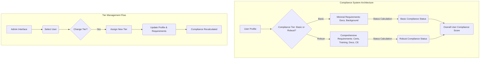
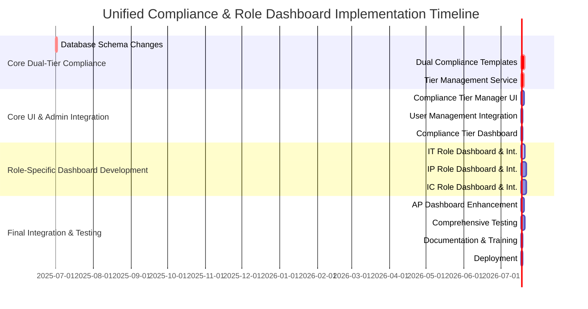

# Comprehensive Plan for Dual-Tier Compliance and Role-Specific Dashboard Integration

Based on your findings and the provided `DUAL_TIER_COMPLIANCE_IMPLEMENTATION_PLAN.md`, this document outlines a full and exhaustive plan for the completion of the dual-tier compliance implementation, along with detailed next steps for dashboard and user integration for the IT (Instructor Trainee), IP (Instructor Provisional), and IC (Instructor Certified) user roles.

The overarching strategy will be to first establish the foundational Dual-Tier Compliance system, and then systematically implement dedicated dashboards and user experiences for each instructor role, building up from the simplest (IT) to the more complex (IC), integrating smoothly with the existing AP (Authorized Provider) functionality.

---

## Part 1: Dual-Tier Compliance System Implementation (Foundation)

This section details the implementation of the core dual-tier compliance system, as outlined in the `DUAL_TIER_COMPLIANCE_IMPLEMENTATION_PLAN.md`.

### Executive Summary

The dual-tier compliance system will allow administrators to assign either **Basic Compliance** (document requirements only) or **Robust Compliance** (current comprehensive + new document requirements) on a user-by-user basis.

### Key Features
- **Basic Tier**: Resume, background check, basic company info (quick onboarding)
- **Robust Tier**: All current requirements + new document requirements (full certification)
- **User-Level Control**: Administrators can switch tiers per user
- **Seamless Integration**: Works with existing user management workflow

### Architecture Overview



### Implementation Phases (as per `DUAL_TIER_COMPLIANCE_IMPLEMENTATION_PLAN.md`)

#### **Phase 1: Database Schema Enhancement**
- **Objective:** Add `compliance_tier` column to the `profiles` table and introduce `compliance_templates` table.
- **Key Deliverables:** Updated `profiles` table, new `compliance_templates` table, and associated indices/RLS policies.
- **Relevant Files:** `db/migrations/20250624_add_compliance_tier_support.sql` (New Migration)

#### **Phase 2: Dual Compliance Templates**
- **Objective:** Define specific requirements for 'basic' and 'robust' tiers across all relevant roles (AP, IC, IP, IT).
- **Key Deliverables:** `BASIC_COMPLIANCE_TEMPLATES` and `ROBUST_COMPLIANCE_TEMPLATES` containing detailed requirements for each role and tier. Updated `ComplianceRequirementsService` methods to retrieve tier-specific templates.
- **Relevant Files:** [`src/services/compliance/complianceRequirementsService.ts`](src/services/compliance/complianceRequirementsService.ts)

#### **Phase 3: Compliance Tier Management Service**
- **Objective:** Implement the core logic for assigning, switching, and retrieving compliance tier information for users.
- **Key Deliverables:** `ComplianceTierService` with functions like `assignComplianceTier`, `getUserComplianceTierInfo`, `switchComplianceTier`, and `getAllUsersComplianceTiers`.
- **Relevant Files:** `src/services/compliance/complianceTierService.ts` (New File)

#### **Phase 4: User Interface Components (Core Tier Management)**
- **Objective:** Develop UI components for managing and displaying compliance tier information. _Note: This phase focuses on the generic tier management, not the dedicated role dashboards yet._
- **Key Deliverables:**
    -   **`ComplianceTierManager.tsx`**: Component for administrators to view and change a user's compliance tier.
    -   **User Management Integration**: Update `UserTableRow.tsx` to display compliance tier and integrate the `ComplianceTierManager`.
    -   **`ComplianceTierDashboard.tsx`**: A high-level dashboard showing statistics on basic vs. robust tier users and overall completion rates.
- **Relevant Files:** `src/components/compliance/ComplianceTierManager.tsx` (New File), `src/components/user-management/UserTableRow.tsx` (Update), `src/components/compliance/ComplianceTierDashboard.tsx` (New File)

#### **Phase 5: Testing & Deployment**
- **Objective:** Ensure the reliable functioning and deployment of the dual-tier compliance system.
- **Key Deliverables:** Comprehensive testing (unit, integration, UAT), successful deployment to production environment, and verification of key functionalities.
- **Includes:** Test scripts for tier assignment, switching, and role changes with tier preservation.

#### **Phase 6: Documentation & Training**
- **Objective:** Provide clear guides for administrators and end-users on the new dual-tier compliance system.
- **Key Deliverables:** Administrator Guide (tier assignment, monitoring) and User Guide (understanding tiers, completing requirements).

---

## Part 2: Detailed Next Steps for IT, IP, IC Dashboard & User Integration

This section extends the previous plan by focusing on the development of dedicated dashboards and comprehensive user integration for the Instructor Trainee (IT), Instructor Provisional (IP), and Instructor Certified (IC) roles. This will ensure each role has a tailored UI/UX experience that leverages the newly implemented dual-tier compliance system.

### Strategic Approach

Following the successful implementation of the core dual-tier compliance system, we will adopt a "bottom-up" approach for role-specific dashboard development:

1.  **Start with IT (Instructor Trainee):** This is likely the simplest role, allowing us to establish foundational patterns and components that can be reused and extended.
2.  **Progress to IP (Instructor Provisional):** Build upon the IT dashboard, adding increased complexity and features relevant to provisional instructors.
3.  **Conclude with IC (Instructor Certified):** Implement the most advanced instructor dashboard, integrating all previous functionalities and unique features for certified instructors.
4.  **Integrate with AP:** Ensure the AP dashboard can seamlessly view and manage users across all new instructor roles.

### Overall Architecture for Role-Specific Dashboards

```mermaid
graph TD
    A[Root Dashboard/Navigation] --> B{User Role?}
    B -- AP --> C[EnhancedProviderDashboard.tsx (Existing)]
    B -- IT --> D[ITDashboard.tsx (New)]
    B -- IP --> E[IPDashboard.tsx (New)]
    B -- IC --> F[ICDashboard.tsx (New)]

    subgraph "Per-Role Dashboard Structure"
        D -- "Uses" --> G[ComplianceTierManager.tsx]
        D -- "Uses" --> H[Role-Specific Requirements Display]
        D -- "Uses" --> I[Document Upload Components]
        D -- "Uses" --> J[Progress Tracking Widget]
        D -- "Integrates with" --> K[ComplianceTierService]
        D -- "Integrates with" --> L[User Profile Service]
        D -- "Integrates with" --> M[Document Management Service]
        
        E -- "Extends" --> D
        F -- "Extends" --> E
    end
```

### Detailed Implementation Steps by User Role

#### **Phase 7: IT (Instructor Trainee) Dashboard & Integration**
**Duration:** 3 Days
**Objective:** Create a dedicated dashboard and user experience for IT users, focusing on basic compliance and onboarding.

**Deliverables:**
-   **New Dashboard Component:** `src/components/dashboard/role-dashboards/ITDashboard.tsx`
    -   Displays user's current compliance tier and status using `ComplianceTierManager` (read-only for IT).
    -   Lists IT-specific Basic/Robust compliance requirements.
    -   Provides clear interface for document uploads (Resume, Contact Info, Background Check).
    -   Shows progress against required items.
-   **Logic for Requirement Display:** Implement a component or function to dynamically display requirements based on the user's assigned tier.
-   **Navigation Integration:** Update `src/components/layout/Sidebar.tsx` or `src/components/layout/Navigation.tsx` to route IT users to `ITDashboard.tsx`.
-   **Service Layer Calls:** Ensure `ITDashboard.tsx` uses `ComplianceTierService`, relevant document upload services, and user profile services.

**Key Components/Files to Create/Modify:**
-   `src/components/dashboard/role-dashboards/ITDashboard.tsx`
-   `src/components/role-management/document-components/DocumentUploader.tsx` (if not generic enough, may need extensions)
-   `src/components/layout/Navigation.tsx` (or similar)
-   `src/services/user/userService.ts` (for fetching user roles and profiles)

#### **Phase 8: IP (Instructor Provisional) Dashboard & Integration**
**Duration:** 4 Days
**Objective:** Build upon the IT dashboard to create a dedicated experience for IP users, including practical assessments and more complex training tracking.

**Deliverables:**
-   **New Dashboard Component:** `src/components/dashboard/role-dashboards/IPDashboard.tsx`
    -   Extends or reuses components from `ITDashboard.tsx`.
    -   Displays IP-specific Basic/Robust compliance requirements (including Participation Training, Practical Assessment).
    -   UI for tracking practical assessment results (e.g., input fields for scores).
    -   Integration with a `training` service for course completion tracking.
-   **Progress and Workflow Components:** Components to track and display progress through IP-specific training and assessment workflows.
-   **Navigation Integration:** Update navigation to route IP users to `IPDashboard.tsx`.

**Key Components/Files to Create/Modify:**
-   `src/components/dashboard/role-dashboards/IPDashboard.tsx`
-   `src/components/courses/assessment-types/PracticalAssessmentInput.tsx` (New/Modify)
-   `src/services/training/trainingService.ts` (Integration)

#### **Phase 9: IC (Instructor Certified) Dashboard & Integration**
**Duration:** 4 Days
**Objective:** Implement the most comprehensive instructor dashboard for IC users, incorporating teaching practice hours, written examinations, and advanced certifications.

**Deliverables:**
-   **New Dashboard Component:** `src/components/dashboard/role-dashboards/ICDashboard.tsx`
    -   Extends or reuses components from `IPDashboard.tsx`.
    -   Displays IC-specific Basic/Robust compliance requirements (including Teaching Practice Hours, Written Examination, CPR/First Aid).
    -   UI for logging teaching hours.
    -   Interface for written examination results.
    -   Integration for CPR/First Aid certification tracking (expiry dates).
-   **Advanced Compliance Widgets:** Widgets specific to CE credits, teaching logs, and recurring certifications.
-   **Navigation Integration:** Update navigation to route IC users to `ICDashboard.tsx`.

**Key Components/Files to Create/Modify:**
-   `src/components/dashboard/role-dashboards/ICDashboard.tsx`
-   `src/components/teaching/TeachingHoursLogger.tsx` (New)
-   `src/components/certificates/CertificationTracker.tsx` (Modify/New for CPR/First Aid)
-   `src/services/teaching/teachingService.ts` (Integration)
-   `src/services/certificates/certificateService.ts` (Integration)

#### **Phase 10: AP (Authorized Provider) Dashboard Enhancement & Oversight**
**Duration:** 2 Days
**Objective:** Enhance the existing `EnhancedProviderDashboard.tsx` to provide a consolidated view and management capabilities for all instructor roles (IT, IP, IC), leveraging the new tier system.

**Deliverables:**
-   **Integrated User List:** Modify `EnhancedProviderDashboard.tsx` to list IT, IP, IC users managed by the AP.
-   **Role and Tier Visibility:** Display the role and compliance tier for each managed user directly on the AP dashboard.
-   **Quick Tier Management:** Integrate `ComplianceTierManager` (with `canManage=true`) into the AP dashboard, allowing APs to change tiers for their managed users.
-   **Compliance Overview per User:** Show a quick overview of each managed user's compliance status and completion percentage.
-   **Filtering/Sorting:** Add capabilities to filter and sort managed users by role and compliance tier.

**Key Components/Files to Modify:**
-   `src/components/providers/dashboards/EnhancedProviderDashboard.tsx`
-   Reuse `src/components/compliance/ComplianceTierManager.tsx`
-   `src/services/provider/providerRelationshipService.ts` (Ensure it can fetch details about managed IT/IP/IC users)

---

## Overall Implementation Timeline (Combined & Revised)

This revised timeline integrates both the foundational dual-tier compliance work and the role-specific dashboard development.



### Week-by-Week Breakdown

**Week 1: Dual-Tier Foundation**
-   **Day 1-2**: Database Schema Changes, Initial Data Seeding
-   **Day 3-5**: Dual Compliance Templates (Basic & Robust for all roles)
-   **Day 6-7**: Compliance Tier Management Service

**Week 2: Core UI & IT Dashboard**
-   **Day 8-9**: Compliance Tier Manager UI Component
-   **Day 10**: User Management Integration for tier display/management
-   **Day 11**: Compliance Tier Dashboard (Overall Statistics)
-   **Day 12-14**: **IT (Instructor Trainee) Dashboard Development**

**Week 3: IP & IC Dashboards**
-   **Day 15-18**: **IP (Instructor Provisional) Dashboard Development**
-   **Day 19-22**: **IC (Instructor Certified) Dashboard Development**

**Week 4: AP Integration, Testing & Deployment**
-   **Day 23-24**: **AP (Authorized Provider) Dashboard Enhancement** for oversight
-   **Day 25-27**: Comprehensive Integration Testing & Bug Fixing
-   **Day 28**: Documentation Updates & Training Material Creation
-   **Day 29**: Production Deployment

---

## Conclusion

This comprehensive plan provides a structured approach to implement both the core dual-tier compliance system and the specialized dashboards for IT, IP, and IC user roles. By building the foundational compliance system first and then progressively developing role-specific interfaces from the simplest to the most complex, we can ensure a robust, scalable, and user-centric solution.