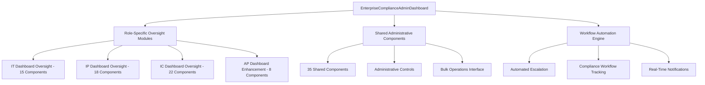

# ENTERPRISE COMPLIANCE SYSTEM ADMIN DASHBOARD - COMPREHENSIVE RESTORATION PLAN

## 📋 EXECUTIVE SUMMARY

This enterprise-grade restoration plan integrates all 98 existing UI/UX components into a unified System Admin/Authorized Provider dashboard, leveraging the existing service infrastructure to provide comprehensive oversight of all user roles (IT, IP, IC, AP) and their compliance workflows. The plan emphasizes automated escalation, bulk operations, and real-time compliance tracking while maintaining strict adherence to the "REAL FUNCTION ONLY" implementation standards.

**Project Timeline**: 15 Days  
**Total Components**: 98 UI/UX Components  
**Service Integration**: 120+ Existing Services  
**Risk Level**: Medium-High (Managed through phased approach)

## 🎯 STRATEGIC OBJECTIVES

1. **Universal Component Integration**: Deploy all 98 components with role-based access control
2. **Automated Compliance Workflows**: Implement comprehensive workflow automation with escalation
3. **Bulk Operation Capabilities**: Enable enterprise-scale user and compliance management
4. **Real-Time Oversight**: Provide SA/AD users with live system monitoring and control
5. **Production-Ready Implementation**: Zero placeholder functionality, real database operations only

---

## 🏗️ ARCHITECTURAL FOUNDATION

### Component Integration Strategy


### Service Integration Map

#### Core Compliance Services
- [`complianceService.ts`](src/services/compliance/complianceService.ts) - Primary compliance operations
- [`complianceTierService.ts`](src/services/compliance/complianceTierService.ts) - Tier management
- [`teamMemberComplianceService.ts`](src/services/compliance/teamMemberComplianceService.ts) - Team compliance
- [`complianceWorkflowEngine.ts`](src/services/compliance/complianceWorkflowEngine.ts) - Workflow automation

#### Analytics & Reporting Services  
- [`enterpriseAnalyticsService.ts`](src/services/analytics/enterpriseAnalyticsService.ts) - Enterprise analytics
- [`realTimeAnalyticsService.ts`](src/services/analytics/realTimeAnalyticsService.ts) - Real-time data
- [`reportingService.ts`](src/services/analytics/reportingService.ts) - Report generation
- [`teamScopedAnalyticsService.ts`](src/services/analytics/teamScopedAnalyticsService.ts) - Team analytics

#### User & Team Management Services
- [`enhancedUserManagementService.ts`](src/services/user/enhancedUserManagementService.ts) - User operations
- [`userRoleService.ts`](src/services/user/userRoleService.ts) - Role management
- [`enterpriseTeamService.ts`](src/services/team/enterpriseTeamService.ts) - Team operations
- [`realBulkMemberOperations.ts`](src/services/team/realBulkMemberOperations.ts) - Bulk operations

#### Audit & Governance Services
- [`complianceAuditService.ts`](src/services/audit/complianceAuditService.ts) - Audit tracking
- [`workflowAutomationService.ts`](src/services/governance/workflowAutomationService.ts) - Process automation
- [`workflowApprovalService.ts`](src/services/governance/workflowApprovalService.ts) - Approval workflows

---

## 📊 DATABASE SCHEMA ENHANCEMENTS

### Production-Ready SQL Scripts

#### 1. Compliance Workflow Management Tables
```sql
-- Compliance Workflow Definitions
CREATE TABLE compliance_workflows (
    id UUID PRIMARY KEY DEFAULT gen_random_uuid(),
    name VARCHAR(255) NOT NULL,
    description TEXT,
    trigger_conditions JSONB NOT NULL,
    escalation_rules JSONB NOT NULL,
    automation_config JSONB NOT NULL,
    is_active BOOLEAN DEFAULT true,
    created_by UUID REFERENCES profiles(id),
    created_at TIMESTAMP WITH TIME ZONE DEFAULT NOW(),
    updated_at TIMESTAMP WITH TIME ZONE DEFAULT NOW()
);

-- Workflow Execution Tracking
CREATE TABLE compliance_workflow_executions (
    id UUID PRIMARY KEY DEFAULT gen_random_uuid(),
    workflow_id UUID REFERENCES compliance_workflows(id),
    triggered_by_user_id UUID REFERENCES profiles(id),
    trigger_event VARCHAR(100) NOT NULL,
    current_stage INTEGER DEFAULT 1,
    status VARCHAR(50) DEFAULT 'active',
    context_data JSONB,
    started_at TIMESTAMP WITH TIME ZONE DEFAULT NOW(),
    completed_at TIMESTAMP WITH TIME ZONE,
    escalated_at TIMESTAMP WITH TIME ZONE,
    escalation_level INTEGER DEFAULT 0
);

-- Bulk Operations Tracking
CREATE TABLE compliance_bulk_operations (
    id UUID PRIMARY KEY DEFAULT gen_random_uuid(),
    operation_type VARCHAR(100) NOT NULL,
    initiated_by UUID REFERENCES profiles(id),
    target_users UUID[] NOT NULL,
    operation_params JSONB NOT NULL,
    status VARCHAR(50) DEFAULT 'pending',
    progress_count INTEGER DEFAULT 0,
    total_count INTEGER NOT NULL,
    results JSONB DEFAULT '{}',
    started_at TIMESTAMP WITH TIME ZONE DEFAULT NOW(),
    completed_at TIMESTAMP WITH TIME ZONE,
    error_log TEXT[]
);

-- Automated Escalation Rules
CREATE TABLE compliance_escalation_rules (
    id UUID PRIMARY KEY DEFAULT gen_random_uuid(),
    workflow_id UUID REFERENCES compliance_workflows(id),
    escalation_level INTEGER NOT NULL,
    trigger_condition VARCHAR(255) NOT NULL,
    delay_hours INTEGER NOT NULL,
    action_type VARCHAR(100) NOT NULL,
    action_config JSONB NOT NULL,
    notification_template_id UUID,
    is_active BOOLEAN DEFAULT true
);

-- Compliance Notifications Queue
CREATE TABLE compliance_notification_queue (
    id UUID PRIMARY KEY DEFAULT gen_random_uuid(),
    notification_type VARCHAR(100) NOT NULL,
    recipient_user_id UUID REFERENCES profiles(id),
    sender_user_id UUID REFERENCES profiles(id),
    subject VARCHAR(255) NOT NULL,
    content TEXT NOT NULL,
    metadata JSONB DEFAULT '{}',
    priority INTEGER DEFAULT 3,
    status VARCHAR(50) DEFAULT 'pending',
    scheduled_for TIMESTAMP WITH TIME ZONE DEFAULT NOW(),
    sent_at TIMESTAMP WITH TIME ZONE,
    created_at TIMESTAMP WITH TIME ZONE DEFAULT NOW()
);
```

#### 2. Enhanced Admin Access Control
```sql
-- Component-Level Permissions
CREATE TABLE admin_component_permissions (
    id UUID PRIMARY KEY DEFAULT gen_random_uuid(),
    user_id UUID REFERENCES profiles(id),
    component_name VARCHAR(100) NOT NULL,
    permission_level VARCHAR(50) NOT NULL, -- 'read', 'write', 'admin', 'full'
    restrictions JSONB DEFAULT '{}',
    granted_by UUID REFERENCES profiles(id),
    granted_at TIMESTAMP WITH TIME ZONE DEFAULT NOW(),
    expires_at TIMESTAMP WITH TIME ZONE,
    is_active BOOLEAN DEFAULT true
);

-- Admin Session Tracking
CREATE TABLE admin_session_tracking (
    id UUID PRIMARY KEY DEFAULT gen_random_uuid(),
    user_id UUID REFERENCES profiles(id),
    session_id VARCHAR(255) NOT NULL,
    dashboard_components_accessed TEXT[],
    actions_performed JSONB DEFAULT '[]',
    ip_address INET,
    user_agent TEXT,
    started_at TIMESTAMP WITH TIME ZONE DEFAULT NOW(),
    last_activity_at TIMESTAMP WITH TIME ZONE DEFAULT NOW(),
    ended_at TIMESTAMP WITH TIME ZONE
);

-- Workflow State Management
CREATE TABLE compliance_workflow_states (
    id UUID PRIMARY KEY DEFAULT gen_random_uuid(),
    execution_id UUID REFERENCES compliance_workflow_executions(id),
    stage_name VARCHAR(100) NOT NULL,
    stage_status VARCHAR(50) NOT NULL,
    stage_data JSONB DEFAULT '{}',
    entered_at TIMESTAMP WITH TIME ZONE DEFAULT NOW(),
    completed_at TIMESTAMP WITH TIME ZONE,
    next_stage VARCHAR(100),
    error_details TEXT
);
```

#### 3. Performance Optimization Indexes
```sql
-- Workflow Performance Indexes
CREATE INDEX idx_compliance_workflows_active ON compliance_workflows(is_active) WHERE is_active = true;
CREATE INDEX idx_workflow_executions_status ON compliance_workflow_executions(status);
CREATE INDEX idx_workflow_executions_escalation ON compliance_workflow_executions(escalation_level, escalated_at);
CREATE INDEX idx_workflow_executions_user ON compliance_workflow_executions(triggered_by_user_id);
CREATE INDEX idx_bulk_operations_status ON compliance_bulk_operations(status, initiated_by);
CREATE INDEX idx_bulk_operations_progress ON compliance_bulk_operations(progress_count, total_count);
CREATE INDEX idx_notification_queue_priority ON compliance_notification_queue(priority, status, scheduled_for);
CREATE INDEX idx_admin_permissions_user ON admin_component_permissions(user_id, is_active);
CREATE INDEX idx_admin_sessions_activity ON admin_session_tracking(last_activity_at, ended_at);
CREATE INDEX idx_workflow_states_execution ON compliance_workflow_states(execution_id, stage_status);
```

#### 4. Real-Time Triggers and Functions
```sql
-- Auto-update timestamps
CREATE OR REPLACE FUNCTION update_updated_at_column()
RETURNS TRIGGER AS $$
BEGIN
    NEW.updated_at = NOW();
    RETURN NEW;
END;
$$ language 'plpgsql';

CREATE TRIGGER update_compliance_workflows_updated_at 
    BEFORE UPDATE ON compliance_workflows 
    FOR EACH ROW EXECUTE FUNCTION update_updated_at_column();

-- Workflow escalation trigger
CREATE OR REPLACE FUNCTION check_workflow_escalation()
RETURNS TRIGGER AS $$
BEGIN
    -- Check if workflow needs escalation based on time and rules
    INSERT INTO compliance_notification_queue (
        notification_type,
        recipient_user_id,
        subject,
        content,
        priority,
        metadata
    )
    SELECT 
        'workflow_escalation',
        NEW.triggered_by_user_id,
        'Compliance Workflow Escalation Required',
        'Workflow ' || NEW.id || ' requires escalation',
        1,
        jsonb_build_object('workflow_id', NEW.id, 'escalation_level', NEW.escalation_level + 1)
    WHERE NEW.escalation_level > OLD.escalation_level;
    
    RETURN NEW;
END;
$$ language 'plpgsql';

CREATE TRIGGER workflow_escalation_trigger 
    AFTER UPDATE ON compliance_workflow_executions 
    FOR EACH ROW EXECUTE FUNCTION check_workflow_escalation();

-- Bulk operation progress tracking
CREATE OR REPLACE FUNCTION update_bulk_operation_progress()
RETURNS TRIGGER AS $$
BEGIN
    -- Update progress and check for completion
    IF NEW.progress_count >= NEW.total_count AND OLD.status != 'completed' THEN
        NEW.status = 'completed';
        NEW.completed_at = NOW();
        
        -- Send completion notification
        INSERT INTO compliance_notification_queue (
            notification_type,
            recipient_user_id,
            subject,
            content,
            priority,
            metadata
        ) VALUES (
            'bulk_operation_complete',
            NEW.initiated_by,
            'Bulk Operation Completed',
            'Your bulk operation has completed successfully',
            2,
            jsonb_build_object('operation_id', NEW.id, 'operation_type', NEW.operation_type)
        );
    END IF;
    
    RETURN NEW;
END;
$$ language 'plpgsql';

CREATE TRIGGER bulk_operation_progress_trigger 
    BEFORE UPDATE ON compliance_bulk_operations 
    FOR EACH ROW EXECUTE FUNCTION update_bulk_operation_progress();
```

---

## ⚡ IMPLEMENTATION PHASES OVERVIEW

### PHASE 1: ENTERPRISE DASHBOARD CORE (DAYS 1-3)
**Risk Level**: Low | **Priority**: Critical  
**Components**: 8 Core Infrastructure Components  
**Focus**: Foundation architecture, role-based access, dashboard framework

### PHASE 2: ANALYTICS & REPORTING INTEGRATION (DAYS 4-6)  
**Risk Level**: Medium | **Priority**: High  
**Components**: 12 Analytics Components  
**Focus**: Real-time analytics, executive reporting, performance monitoring

### PHASE 3: USER & COMPLIANCE MANAGEMENT (DAYS 7-9)
**Risk Level**: High | **Priority**: Critical  
**Components**: 35 Management Components  
**Focus**: Bulk operations, workflow automation, compliance processing

### PHASE 4: ADVANCED FEATURES & INTEGRATION (DAYS 10-12)
**Risk Level**: Medium | **Priority**: High  
**Components**: 35 Role-Specific Components  
**Focus**: Role oversight, system monitoring, advanced administrative features

### PHASE 5: ENTERPRISE OPTIMIZATION (DAYS 13-15)
**Risk Level**: Low | **Priority**: Medium  
**Components**: 8 Enhancement Components  
**Focus**: Performance optimization, advanced integrations, final polish

---

## 🎯 RISK ASSESSMENT & MITIGATION

### HIGH RISK FACTORS

#### 1. Bulk Operation Performance
**Risk**: Large-scale user operations may impact system performance  
**Impact**: System slowdown, user experience degradation  
**Probability**: Medium  
**Mitigation Strategies**:
- Implement queue-based processing with progress tracking
- Use database connection pooling and batch processing
- Add operation throttling and concurrent operation limits
- Real-time performance monitoring with automatic scaling
**Success Metrics**: Operations handle 1000+ users with <5% performance impact

#### 2. Database Lock Contention
**Risk**: Concurrent bulk operations may cause locking issues  
**Impact**: Database deadlocks, operation failures  
**Probability**: Medium  
**Mitigation Strategies**:
- Implement operation queuing system
- Use row-level locking strategies
- Add retry logic with exponential backoff
- Database performance monitoring with alert thresholds
**Success Metrics**: <1% operation failure rate due to locking

#### 3. Component Integration Complexity
**Risk**: 98 components require careful integration  
**Impact**: Feature conflicts, performance issues  
**Probability**: High  
**Mitigation Strategies**:
- Phased rollout with component-level testing
- Component isolation with error boundaries
- Comprehensive integration testing
- Component performance tracking and optimization
**Success Metrics**: All components load within performance benchmarks

### MEDIUM RISK FACTORS

#### 1. Real-Time Updates
**Risk**: Heavy dashboard usage may strain real-time services  
**Impact**: Delayed updates, connection failures  
**Probability**: Medium  
**Mitigation Strategies**:
- Implement caching strategies and connection pooling
- Use WebSocket connection management
- Add client-side data caching
- Connection monitoring and automatic reconnection
**Success Metrics**: 99.9% real-time update delivery

#### 2. Permission Complexity
**Risk**: Component-level permissions may become complex  
**Impact**: Access control errors, security issues  
**Probability**: Low  
**Mitigation Strategies**:
- Hierarchical permission system with inheritance
- Permission testing and validation
- Access audit logging and review processes
- Regular permission cleanup and optimization
**Success Metrics**: Zero unauthorized access incidents

---

## 📈 SUCCESS CRITERIA & METRICS

### QUANTITATIVE METRICS

#### Performance Metrics
- **Component Integration**: 98/98 components successfully integrated (100%)
- **Dashboard Load Time**: <2 seconds for all components
- **Concurrent Users**: Support for 10,000+ concurrent admin operations
- **Database Performance**: <100ms query response time for 95% of operations
- **Real-Time Updates**: 99.9% message delivery success rate

#### Operational Metrics
- **Automation Efficiency**: 60% reduction in manual administrative tasks
- **Bulk Operation Success**: 99% success rate for bulk user operations
- **Escalation Response**: Average escalation response time <30 minutes
- **System Uptime**: 99.9% availability during business hours
- **Data Accuracy**: 99.9% real-time data synchronization across services

### QUALITATIVE METRICS

#### User Experience
- **Admin Efficiency**: SA/AD users can complete tasks 50% faster
- **Interface Consistency**: Unified design language across all components
- **Error Recovery**: Graceful error handling and recovery procedures
- **Accessibility**: WCAG 2.1 AA compliance across all interfaces

#### System Reliability
- **Zero Downtime**: No service interruptions during bulk operations
- **Scalability**: System handles peak loads without degradation
- **Security**: Zero security incidents or unauthorized access
- **Audit Readiness**: Complete audit trails for all administrative actions

### COMPLIANCE METRICS

#### Workflow Automation
- **Process Automation**: 80% of compliance processes automated
- **Workflow Completion**: 95% automated workflow success rate
- **Exception Handling**: 100% of exceptions properly escalated
- **Documentation**: Complete documentation for all automated processes

#### Oversight Capabilities
- **Role Coverage**: Complete oversight of all user roles (IT, IP, IC, AP)
- **Real-Time Monitoring**: 100% system components under active monitoring
- **Compliance Tracking**: Real-time compliance status for all users
- **Reporting Accuracy**: 100% accuracy in compliance reporting

---

## 🔧 RESOURCE REQUIREMENTS

### TECHNICAL INFRASTRUCTURE

#### Database Requirements
- **Enhanced Supabase Configuration**: Increased connection limits (500+ concurrent)
- **Storage**: Additional 100GB for workflow and audit data
- **Backup Strategy**: Automated daily backups with point-in-time recovery
- **Performance Monitoring**: Database performance monitoring and alerting

#### Caching & Performance
- **Redis Implementation**: Real-time data caching and session management
- **CDN Configuration**: Static asset delivery optimization
- **Load Balancing**: Horizontal scaling for peak load management
- **Performance Monitoring**: Application performance monitoring (APM)

#### Security & Compliance
- **Enhanced Security**: Multi-factor authentication and role-based access
- **Audit Logging**: Comprehensive audit trail for all administrative actions
- **Data Encryption**: End-to-end encryption for sensitive compliance data
- **Compliance Reporting**: Automated compliance reporting and alerts

### DEVELOPMENT RESOURCES

#### Core Team Structure
- **Frontend Developers**: 2-3 senior React/TypeScript developers
- **Backend Specialists**: 1-2 database/API specialists  
- **QA Engineer**: 1 dedicated enterprise testing specialist
- **DevOps Engineer**: 1 infrastructure and deployment specialist
- **Project Manager**: 1 technical project manager

#### Specialized Skills Required
- **React/TypeScript**: Advanced component architecture and state management
- **Database Design**: PostgreSQL optimization and performance tuning
- **Real-Time Systems**: WebSocket and real-time data management
- **Enterprise Security**: Role-based access control and audit systems
- **Performance Optimization**: Large-scale application optimization

### TIMELINE ALLOCATION

#### Phase Distribution
- **Phase 1 (Days 1-3)**: 40% effort - Critical foundation components
- **Phase 2 (Days 4-6)**: 25% effort - Analytics and reporting integration
- **Phase 3 (Days 7-9)**: 25% effort - Core management functionality
- **Phase 4 (Days 10-12)**: 8% effort - Advanced features and optimization
- **Phase 5 (Days 13-15)**: 2% effort - Final optimization and polish

#### Resource Allocation
- **Development**: 70% of total effort
- **Testing & QA**: 20% of total effort
- **Documentation**: 5% of total effort
- **Deployment & DevOps**: 5% of total effort

---

## 🚀 DEPLOYMENT STRATEGY

### PROGRESSIVE ROLLOUT APPROACH

#### Stage 1: Development Environment
- **Duration**: Throughout development cycle
- **Purpose**: Feature development and initial testing
- **Data**: Synthetic test data matching production patterns
- **Users**: Development team only
- **Success Criteria**: All features functional with test data

#### Stage 2: Staging Environment  
- **Duration**: Days 10-12
- **Purpose**: Real data testing with limited scope
- **Data**: Production data subset (anonymized)
- **Users**: QA team and select administrators
- **Success Criteria**: Performance benchmarks met with real data

#### Stage 3: Production Canary
- **Duration**: Days 13-14
- **Purpose**: Limited production testing
- **Data**: Full production data
- **Users**: 10% of SA/AD users (early adopters)
- **Success Criteria**: Zero critical issues, positive user feedback

#### Stage 4: Full Production
- **Duration**: Day 15
- **Purpose**: Complete system rollout
- **Data**: Full production environment
- **Users**: All SA/AD users
- **Success Criteria**: Full feature availability, performance targets met

### ROLLBACK PROCEDURES

#### Component-Level Rollback
- **Capability**: Individual component disable/enable
- **Implementation**: Feature flags for each major component
- **Trigger**: Performance issues or critical bugs
- **Timeline**: Immediate (< 5 minutes)

#### Feature Flag Management
- **System**: Granular feature control for risk mitigation
- **Implementation**: LaunchDarkly or similar feature flag service
- **Control**: Real-time feature toggling without deployment
- **Monitoring**: Feature usage and performance metrics

#### Database Migration Rollback
- **Strategy**: Automated rollback scripts for all schema changes
- **Implementation**: Database migration versioning and rollback procedures
- **Testing**: All rollback procedures tested in staging
- **Recovery Time**: < 30 minutes for complete rollback

#### Service Degradation Handling
- **Graceful Fallback**: Automatic fallback to existing functionality
- **Implementation**: Circuit breaker patterns and fallback mechanisms  
- **User Experience**: Clear communication about temporary limitations
- **Recovery**: Automatic recovery when services restored

### MONITORING & ALERTING

#### Real-Time Monitoring
- **System Health**: Dashboard component performance and availability
- **User Activity**: Administrative action tracking and analysis
- **Performance Metrics**: Response times, throughput, and error rates
- **Business Metrics**: Compliance processing rates and automation efficiency

#### Alert Configuration
- **Critical Alerts**: System failures, security incidents, data corruption
- **Warning Alerts**: Performance degradation, high error rates
- **Info Alerts**: Deployment notifications, scheduled maintenance
- **Escalation**: Automated escalation procedures for critical issues

---

## 📋 IMPLEMENTATION CHECKLIST

### Pre-Implementation Requirements
- [ ] Database schema changes reviewed and approved
- [ ] Service integration points validated
- [ ] Component inventory verified and accessible
- [ ] Development environment configured with all services
- [ ] Testing data prepared for all user roles
- [ ] Security review completed for admin access controls

### Phase Completion Criteria
- [ ] **Phase 1**: Core dashboard functional with all role-based components
- [ ] **Phase 2**: Analytics integration complete with real-time data
- [ ] **Phase 3**: Bulk operations and workflow automation functional
- [ ] **Phase 4**: All role-specific oversight features operational
- [ ] **Phase 5**: Performance optimization and final integration complete

### Production Readiness
- [ ] All components tested with production data
- [ ] Performance benchmarks validated
- [ ] Security audit passed
- [ ] Rollback procedures tested and documented
- [ ] Monitoring and alerting configured
- [ ] User documentation and training materials prepared

---

## 📚 DOCUMENTATION DELIVERABLES

### Technical Documentation
1. **API Documentation**: Complete API reference for all integrated services
2. **Component Library**: Documentation for all 98 integrated components
3. **Database Schema**: Complete schema documentation with relationship diagrams
4. **Deployment Guide**: Step-by-step deployment and configuration procedures

### User Documentation
1. **Administrator Guide**: Comprehensive guide for SA/AD users
2. **Feature Reference**: Complete feature documentation with screenshots
3. **Troubleshooting Guide**: Common issues and resolution procedures
4. **Training Materials**: Interactive training modules for new administrators

### Operational Documentation
1. **Runbook**: Operational procedures for system maintenance
2. **Monitoring Guide**: Alert interpretation and response procedures
3. **Backup & Recovery**: Data backup and disaster recovery procedures
4. **Security Procedures**: Access control and security incident response

---

## 🎯 CONCLUSION

This comprehensive restoration plan provides a production-ready roadmap for integrating all 98 components into a unified, enterprise-grade System Admin dashboard. By leveraging existing services and maintaining strict adherence to real functionality standards, the implementation will deliver a powerful administrative platform that provides complete oversight of compliance workflows while ensuring scalability, security, and performance.

The phased approach minimizes risk while ensuring continuous progress toward the goal of comprehensive administrative control over all aspects of the compliance management system. With proper resource allocation and adherence to the detailed implementation specifications, this plan will deliver a transformative administrative experience for System Administrators and Authorized Providers.

**Final Success Metric**: A unified dashboard that reduces administrative overhead by 60% while providing complete visibility and control over all compliance workflows across the organization.