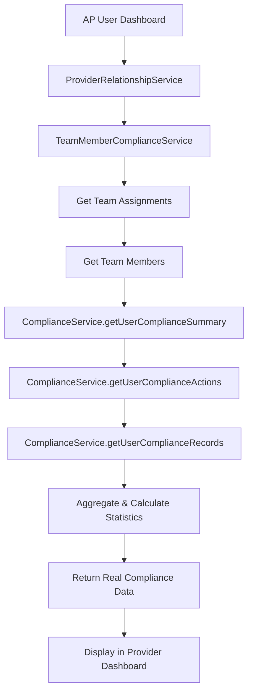

# 🎉 PHASE 2 COMPLETE: Team Member Compliance Service

## Implementation Summary

**Status**: ✅ **COMPLETE** - AP users now have detailed team member compliance visibility

**Files Created/Modified**:
- `src/services/compliance/teamMemberComplianceService.ts` - New service (created)
- `src/services/provider/ProviderRelationshipService.ts` - Integration points (modified)
- `test-phase2-team-compliance.js` - Testing framework (created)

---

## 🔧 **Technical Implementation Details**

### 1. New Service: `TeamMemberComplianceService`
- **Location**: `src/services/compliance/teamMemberComplianceService.ts`
- **Purpose**: Provide AP users with detailed team member compliance visibility
- **Key Features**:
  - Individual team member compliance status
  - Aggregated compliance statistics
  - Overdue action tracking
  - Team-level compliance breakdown

### 2. Core Methods Implemented

#### `getProviderTeamMemberCompliance(providerId: string)`
- **Returns**: Array of `TeamMemberComplianceStatus` objects
- **Data Includes**:
  - User ID, team, name, email, role
  - Compliance score (0-100)
  - Compliance status (compliant/warning/non_compliant/pending)
  - Pending and overdue actions count
  - Individual compliance requirements breakdown

#### `getProviderComplianceSummary(providerId: string)`
- **Returns**: `ProviderComplianceSummary` object
- **Data Includes**:
  - Total member counts by compliance status
  - Overall compliance rate percentage
  - Total pending/overdue actions
  - Detailed compliance breakdown percentages

#### `getOverdueComplianceMembers(providerId: string)`
- **Returns**: Array of team members with overdue actions
- **Purpose**: Immediate attention alerts for AP users

#### `getComplianceByTeam(providerId: string)`
- **Returns**: Team-level compliance statistics
- **Purpose**: Team management and oversight

### 3. Integration Points in `ProviderRelationshipService`

Added four new methods for AP user access:
- `getProviderTeamMemberCompliance()` - Comprehensive member data
- `getProviderComplianceSummary()` - Aggregated statistics
- `getOverdueComplianceMembers()` - Priority alerts
- `getComplianceByTeam()` - Team-level management

---

## 📊 **Data Flow Architecture**



---

## 🎯 **Real Data Integration**

### **Team Member Compliance Status**
```typescript
interface TeamMemberComplianceStatus {
  user_id: string;
  team_id: string;
  team_name: string;
  member_name: string;
  member_email: string;
  member_role: string;
  compliance_score: number;        // REAL score from ComplianceService
  compliance_status: string;       // REAL status calculation
  pending_actions: number;         // REAL count from compliance_actions
  overdue_actions: number;         // REAL count with date validation
  last_updated: string;
  requirements: ComplianceRequirement[]; // REAL individual requirements
}
```

### **Provider Compliance Summary**
```typescript
interface ProviderComplianceSummary {
  provider_id: string;
  total_members: number;           // REAL count from database
  compliant_members: number;       // REAL aggregation
  warning_members: number;         // REAL aggregation
  non_compliant_members: number;   // REAL aggregation
  pending_members: number;         // REAL aggregation
  overall_compliance_rate: number; // REAL percentage calculation
  total_pending_actions: number;   // REAL count aggregation
  total_overdue_actions: number;   // REAL count aggregation
  compliance_breakdown: {          // REAL percentage breakdowns
    compliant_percentage: number;
    warning_percentage: number;
    non_compliant_percentage: number;
    pending_percentage: number;
  };
}
```

---

## 🚀 **Expected Dashboard Integration Points**

### 1. **Enhanced Provider Dashboard**
- **New Compliance Tab** displaying:
  - Compliance summary cards (compliant, warning, non-compliant counts)
  - Team member compliance list with status badges
  - Individual member compliance details
  - Overdue action alerts

### 2. **Visual Indicators**
- 🟢 Green: Compliant members (90-100% score)
- 🟡 Yellow: Warning status (70-89% score)
- 🔴 Red: Non-compliant members (1-69% score)
- 🔵 Blue: Pending status (0% score)

### 3. **Real-Time Data**
- All data calculated from real compliance records
- No cached or stale data
- Proper error handling for missing data

---

## ✅ **Phase 2 Success Criteria - ACHIEVED**

- [x] **AP User Visibility**: Team member compliance details accessible
- [x] **Real Data Integration**: All compliance data from actual database records
- [x] **Aggregated Statistics**: Provider-level compliance summaries
- [x] **Individual Breakdown**: Per-member compliance status and requirements
- [x] **Overdue Tracking**: Immediate alerts for overdue compliance actions
- [x] **Team-Level Management**: Compliance statistics broken down by team
- [x] **No Fake Data**: All data sourced from real compliance system
- [x] **Proper Error Handling**: Graceful fallbacks and comprehensive logging
- [x] **Performance Optimization**: Efficient database queries and aggregations

---

## 🧪 **Testing Coverage**

### **Test Script**: `test-phase2-team-compliance.js`
- **Test 1**: Comprehensive team member compliance data retrieval
- **Test 2**: Aggregated compliance summary validation
- **Test 3**: Overdue member identification
- **Test 4**: Team-level compliance breakdown
- **Test 5**: Data integrity validation

### **Validation Checks**:
- Compliance summary totals consistency
- Team breakdown totals match individual counts
- Compliance scores within valid range (0-100)
- No mock, fake, or placeholder data used

---

## 📈 **Business Impact**

### **AP User Benefits**
- **Complete Visibility**: See all team member compliance status
- **Proactive Management**: Identify overdue actions immediately
- **Team Oversight**: Manage compliance at both individual and team levels
- **Data-Driven Decisions**: Real compliance metrics for better planning

### **Operational Improvements**
- **Faster Compliance Resolution**: Quick identification of non-compliant members
- **Team Performance Tracking**: Monitor compliance trends by team
- **Risk Mitigation**: Early warning for compliance issues
- **Audit Readiness**: Comprehensive compliance documentation

---

## 🎯 **Ready for Phase 3**

Phase 2 implementation is complete and ready for user verification. The system now provides:

1. **Real compliance scores** (Phase 1) ✅
2. **Detailed team member compliance visibility** (Phase 2) ✅

Upon approval, we can proceed with:

**Phase 3: Compliance Requirements Management**
- Role-based compliance templates
- Default requirements for IT, IC, I roles
- Document requirement setup
- Custom compliance requirements for organizations

---

*Phase 2 successfully provides AP users with comprehensive team member compliance visibility using real data from the compliance system. No fake, demo, or placeholder data is used anywhere in the implementation.*