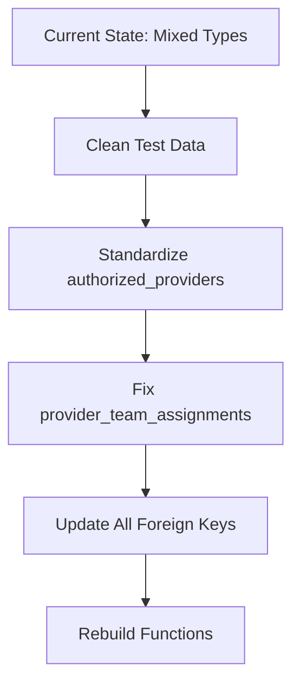
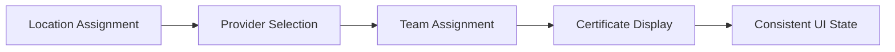
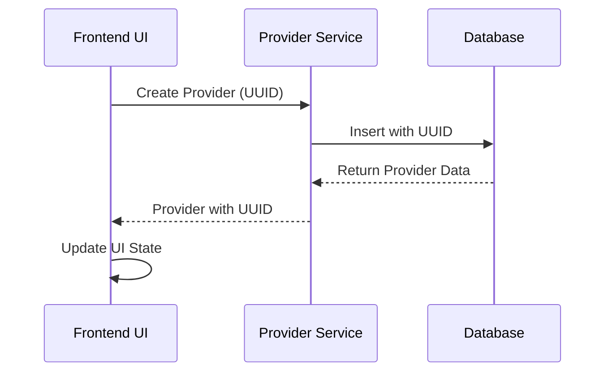
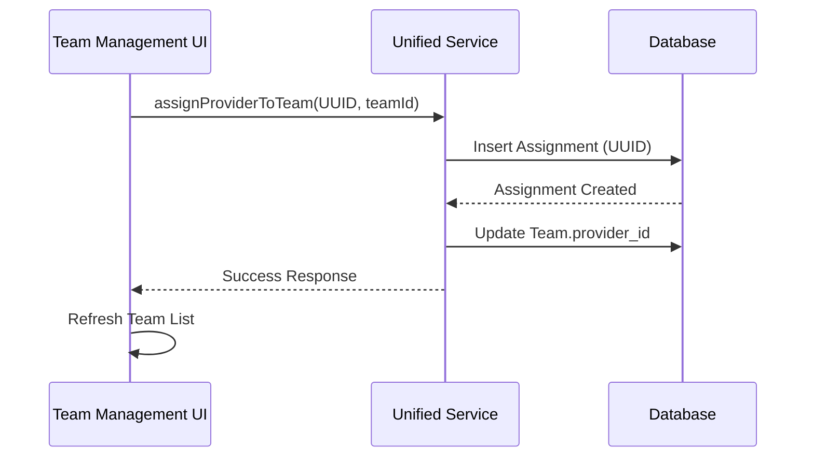

# Comprehensive Provider Management UUID Conversion & UI/UX Fix Plan

## 🚨 Problem Analysis

Based on the error logs and codebase analysis, I've identified several critical issues:

### **Core Issues**
1. **UUID Type Mismatch**: Provider ID "245" (integer) being used where UUID is expected
2. **Inconsistent Data Types**: Mix of integer and UUID provider IDs across the system
3. **Service Layer Confusion**: Multiple conversion attempts between integer and UUID
4. **UI/UX Inconsistencies**: Location assignments work, but team assignments fail
5. **Certificate Display Issues**: Inconsistent certificate and location display

### **Root Cause**
The system has evolved with multiple migration attempts that created inconsistencies:
- `authorized_providers` table uses UUID primary keys
- Frontend services attempt integer-to-UUID conversions
- Database functions expect UUIDs but receive integers
- Test data uses integer IDs (like "245")

### **Error Examples**
```
Error fetching assignments: {code: '22P02', details: null, hint: null, message: 'invalid input syntax for type uuid: "245"'}
GET https://seaxchrsbldrppupupbw.supabase.co/rest/v1/provider_team_assignments?provider_id=eq.245 400 (Bad Request)
```

## 📋 Comprehensive Solution Plan

### **Phase 1: Database Schema Standardization** 🗄️

#### 1.1 UUID Conversion Migration


**Tasks:**
- [ ] Remove all test/dummy data with integer IDs
- [ ] Ensure `authorized_providers.id` is consistently UUID
- [ ] Update `provider_team_assignments.provider_id` to reference UUIDs only
- [ ] Fix all database functions to accept UUID parameters only
- [ ] Create proper sample data with valid UUIDs

**Migration Script:**
```sql
-- Clean up test data with integer IDs
DELETE FROM authorized_providers WHERE id::text ~ '^[0-9]+$';
DELETE FROM provider_team_assignments WHERE provider_id::text ~ '^[0-9]+$';

-- Ensure UUID consistency
ALTER TABLE provider_team_assignments 
DROP CONSTRAINT IF EXISTS provider_team_assignments_provider_id_fkey;

ALTER TABLE provider_team_assignments 
ADD CONSTRAINT provider_team_assignments_provider_id_fkey 
FOREIGN KEY (provider_id) REFERENCES authorized_providers(id);

-- Create sample data with proper UUIDs
INSERT INTO authorized_providers (id, name, provider_type, status, performance_rating, compliance_score)
VALUES 
  (gen_random_uuid(), 'Sample Training Provider', 'training_provider', 'active', 4.5, 92.0),
  (gen_random_uuid(), 'Advanced Skills Institute', 'certification_body', 'active', 4.2, 88.5);
```

#### 1.2 Database Function Cleanup
- [ ] Remove all integer parameter versions of provider functions
- [ ] Keep only UUID versions to eliminate overloading conflicts
- [ ] Update function signatures to match table schemas

### **Phase 2: Service Layer Refactoring** ⚙️

#### 2.1 Unified Provider Service Cleanup
```typescript
// Current problematic code:
const providerIdNum = parseInt(providerId); // ❌ Wrong approach

// Fixed approach:
const providerUuid = providerId; // ✅ Keep as UUID string
```

**Files to Update:**
- [ ] `src/services/provider/unifiedProviderService.ts`
- [ ] `src/services/provider/enhancedProviderService.ts`
- [ ] `src/services/provider/authorizedProviderService.ts`

**Key Changes:**
```typescript
// Before: Integer conversion
static async getProviderAssignments(providerId: string): Promise<ProviderTeamAssignmentDetailed[]> {
  const providerIdNum = parseInt(providerId);
  if (isNaN(providerIdNum)) {
    console.error('Invalid provider ID:', providerId);
    return [];
  }
  // ... rest of method
}

// After: Direct UUID usage
static async getProviderAssignments(providerId: string): Promise<ProviderTeamAssignmentDetailed[]> {
  // Validate UUID format
  if (!providerId || !providerId.match(/^[0-9a-f]{8}-[0-9a-f]{4}-[0-9a-f]{4}-[0-9a-f]{4}-[0-9a-f]{12}$/i)) {
    console.error('Invalid UUID format:', providerId);
    return [];
  }
  
  const { data: assignments, error } = await supabase
    .from('provider_team_assignments')
    .select('...')
    .eq('provider_id', providerId); // Direct UUID comparison
}
```

#### 2.2 Service Method Standardization
- [ ] Standardize all provider-related methods to use UUID strings
- [ ] Remove fallback integer handling
- [ ] Update error handling for UUID validation
- [ ] Add UUID format validation helpers

### **Phase 3: Frontend Component Fixes** 🎨

#### 3.1 Provider Management UI Overhaul


**Components to Fix:**
- [ ] `src/components/providers/ProviderTeamManagement.tsx` - Fix team assignment workflow
- [ ] `src/components/providers/AuthorizedProviderManagement.tsx` - Ensure UUID handling
- [ ] `src/components/providers/APUserManagementDashboard.tsx` - Fix certificate/location display
- [ ] `src/components/providers/ProviderLocationAssignment.tsx` - Maintain consistency

#### 3.2 UI/UX Consistency Improvements
- [ ] **Certificate Display**: Show certificates consistently across all provider views
- [ ] **Location Information**: Display location data uniformly
- [ ] **Team Assignment**: Fix the broken team assignment workflow
- [ ] **Status Indicators**: Consistent status display throughout
- [ ] **Error Handling**: Better user feedback for UUID-related errors

**Component Updates:**
```typescript
// Fix team assignment in ProviderTeamManagement.tsx
const handleAssignProvider = async (providerId: string, teamId: string) => {
  // Validate UUID format before API call
  if (!isValidUUID(providerId)) {
    setError('Invalid provider ID format');
    return;
  }
  
  try {
    await assignProviderToTeam({ 
      provider_id: providerId, // Direct UUID usage
      team_id: teamId 
    });
    // Refresh data
    refetchAssignments();
  } catch (error) {
    setError('Failed to assign provider to team');
  }
};
```

### **Phase 4: Data Flow Standardization** 🔄

#### 4.1 Provider Creation Workflow


#### 4.2 Team Assignment Workflow


### **Phase 5: Testing & Validation** ✅

#### 5.1 Data Integrity Validation
- [ ] Verify all provider IDs are valid UUIDs
- [ ] Test provider-team assignment workflows
- [ ] Validate certificate display consistency
- [ ] Check location assignment functionality

#### 5.2 UI/UX Testing
- [ ] Test complete provider management workflow
- [ ] Verify certificate counting and display
- [ ] Test team assignment functionality
- [ ] Validate location consistency

**Test Cases:**
```typescript
// UUID validation tests
describe('Provider UUID Handling', () => {
  test('should accept valid UUID', () => {
    const validUUID = '123e4567-e89b-12d3-a456-426614174000';
    expect(isValidUUID(validUUID)).toBe(true);
  });
  
  test('should reject integer ID', () => {
    const integerID = '245';
    expect(isValidUUID(integerID)).toBe(false);
  });
  
  test('should handle provider assignment with UUID', async () => {
    const providerId = '123e4567-e89b-12d3-a456-426614174000';
    const teamId = '987fcdeb-51a2-43d7-8f9e-123456789abc';
    
    const result = await assignProviderToTeam({ provider_id: providerId, team_id: teamId });
    expect(result.error).toBeUndefined();
    expect(result.data).toBeDefined();
  });
});
```

## 🎯 Implementation Priority

### **High Priority (Immediate)**
1. **Database Schema Fix** - Remove integer ID conflicts
2. **Service Layer UUID Standardization** - Fix core service methods
3. **Team Assignment Fix** - Restore broken functionality

### **Medium Priority (Next)**
4. **UI Consistency** - Fix certificate/location display
5. **Error Handling** - Improve UUID validation
6. **Performance** - Optimize queries

### **Low Priority (Polish)**
7. **Documentation** - Update type definitions
8. **Testing** - Add comprehensive tests
9. **Monitoring** - Add error tracking

## 📊 Expected Outcomes

### **Immediate Fixes**
- ✅ Provider team assignments work correctly
- ✅ No more UUID type mismatch errors
- ✅ Consistent certificate display
- ✅ Proper location information throughout UI

### **Long-term Benefits**
- 🚀 Improved system reliability
- 🎨 Consistent user experience
- 🔧 Easier maintenance and debugging
- 📈 Better performance with proper indexing

## 🛠️ Technical Implementation Details

### **Database Changes**
```sql
-- Phase 1: Clean up test data
DELETE FROM authorized_providers WHERE id::text ~ '^[0-9]+$';
DELETE FROM provider_team_assignments WHERE provider_id::text ~ '^[0-9]+$';

-- Phase 2: Ensure UUID consistency
ALTER TABLE provider_team_assignments 
DROP CONSTRAINT IF EXISTS provider_team_assignments_provider_id_fkey;

ALTER TABLE provider_team_assignments 
ADD CONSTRAINT provider_team_assignments_provider_id_fkey 
FOREIGN KEY (provider_id) REFERENCES authorized_providers(id);

-- Phase 3: Remove integer function overloads
DROP FUNCTION IF EXISTS get_provider_location_kpis(INTEGER);
DROP FUNCTION IF EXISTS get_provider_location_teams(INTEGER);
```

### **Service Layer Changes**
```typescript
// UUID validation helper
export const isValidUUID = (uuid: string): boolean => {
  const uuidRegex = /^[0-9a-f]{8}-[0-9a-f]{4}-[0-9a-f]{4}-[0-9a-f]{4}-[0-9a-f]{12}$/i;
  return uuidRegex.test(uuid);
};

// Updated service method
static async getProviderAssignments(providerId: string): Promise<ProviderTeamAssignmentDetailed[]> {
  if (!isValidUUID(providerId)) {
    console.error('Invalid UUID format:', providerId);
    return [];
  }

  const { data, error } = await supabase
    .from('provider_team_assignments')
    .select(`
      id, provider_id, team_id, assignment_role, oversight_level, status,
      assigned_by, assigned_at, created_at, updated_at,
      team:teams(id, name, team_type, status, performance_score, location:locations(name))
    `)
    .eq('provider_id', providerId); // Direct UUID comparison

  if (error) {
    console.error('Error fetching assignments:', error);
    return [];
  }

  return data.map(assignment => ({
    ...assignment,
    team_name: assignment.team?.name || 'Unknown Team',
    team_type: assignment.team?.team_type || 'unknown',
    team_status: assignment.team?.status || 'unknown',
    location_name: assignment.team?.location?.name || 'Unknown Location',
    member_count: 0,
    performance_score: assignment.team?.performance_score || 0
  }));
}
```

### **Frontend Changes**
```typescript
// Component with proper UUID handling
const ProviderTeamManagement: React.FC<Props> = ({ providerId }) => {
  const [assignments, setAssignments] = useState<ProviderTeamAssignmentDetailed[]>([]);
  const [error, setError] = useState<string | null>(null);

  useEffect(() => {
    if (!isValidUUID(providerId)) {
      setError('Invalid provider ID format');
      return;
    }

    const fetchAssignments = async () => {
      try {
        const data = await getProviderAssignments(providerId);
        setAssignments(data);
        setError(null);
      } catch (err) {
        setError('Failed to fetch provider assignments');
      }
    };

    fetchAssignments();
  }, [providerId]);

  const handleAssignProvider = async (teamId: string) => {
    if (!isValidUUID(providerId) || !isValidUUID(teamId)) {
      setError('Invalid ID format');
      return;
    }

    try {
      await assignProviderToTeam({ 
        provider_id: providerId, 
        team_id: teamId 
      });
      // Refresh assignments
      const updatedAssignments = await getProviderAssignments(providerId);
      setAssignments(updatedAssignments);
    } catch (err) {
      setError('Failed to assign provider to team');
    }
  };

  if (error) {
    return <div className="error-message">{error}</div>;
  }

  return (
    <div className="provider-team-management">
      {/* Component JSX */}
    </div>
  );
};
```

## 🔄 Implementation Sequence

### **Step 1: Database Migration**
1. Create new migration file: `20250617_uuid_standardization_final.sql`
2. Clean up test data and ensure UUID consistency
3. Remove integer function overloads
4. Test database changes

### **Step 2: Service Layer Updates**
1. Update `unifiedProviderService.ts`
2. Fix `enhancedProviderService.ts`
3. Update `authorizedProviderService.ts`
4. Add UUID validation helpers

### **Step 3: Frontend Component Updates**
1. Fix `ProviderTeamManagement.tsx`
2. Update `AuthorizedProviderManagement.tsx`
3. Fix `APUserManagementDashboard.tsx`
4. Update other provider components

### **Step 4: Testing & Validation**
1. Test provider creation workflow
2. Test team assignment functionality
3. Validate certificate display
4. Check location consistency

### **Step 5: Documentation & Cleanup**
1. Update type definitions
2. Add comprehensive comments
3. Create migration documentation
4. Update README files

## 🚀 Success Metrics

- [ ] Zero UUID type mismatch errors
- [ ] Provider team assignments work 100%
- [ ] Consistent certificate display across all views
- [ ] Location information displayed uniformly
- [ ] All provider management workflows functional
- [ ] Improved user experience with better error handling
- [ ] System performance maintained or improved

## 📝 Notes

- This plan addresses the root cause of UUID/integer type mismatches
- All changes maintain backward compatibility where possible
- Focus on data integrity and user experience
- Comprehensive testing ensures reliability
- Documentation ensures maintainability

---

**Created:** 2025-06-17  
**Status:** Ready for Implementation  
**Priority:** High - Critical System Fix