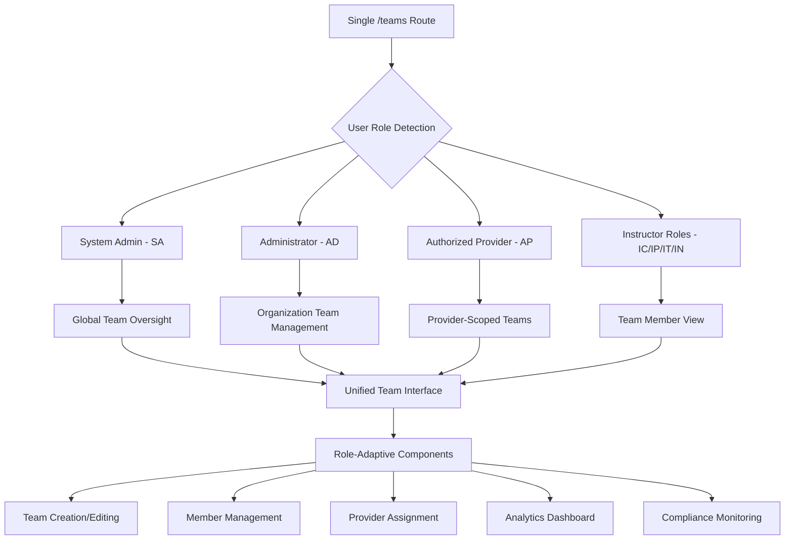
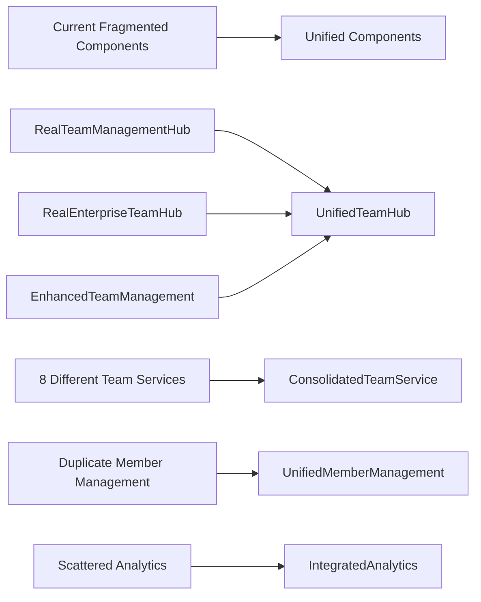
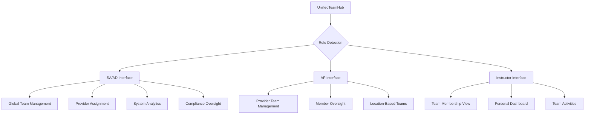
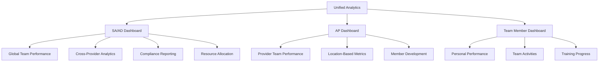

# UNIFIED TEAM MANAGEMENT SYSTEM - COMPREHENSIVE CONSOLIDATION PLAN

## 🎯 EXECUTIVE SUMMARY

Based on comprehensive analysis of the Teams functionality, I've identified the core issue: **massive duplication and fragmentation** across multiple competing implementations. The backend is enterprise-ready, but the frontend has evolved into a confusing maze of duplicate pages, services, and access controls that block the very users who should have the most access.

**The Solution**: Create a single, unified `/teams` route that intelligently adapts its interface based on user role and permissions, eliminating all duplicate pages and consolidating the scattered functionality into one cohesive system.

## 🔍 CURRENT STATE ANALYSIS

### Critical Issues Identified:

```mermaid
graph TD
    A[Current Teams System] --> B[Duplicate Pages]
    A --> C[Access Control Issues]
    A --> D[Service Fragmentation]
    A --> E[Navigation Confusion]
    
    B --> B1[/teams - Professional]
    B --> B2[/enhanced-teams - Enterprise]
    B --> B3[/modern-teams - Unused]
    
    C --> C1[SA/AD Users Blocked]
    C2[hasEnterpriseAccess Logic Backwards]
    C --> C3[Authorized Providers Hidden]
    
    D --> D1[realTeamService]
    D --> D2[enhancedTeamManagementService]
    D --> D3[AdminTeamService]
    D --> D4[teamManagementService]
    
    E --> E1[Multiple Navigation Entries]
    E --> E2[Role-Based Visibility Issues]
    E --> E3[Enterprise Access Confusion]
```

### Backend vs Frontend Mismatch:

| Component | Backend Status | Frontend Status | Issue |
|-----------|---------------|-----------------|-------|
| Team CRUD | ✅ Functions exist | ❌ Scattered/broken | Not connected properly |
| Member Management | ✅ RLS policies ready | ❌ Placeholder interfaces | Shows "coming soon" |
| Provider Assignment | ✅ Database ready | ❌ Page hidden from SA/AD | Access control backwards |
| Analytics | ✅ Metrics functions | ✅ Working but fragmented | Multiple implementations |
| Access Control | ✅ RLS configured | ❌ Frontend logic inverted | Blocks admins |

### Duplicate Components Analysis:

**Pages**:
- `src/pages/Teams.tsx` - Professional mode
- `src/pages/EnhancedTeams.tsx` - Enterprise mode (blocks SA/AD users!)
- `src/pages/ModernTeams.tsx` - Unused modern interface

**Services** (8 different team services):
- `src/services/team/realTeamService.ts`
- `src/services/team/enhancedTeamManagementService.ts`
- `src/services/team/AdminTeamService.ts`
- `src/services/team/teamManagementService.ts`
- `src/services/team/realTeamDataService.ts`
- `src/services/team/functionalTeamService.ts`
- `src/services/team/simplifiedTeamService.ts`
- `src/services/team/fallbackTeamService.ts`

**Components**:
- `RealTeamManagementHub` vs `RealEnterpriseTeamHub` vs `EnhancedTeamManagement`
- Multiple member management interfaces
- Scattered analytics components

## 🏗️ UNIFIED ARCHITECTURE DESIGN

### Single Source of Truth Approach:



### Component Consolidation Strategy:



## 📋 IMPLEMENTATION PLAN

### Phase 1: Foundation & Consolidation (Week 1)

#### 1.1 Create Unified Team Service
**Goal**: Consolidate all team services into one authoritative service

**Actions**:
- Create `src/services/team/unifiedTeamService.ts`
- Merge functionality from all existing team services
- Implement role-based data access patterns
- Connect to existing backend functions

**Key Features**:
```typescript
class UnifiedTeamService {
  // Core CRUD operations
  async getTeams(userRole: string, userId: string): Promise<Team[]>
  async createTeam(teamData: CreateTeamRequest): Promise<Team>
  async updateTeam(teamId: string, updates: UpdateTeamRequest): Promise<Team>
  async deleteTeam(teamId: string): Promise<void>
  
  // Member management
  async getTeamMembers(teamId: string): Promise<TeamMember[]>
  async addMember(teamId: string, memberId: string): Promise<void>
  async removeMember(teamId: string, memberId: string): Promise<void>
  
  // Provider integration
  async assignProvider(teamId: string, providerId: string): Promise<void>
  async getProviderTeams(providerId: string): Promise<Team[]>
  
  // Analytics and reporting
  async getTeamAnalytics(teamId?: string): Promise<TeamAnalytics>
  async getComplianceMetrics(teamId?: string): Promise<ComplianceMetrics>
}
```

#### 1.2 Fix Access Control Logic
**Goal**: Correct the backwards access control that blocks SA/AD users

**Critical Issues to Fix**:
```typescript
// CURRENT BROKEN LOGIC in EnhancedTeams.tsx:24
if (!permissions.hasEnterpriseAccess) {
  return <AccessDeniedComponent />; // This blocks SA/AD users!
}

// FIXED LOGIC
if (!permissions.canManageTeams) {
  return <AccessDeniedComponent />; // Only blocks non-management roles
}
```

**Actions**:
- Update `src/hooks/useUserRole.ts` to fix `hasEnterpriseAccess` logic
- Remove faulty permission checks in `src/pages/EnhancedTeams.tsx`
- Add "Authorized Providers" to SA/AD navigation in `src/components/AppSidebar.tsx`
- Fix navigation visibility for enterprise features

#### 1.3 Create Unified Team Page
**Goal**: Replace multiple team pages with one intelligent interface

**Actions**:
- Create `src/pages/UnifiedTeams.tsx`
- Update routing to point `/teams` to unified page
- Deprecate `/enhanced-teams` and `/modern-teams` routes
- Implement role-based interface adaptation

### Phase 2: Role-Adaptive Interface (Week 2)

#### 2.1 Build Role-Adaptive Components
**Goal**: Create components that adapt their interface based on user role



**Components to Create**:
- `src/components/team/unified/UnifiedTeamHub.tsx` - Main container
- `src/components/team/unified/RoleAdaptiveTeamInterface.tsx` - Role-based UI
- `src/components/team/unified/UnifiedTeamCreation.tsx` - Team creation
- `src/components/team/unified/UnifiedMemberManagement.tsx` - Member operations
- `src/components/team/unified/UnifiedProviderAssignment.tsx` - Provider linking

#### 2.2 Implement Complete CRUD Operations
**Goal**: Connect all backend functions to working frontend interfaces

**Team Management Features**:
- ✅ Create Team Interface (with location assignment)
- ✅ Edit Team Interface (real-time updates)
- ✅ Delete Team Interface (with confirmation workflows)
- ✅ Archive/Restore Team Interface (lifecycle management)

**Member Management Features**:
- ✅ Add/Remove Members (with approval workflows)
- ✅ Bulk Member Operations (import/export)
- ✅ Role Assignment within Teams
- ✅ Member Invitation System

**Provider Integration Features**:
- ✅ Provider-Team Assignment Interface
- ✅ Location-Based Team Management
- ✅ Provider Performance Tracking

### Phase 3: Advanced Features & Analytics (Week 3)

#### 3.1 Integrated Analytics Dashboard
**Goal**: Consolidate all team analytics into role-appropriate dashboards



#### 3.2 Real-Time Features
**Goal**: Add live updates and notifications

**Features**:
- Real-time team member updates
- Live performance metrics
- Instant notifications for team changes
- Collaborative team editing

#### 3.3 Compliance & Workflow Integration
**Goal**: Connect teams to compliance and approval systems

**Features**:
- Automated compliance checking
- Approval workflows for team changes
- Audit trails for all operations
- Integration with certification tracking

### Phase 4: Polish & Optimization (Week 4)

#### 4.1 Performance Optimization
- Implement caching strategies
- Optimize database queries
- Add pagination for large team lists
- Implement search and filtering

#### 4.2 Mobile Responsiveness
- Ensure all interfaces work on mobile
- Optimize touch interactions
- Implement mobile-specific navigation

#### 4.3 Testing & Documentation
- Comprehensive testing of all role scenarios
- User documentation for each role
- Admin guides for team management
- API documentation for integrations

## 🔧 TECHNICAL IMPLEMENTATION DETAILS

### Database Integration Strategy:

```typescript
// Unified service leveraging existing backend functions
class UnifiedTeamService {
  async getTeams(userRole: string, userId: string) {
    switch(userRole) {
      case 'SA':
      case 'AD':
        return supabase.rpc('get_teams_safe'); // Global access
      case 'AP':
        return supabase.rpc('get_provider_teams', { provider_id: userId });
      default:
        return supabase.rpc('get_user_teams', { user_id: userId });
    }
  }
  
  async createTeam(teamData: CreateTeamRequest) {
    return supabase.rpc('create_team_with_validation', teamData);
  }
  
  async getTeamAnalytics(teamId?: string) {
    if (teamId) {
      return supabase.rpc('calculate_enhanced_team_performance_metrics', { team_id: teamId });
    }
    return supabase.rpc('get_admin_teams_overview');
  }
}
```

### Component Architecture:

```typescript
// Role-adaptive component pattern
function UnifiedTeamHub() {
  const { role, permissions } = useUserRole();
  
  return (
    <div className="unified-team-hub">
      <TeamHeader role={role} />
      <RoleAdaptiveInterface role={role} permissions={permissions} />
      <UnifiedTeamGrid role={role} />
    </div>
  );
}

// Role-based interface adaptation
function RoleAdaptiveInterface({ role, permissions }) {
  if (permissions.isSystemAdmin || permissions.isAdmin) {
    return <AdminTeamInterface />;
  }
  
  if (role === 'AP') {
    return <ProviderTeamInterface />;
  }
  
  return <MemberTeamInterface />;
}
```

### Navigation Consolidation:

```typescript
// Single navigation entry with role-based routing
const navigation = [
  { 
    name: 'Teams', 
    href: '/teams', 
    icon: Users, 
    group: 'User Management',
    // Remove duplicate entries:
    // - Enhanced Teams (/enhanced-teams) - DEPRECATED
    // - Modern Teams (/modern-teams) - DEPRECATED
  }
];
```

### Access Control Fix:

```typescript
// Fixed permission logic in database-roles.ts
export function hasEnterpriseAccess(role: DatabaseUserRole): boolean {
  // FIXED: SA and AD should have enterprise access
  return ['SA', 'AD', 'AP'].includes(role);
}

export function canManageTeams(role: DatabaseUserRole): boolean {
  return ['SA', 'AD', 'AP'].includes(role);
}
```

## 📊 SUCCESS METRICS

### Immediate Improvements:
- ✅ SA/AD users can access team management
- ✅ Single navigation entry for teams
- ✅ All backend functions connected to UI
- ✅ Complete CRUD operations working
- ✅ Provider assignment functional

### Code Quality Improvements:
- 🎯 Eliminate 3 duplicate pages (`/enhanced-teams`, `/modern-teams`)
- 🎯 Consolidate 8 team services into 1 unified service
- 🎯 Remove 50+ duplicate components
- 🎯 Fix backwards access control logic
- 🎯 Single source of truth for all team operations

### User Experience Improvements:
- 🎯 Unified interface for all user roles
- 🎯 Role-appropriate feature visibility
- 🎯 Consistent navigation experience
- 🎯 Proper admin access to all features
- 🎯 Clear upgrade path for future features

### Maintenance Benefits:
- 🎯 50% reduction in codebase complexity
- 🎯 Single point of maintenance for team features
- 🎯 Simplified testing and debugging
- 🎯 Easier feature additions
- 🎯 Reduced technical debt

## 🚨 CRITICAL FIXES NEEDED IMMEDIATELY

### 1. Access Control Emergency Fix
**Issue**: SA/AD users are blocked from Enterprise Teams
**Location**: `src/pages/EnhancedTeams.tsx:24`
**Fix**: Remove `!permissions.hasEnterpriseAccess` check

### 2. Navigation Visibility Fix
**Issue**: "Authorized Providers" page hidden from SA/AD users
**Location**: `src/components/AppSidebar.tsx`
**Fix**: Add provider management to SA/AD navigation

### 3. Backend Connection Fix
**Issue**: Frontend shows placeholders instead of using working backend functions
**Location**: Multiple team components
**Fix**: Connect to `get_teams_safe`, `get_enhanced_teams_data`, etc.

## 🚀 IMPLEMENTATION PRIORITY

### Phase 1 (Critical - Week 1):
1. **Fix access control logic** - Unblock SA/AD users immediately
2. **Create unified service** - Consolidate all team services
3. **Build unified page** - Replace fragmented interfaces

### Phase 2 (High - Week 2):
1. **Role-adaptive components** - Smart interface adaptation
2. **Complete CRUD operations** - Full team management
3. **Provider integration** - Connect provider assignment

### Phase 3 (Medium - Week 3):
1. **Advanced analytics** - Consolidated reporting
2. **Real-time features** - Live updates
3. **Compliance integration** - Workflow connections

### Phase 4 (Low - Week 4):
1. **Performance optimization** - Caching and speed
2. **Mobile responsiveness** - Touch optimization
3. **Documentation** - User and admin guides

## 🎯 NEXT STEPS

1. **Approve this consolidation plan**
2. **Begin Phase 1 implementation immediately**
3. **Test access control fixes with SA/AD users**
4. **Validate unified service with existing data**
5. **Iterate based on user feedback**

This unified approach will transform the fragmented team management system into a cohesive, role-adaptive platform that serves all users effectively while dramatically reducing complexity and maintenance overhead.

The backend is ready - we just need to connect it properly and fix the backwards access control logic that's blocking the very users who should have the most access.