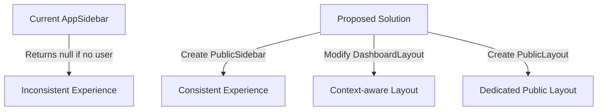
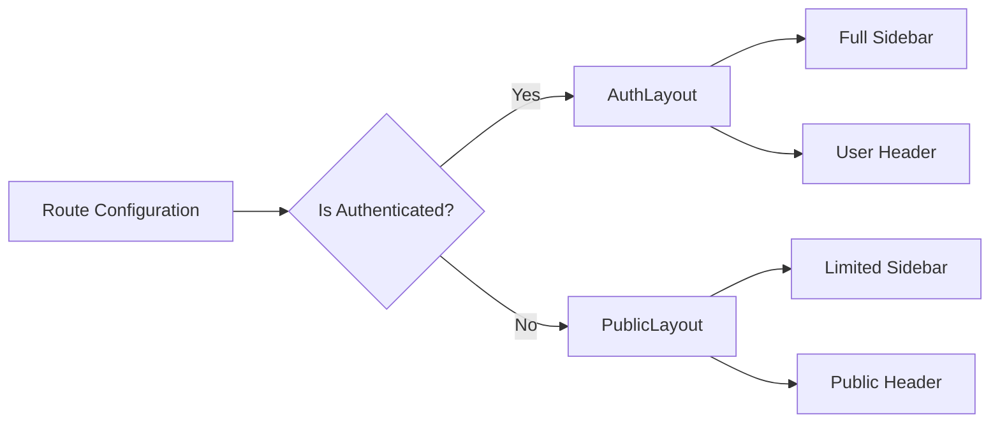
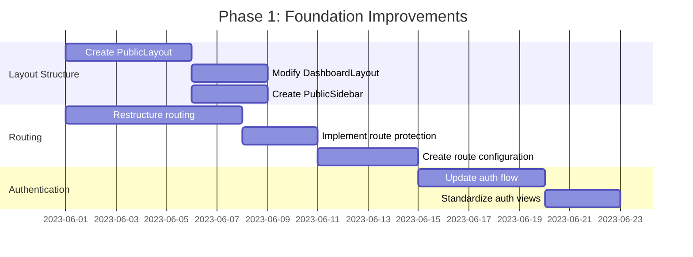
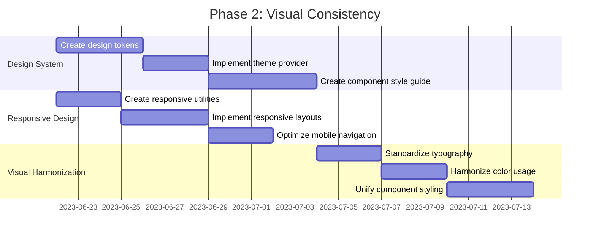
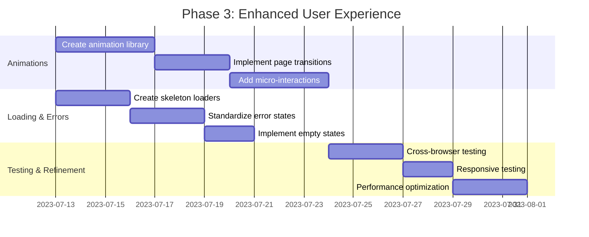

# UI/UX Audit: Certificate Management System

## Executive Summary

This document presents a comprehensive UI/UX audit of the Certificate Management System application, focusing on identified inconsistencies and opportunities for improvement. The audit addresses specific issues with the AppSidebar behavior, navigation headers, layout standardization, routing architecture, animations, responsive design, visual consistency, and error handling.

Each recommendation includes a priority level (High, Medium, Low) and implementation complexity assessment (High, Medium, Low) to help prioritize development efforts.

## 1. Current State Analysis

### Application Structure
The application currently has:
- A flat routing structure in `AppRoutes.tsx` with no clear separation between authenticated and non-authenticated routes
- A `DashboardLayout` component that includes the `AppSidebar` and is used by most pages
- The `AppSidebar` returns null if there's no user or if the profile is loading
- Some pages that should be accessible to non-authenticated users (like `CertificateVerification`) use the `DashboardLayout`
- Other non-authenticated pages (like `AcceptInvitation`) have their own custom layouts

### Identified Issues

1. **Inconsistent AppSidebar behavior**:
   - The sidebar doesn't appear for non-authenticated users on verification pages
   - This creates an inconsistent experience for users trying to verify certificates

2. **Navigation headers inconsistency**:
   - The `DashboardLayout` includes a header with user information
   - This header appears on pages that should be accessible to non-authenticated users

3. **Routing architecture**:
   - No clear separation between authenticated and non-authenticated routes
   - No route protection or redirection logic in the router configuration

4. **Layout inconsistencies**:
   - No dedicated layout for public/non-authenticated pages
   - Inconsistent user experience between authenticated and non-authenticated views

5. **Missing transitions and animations**:
   - Limited use of animations for state changes and navigation
   - No loading states for data fetching operations in some components

6. **Responsive design issues**:
   - Some components may not be fully responsive across all viewports

7. **Visual design inconsistencies**:
   - Inconsistent color usage across components
   - Typography variations between pages

8. **Loading states and error handling**:
   - Inconsistent loading indicators
   - Generic error messages without clear recovery actions
## 2. Detailed Recommendations

### 2.1 Resolve AppSidebar Behavior



**Priority: High | Complexity: Medium**

#### Current Implementation
The `AppSidebar` component currently returns null if there's no authenticated user:

```tsx
// In AppSidebar.tsx
if (!user || isLoading) return null;
```

This creates an inconsistent experience for non-authenticated users on pages like Certificate Verification.

#### Recommended Changes

1. **Create a `PublicSidebar` component**:
   - Simplified sidebar for non-authenticated users
   - Include only public navigation items (Home, Certificate Verification)
   - Remove user-specific elements and authentication-dependent features

```tsx
// Example PublicSidebar.tsx
export function PublicSidebar() {
  const location = useLocation();
  
  const publicNavigationItems = [
    {
      title: "Home",
      icon: Home,
      url: "/",
    },
    {
      title: "Certificate Verification",
      icon: CheckCircle,
      url: "/verification",
    },
  ];
  
  return (
    <Sidebar>
      <SidebarContent>
        {/* Brand area */}
        <div className="flex flex-col items-center justify-center pb-2 pt-6 border-b border-muted bg-gradient-to-br from-blue-500 to-purple-500">
          
          <div className="mt-2 font-semibold text-sm text-white tracking-wide text-center">
            Assured Response
          </div>
        </div>
        
        {/* Public Features Group */}
        <SidebarGroup className="mt-4">
          <SidebarGroupLabel className="pl-3 text-xs font-semibold text-muted-foreground tracking-wider">
            Certificate Verification
          </SidebarGroupLabel>
          <SidebarMenu>
            {publicNavigationItems.map((item) => (
              <SidebarMenuItem key={item.title}>
                <SidebarMenuButton
                  asChild
                  isActive={location.pathname === item.url}
                  className="group flex items-center gap-3 w-full py-2 px-3 rounded-md transition-colors duration-200 hover:bg-blue-50 focus:bg-blue-100 aria-[active=true]:bg-blue-100 aria-[active=true]:text-blue-700"
                >
                  <Link to={item.url} className="flex items-center w-full gap-3">
                    <item.icon className={`h-5 w-5 transition-colors duration-200 ${location.pathname === item.url ? "text-blue-600" : "text-gray-400 group-hover:text-blue-600"}`} />
                    <span className="font-medium text-[15px]">{item.title}</span>
                  </Link>
                </SidebarMenuButton>
              </SidebarMenuItem>
            ))}
          </SidebarMenu>
        </SidebarGroup>
        
        {/* Public footer */}
        <div className="mt-auto flex flex-col">
          <div className="px-4 py-3 border-t border-muted bg-muted/40 rounded-b-lg flex flex-col gap-2 shadow-inner">
            <Link to="/auth" className="text-blue-600 hover:text-blue-800 text-sm font-medium">
              Sign In / Register
            </Link>
          </div>
        </div>
      </SidebarContent>
    </Sidebar>
  );
}
```

2. **Modify the `DashboardLayout` to be context-aware**:
   - Detect if the current route should be public or private
   - Render appropriate sidebar based on authentication state

```tsx
// Example modification to DashboardLayout.tsx
export function DashboardLayout({ children }: { children: React.ReactNode }) {
  const { user, signOut } = useAuth();
  const { data: profile, isLoading: isProfileLoading } = useProfile();
  const isMobile = useIsMobile();
  const location = useLocation();
  const [isPageTransitioning, setIsPageTransitioning] = useState(false);
  
  // Public routes that should work for both authenticated and non-authenticated users
  const publicRoutes = ['/verification'];
  const isPublicRoute = publicRoutes.includes(location.pathname);
  
  // ...existing code...
  
  return (
    <SidebarProvider>
      <div className="min-h-screen flex w-full bg-gradient-to-br from-blue-50/50 via-white to-blue-50/30">
        {/* Render appropriate sidebar based on auth state and route */}
        {user ? <AppSidebar /> : <PublicSidebar />}
        
        <main className="flex-1 overflow-x-hidden">
          <header className="border-b bg-white shadow-sm sticky top-0 z-30 animate-fade-in">
            <div className="container mx-auto px-4 flex items-center justify-between h-16">
              {/* ...header content... */}
              
              {/* Only show user-specific header elements if user is authenticated */}
              {user && (
                <div className="flex items-center gap-4">
### 2.2 Remove Unnecessary Navigation Headers

**Priority: Medium | Complexity: Low**

#### Current Implementation
The `DashboardLayout` includes a header with user information and navigation elements that aren't relevant for all pages.

#### Recommended Changes

1. **Create a configuration object for header visibility**:

```tsx
// In a new file: src/config/layout-config.ts
export const PAGE_HEADER_CONFIG = {
  // Pages with full headers
  '/': { showHeader: true, showBreadcrumbs: true },
  '/courses': { showHeader: true, showBreadcrumbs: true },
  
  // Pages with simplified headers
  '/verification': { showHeader: true, showBreadcrumbs: false, simplified: true },
  
  // Pages with no headers
  '/auth': { showHeader: false, showBreadcrumbs: false },
  '/accept-invitation': { showHeader: false, showBreadcrumbs: false },
};

// Default configuration for pages not explicitly listed
export const DEFAULT_HEADER_CONFIG = { 
  showHeader: true, 
  showBreadcrumbs: true,
  simplified: false
};
```

2. **Modify the `DashboardLayout` to use this configuration**:

```tsx
// In DashboardLayout.tsx
import { PAGE_HEADER_CONFIG, DEFAULT_HEADER_CONFIG } from '@/config/layout-config';

export function DashboardLayout({ children }: { children: React.ReactNode }) {
  // ...existing code...
  
  const headerConfig = PAGE_HEADER_CONFIG[location.pathname] || DEFAULT_HEADER_CONFIG;
  
  return (
    <SidebarProvider>
      <div className="min-h-screen flex w-full bg-gradient-to-br from-blue-50/50 via-white to-blue-50/30">
        {/* ...sidebar... */}
        
        <main className="flex-1 overflow-x-hidden">
          {headerConfig.showHeader && (
            <header className="border-b bg-white shadow-sm sticky top-0 z-30 animate-fade-in">
              {/* Render simplified or full header based on config */}
              {headerConfig.simplified ? (
                <SimplifiedHeader />
              ) : (
                <FullHeader user={user} profile={profile} signOut={signOut} />
              )}
            </header>
          )}
          
          <div className="container mx-auto p-4 sm:p-6">
            {/* Only show breadcrumbs if configured */}
            {headerConfig.showBreadcrumbs && (
              <Breadcrumbs currentPath={location.pathname} />
            )}
            
            {/* ...rest of layout... */}
          </div>
        </main>
      </div>
    </SidebarProvider>
  );
}
```

3. **Create a `SimplifiedHeader` component**:
   - Minimal header with just logo and essential navigation
   - No user-specific information

### 2.3 Standardize Authorized and Non-authorized Views



**Priority: High | Complexity: Medium**

#### Current Implementation
The application lacks a consistent approach to handling authenticated vs. non-authenticated views. Some public pages use the same layout as authenticated pages, while others have custom layouts.

#### Recommended Changes

1. **Create a `PublicLayout` component**:

```tsx
// src/components/PublicLayout.tsx
import { Link, useLocation } from 'react-router-dom';
import { PublicSidebar } from './PublicSidebar';
import { SidebarProvider, SidebarTrigger } from '@/components/ui/sidebar';
import { Menu } from 'lucide-react';

export function PublicLayout({ children }: { children: React.ReactNode }) {
  const location = useLocation();
  
  return (
    <SidebarProvider>
      <div className="min-h-screen flex w-full bg-gradient-to-br from-blue-50/50 via-white to-blue-50/30">
        <PublicSidebar />
        <main className="flex-1 overflow-x-hidden">
          <header className="border-b bg-white shadow-sm sticky top-0 z-30 animate-fade-in">
            <div className="container mx-auto px-4 flex items-center justify-between h-16">
              <div className="flex items-center gap-3">
                <SidebarTrigger>
                  <Menu className="h-5 w-5 text-gray-600 hover:text-primary transition-colors" />
                </SidebarTrigger>
                <div className="flex items-center">
                  
                  <div className="flex flex-col ml-4">
                    <h1 className="text-lg font-semibold text-gray-800 tracking-tight">
                      Certificate Management System
                    </h1>
                  </div>
                </div>
              </div>
              
              <Link 
                to="/auth" 
                className="text-blue-600 hover:text-blue-800 text-sm font-medium px-4 py-2 border border-blue-200 rounded-md hover:bg-blue-50 transition-colors"
              >
                Sign In
              </Link>
            </div>
          </header>
          
          <div className="container mx-auto p-4 sm:p-6">
            {children}
          </div>
        </main>
      </div>
    </SidebarProvider>
  );
}
```

2. **Create a `LayoutRouter` component to handle layout switching**:

```tsx
// src/components/LayoutRouter.tsx
import { useAuth } from '@/contexts/AuthContext';
import { DashboardLayout } from './DashboardLayout';
import { PublicLayout } from './PublicLayout';
import { Loader2 } from 'lucide-react';

// Pages that should always use PublicLayout regardless of auth state
const ALWAYS_PUBLIC_PAGES = ['/auth', '/accept-invitation'];

// Pages that can be accessed by both authenticated and non-authenticated users
const MIXED_ACCESS_PAGES = ['/verification'];

export function LayoutRouter({ children }: { children: React.ReactNode }) {
  const { user, loading: authLoading } = useAuth();
  const location = useLocation();
  
  // Show loading state if auth is still initializing
  if (authLoading) {
    return (
      <div className="flex items-center justify-center min-h-screen bg-gray-50">
        <div className="text-center">
### 2.4 Optimize Routing Architecture

**Priority: High | Complexity: High**

#### Current Implementation
The current routing structure is flat with no nested routes or route protection. This makes it difficult to manage authentication requirements and layout consistency.

#### Recommended Changes

1. **Restructure the routing configuration to use nested routes**:

```tsx
// Updated AppRoutes.tsx
import { Routes, Route, Navigate, Outlet } from "react-router-dom";
import { useAuth } from "@/contexts/AuthContext";
import { Loader2 } from "lucide-react";

// Protected route component
const ProtectedRoute = ({ children }: { children: React.ReactNode }) => {
  const { user, loading } = useAuth();
  
  if (loading) {
    return (
      <div className="flex items-center justify-center min-h-screen">
        <Loader2 className="h-12 w-12 animate-spin text-primary" />
      </div>
    );
  }
  
  if (!user) {
    return <Navigate to="/auth" replace />;
  }
  
  return <>{children}</>;
};

const AppRoutes = () => {
  return (
    <Routes>
      {/* Public routes */}
      <Route path="/auth" element={<Auth />} />
      <Route path="/verification" element={<CertificateVerification />} />
      <Route path="/accept-invitation" element={<AcceptInvitation />} />
      
      {/* Protected routes */}
      <Route element={<ProtectedRoute><Outlet /></ProtectedRoute>}>
        <Route path="/" element={<Index />} />
        <Route path="/courses" element={<Courses />} />
        <Route path="/locations" element={<Locations />} />
        <Route path="/user-management" element={<UserManagementPage />} />
        <Route path="/profile" element={<Profile />} />
        <Route path="/supervision" element={<Supervision />} />
        <Route path="/settings" element={<Settings />} />
        <Route path="/certifications" element={<Certifications />} />
        <Route path="/role-management" element={<RoleManagement />} />
        <Route path="/progression-paths" element={<ProgressionPathBuilderPage />} />
        <Route path="/certificate-analytics" element={<CertificateAnalyticsPage />} />
        <Route path="/auth-diagnostic" element={<AuthDiagnostic />} />
      </Route>
      
      {/* Catch-all route */}
      <Route path="*" element={<NotFound />} />
    </Routes>
  );
};
```

2. **Implement route-based code splitting**:

```tsx
// With lazy loading
import { lazy, Suspense } from "react";
import { Routes, Route, Navigate, Outlet } from "react-router-dom";
import { useAuth } from "@/contexts/AuthContext";
import { Loader2 } from "lucide-react";

// Lazy load components
const Auth = lazy(() => import("./pages/Auth"));
const Index = lazy(() => import("./pages/Index"));
const Courses = lazy(() => import("./pages/Courses"));
// ... other lazy imports

// Loading component
const PageLoader = () => (
  <div className="flex items-center justify-center min-h-screen">
    <Loader2 className="h-12 w-12 animate-spin text-primary" />
  </div>
);

const AppRoutes = () => {
  return (
    <Suspense fallback={<PageLoader />}>
      <Routes>
        {/* Routes as above, but with lazy-loaded components */}
      </Routes>
    </Suspense>
  );
};
```

3. **Create route configuration with metadata**:

```tsx
// src/config/routes.ts
import { IconType } from "react-icons";
import { Home, ScrollText, CheckCircle, /* other icons */ } from "lucide-react";

export interface RouteConfig {
  path: string;
  title: string;
  icon?: IconType;
  isPublic: boolean;
  showInSidebar: boolean;
  showHeader: boolean;
  showBreadcrumbs: boolean;
  requiredRoles?: string[];
}

export const ROUTES: Record<string, RouteConfig> = {
  home: {
    path: "/",
    title: "Dashboard",
    icon: Home,
    isPublic: false,
    showInSidebar: true,
    showHeader: true,
    showBreadcrumbs: true,
  },
  verification: {
    path: "/verification",
    title: "Certificate Verification",
    icon: CheckCircle,
    isPublic: true,
    showInSidebar: true,
    showHeader: true,
    showBreadcrumbs: false,
  },
  // ... other routes
};

// Helper functions
export const getPublicRoutes = () => 
  Object.values(ROUTES).filter(route => route.isPublic);

export const getProtectedRoutes = () => 
  Object.values(ROUTES).filter(route => !route.isPublic);

export const getSidebarRoutes = (isAuthenticated: boolean) => 
  Object.values(ROUTES).filter(route => 
    route.showInSidebar && (route.isPublic || isAuthenticated)
  );
```

### 2.5 Implement Animations and Transitions

**Priority: Medium | Complexity: Medium**

#### Current Implementation
The application has limited animations and transitions, which can make the user experience feel static and less engaging.

#### Recommended Changes

1. **Create a reusable animation library**:

```tsx
// src/components/ui/animations.tsx
import { motion } from "framer-motion";

// Page transition variants
export const pageVariants = {
  initial: { opacity: 0, y: 10 },
  animate: { opacity: 1, y: 0 },
  exit: { opacity: 0, y: -10 }
};

// Staggered list item animations
export const listVariants = {
  initial: { opacity: 0 },
  animate: { 
    opacity: 1,
    transition: { staggerChildren: 0.05 }
  }
};

export const listItemVariants = {
### 2.6 Ensure Responsive Design

**Priority: High | Complexity: Medium**

#### Current Implementation
While the application has some responsive elements, there are inconsistencies across different viewports.

#### Recommended Changes

1. **Create a responsive utility hook**:

```tsx
// src/hooks/useResponsive.ts
import { useEffect, useState } from 'react';

type Breakpoint = 'xs' | 'sm' | 'md' | 'lg' | 'xl' | '2xl';

const breakpoints = {
  xs: 0,
  sm: 640,
  md: 768,
  lg: 1024,
  xl: 1280,
  '2xl': 1536,
};

export function useResponsive() {
  const [breakpoint, setBreakpoint] = useState<Breakpoint>('xs');
  const [width, setWidth] = useState(0);
  
  useEffect(() => {
    const handleResize = () => {
      const currentWidth = window.innerWidth;
      setWidth(currentWidth);
      
      if (currentWidth >= breakpoints['2xl']) {
        setBreakpoint('2xl');
      } else if (currentWidth >= breakpoints.xl) {
        setBreakpoint('xl');
      } else if (currentWidth >= breakpoints.lg) {
        setBreakpoint('lg');
      } else if (currentWidth >= breakpoints.md) {
        setBreakpoint('md');
      } else if (currentWidth >= breakpoints.sm) {
        setBreakpoint('sm');
      } else {
        setBreakpoint('xs');
      }
    };
    
    handleResize();
    window.addEventListener('resize', handleResize);
    return () => window.removeEventListener('resize', handleResize);
  }, []);
  
  return {
    breakpoint,
    width,
    isMobile: breakpoint === 'xs' || breakpoint === 'sm',
    isTablet: breakpoint === 'md',
    isDesktop: breakpoint === 'lg' || breakpoint === 'xl' || breakpoint === '2xl',
  };
}
```

2. **Implement responsive typography**:

```css
/* src/styles/typography.css */
:root {
  --font-size-base: 16px;
  --font-size-scale: 1.25;
  
  --font-size-xs: calc(var(--font-size-base) / var(--font-size-scale));
  --font-size-sm: var(--font-size-base);
  --font-size-md: calc(var(--font-size-base) * var(--font-size-scale));
  --font-size-lg: calc(var(--font-size-md) * var(--font-size-scale));
  --font-size-xl: calc(var(--font-size-lg) * var(--font-size-scale));
  --font-size-2xl: calc(var(--font-size-xl) * var(--font-size-scale));
}

@media (max-width: 640px) {
  :root {
    --font-size-base: 14px;
  }
}

.text-fluid-xs { font-size: var(--font-size-xs); }
.text-fluid-sm { font-size: var(--font-size-sm); }
.text-fluid-md { font-size: var(--font-size-md); }
.text-fluid-lg { font-size: var(--font-size-lg); }
.text-fluid-xl { font-size: var(--font-size-xl); }
.text-fluid-2xl { font-size: var(--font-size-2xl); }
```

3. **Create responsive layout components**:

```tsx
// src/components/ui/responsive-grid.tsx
interface ResponsiveGridProps {
  children: React.ReactNode;
  cols?: {
    xs?: number;
    sm?: number;
    md?: number;
    lg?: number;
    xl?: number;
  };
  gap?: string;
  className?: string;
}

export function ResponsiveGrid({
  children,
  cols = { xs: 1, sm: 2, md: 3, lg: 4, xl: 4 },
  gap = '1rem',
  className = '',
}: ResponsiveGridProps) {
  return (
    <div
      className={`grid ${className}`}
      style={{
        gap,
        gridTemplateColumns: `repeat(${cols.xs || 1}, 1fr)`,
        '@media (min-width: 640px)': {
          gridTemplateColumns: `repeat(${cols.sm || cols.xs || 1}, 1fr)`,
        },
        '@media (min-width: 768px)': {
          gridTemplateColumns: `repeat(${cols.md || cols.sm || cols.xs || 1}, 1fr)`,
        },
        '@media (min-width: 1024px)': {
          gridTemplateColumns: `repeat(${cols.lg || cols.md || cols.sm || cols.xs || 1}, 1fr)`,
        },
        '@media (min-width: 1280px)': {
          gridTemplateColumns: `repeat(${cols.xl || cols.lg || cols.md || cols.sm || cols.xs || 1}, 1fr)`,
        },
      }}
    >
      {children}
    </div>
  );
}
```

4. **Optimize mobile navigation**:

```tsx
// src/components/ui/mobile-navigation.tsx
import { useState } from 'react';
import { motion, AnimatePresence } from 'framer-motion';
import { Menu, X } from 'lucide-react';
import { Link, useLocation } from 'react-router-dom';
import { useAuth } from '@/contexts/AuthContext';
import { getSidebarRoutes } from '@/config/routes';

export function MobileNavigation() {
  const [isOpen, setIsOpen] = useState(false);
  const location = useLocation();
  const { user } = useAuth();
  
  const routes = getSidebarRoutes(!!user);
  
  return (
    <>
      <button
        onClick={() => setIsOpen(true)}
        className="md:hidden p-2 rounded-md hover:bg-gray-100"
      >
        <Menu className="h-6 w-6 text-gray-600" />
      </button>
      
      <AnimatePresence>
        {isOpen && (
          <motion.div
            initial={{ opacity: 0 }}
            animate={{ opacity: 1 }}
            exit={{ opacity: 0 }}
            className="fixed inset-0 bg-black/50 z-50 md:hidden"
            onClick={() => setIsOpen(false)}
          >
            <motion.div
              initial={{ x: '100%' }}
              animate={{ x: 0 }}
              exit={{ x: '100%' }}
              transition={{ type: 'spring', damping: 25, stiffness: 300 }}
              className="absolute top-0 right-0 bottom-0 w-3/4 max-w-sm bg-white shadow-xl"
              onClick={(e) => e.stopPropagation()}
            >
              <div className="flex justify-between items-center p-4 border-b">
                <h2 className="font-semibold text-lg">Menu</h2>
                <button onClick={() => setIsOpen(false)}>
                  <X className="h-6 w-6 text-gray-600" />
                </button>
              </div>
              
              <nav className="p-4">
                <ul className="space-y-2">
                  {routes.map((route) => (
                    <li key={route.path}>
                      <Link
                        to={route.path}
                        className={`flex items-center p-3 rounded-md ${
                          location.pathname === route.path
                            ? 'bg-blue-50 text-blue-600'
                            : 'text-gray-700 hover:bg-gray-50'
                        }`}
                        onClick={() => setIsOpen(false)}
                      >
                        {route.icon && <route.icon className="h-5 w-5 mr-3" />}
                        {route.title}
                      </Link>
                    </li>
                  ))}
                </ul>
              </nav>
            </motion.div>
          </motion.div>
        )}
      </AnimatePresence>
    </>
  );
}
```

### 2.7 Harmonize Visual Design

**Priority: Medium | Complexity: Medium**

#### Current Implementation
The application has inconsistent visual styling across different components and pages.

#### Recommended Changes

1. **Create a design token system**:

```tsx
// src/styles/tokens.ts
export const tokens = {
  colors: {
    primary: {
      50: '#eef2ff',
      100: '#e0e7ff',
      200: '#c7d2fe',
      300: '#a5b4fc',
      400: '#818cf8',
      500: '#6366f1',
      600: '#4f46e5',
      700: '#4338ca',
      800: '#3730a3',
      900: '#312e81',
    },
    secondary: {
      50: '#f0fdfa',
      100: '#ccfbf1',
      200: '#99f6e4',
      300: '#5eead4',
      400: '#2dd4bf',
      500: '#14b8a6',
      600: '#0d9488',
      700: '#0f766e',
      800: '#115e59',
      900: '#134e4a',
    },
    gray: {
      50: '#f9fafb',
      100: '#f3f4f6',
      200: '#e5e7eb',
      300: '#d1d5db',
      400: '#9ca3af',
      500: '#6b7280',
      600: '#4b5563',
      700: '#374151',
      800: '#1f2937',
      900: '#111827',
    },
    success: '#10b981',
    warning: '#f59e0b',
    error: '#ef4444',
    info: '#3b82f6',
  },
  typography: {
    fontFamily: {
      sans: 'Inter, system-ui, sans-serif',
      mono: 'JetBrains Mono, monospace',
    },
    fontWeight: {
      normal: '400',
      medium: '500',
      semibold: '600',
      bold: '700',
    },
    fontSize: {
      xs: '0.75rem',
      sm: '0.875rem',
      base: '1rem',
      lg: '1.125rem',
      xl: '1.25rem',
      '2xl': '1.5rem',
      '3xl': '1.875rem',
      '4xl': '2.25rem',
    },
  },
  spacing: {
    0: '0',
    1: '0.25rem',
    2: '0.5rem',
    3: '0.75rem',
    4: '1rem',
    5: '1.25rem',
    6: '1.5rem',
    8: '2rem',
    10: '2.5rem',
    12: '3rem',
    16: '4rem',
    20: '5rem',
    24: '6rem',
    32: '8rem',
    40: '10rem',
    48: '12rem',
    56: '14rem',
    64: '16rem',
  },
  borderRadius: {
    none: '0',
    sm: '0.125rem',
    DEFAULT: '0.25rem',
    md: '0.375rem',
    lg: '0.5rem',
    xl: '0.75rem',
    '2xl': '1rem',
    full: '9999px',
  },
  shadows: {
    sm: '0 1px 2px 0 rgba(0, 0, 0, 0.05)',
    DEFAULT: '0 1px 3px 0 rgba(0, 0, 0, 0.1), 0 1px 2px 0 rgba(0, 0, 0, 0.06)',
    md: '0 4px 6px -1px rgba(0, 0, 0, 0.1), 0 2px 4px -1px rgba(0, 0, 0, 0.06)',
    lg: '0 10px 15px -3px rgba(0, 0, 0, 0.1), 0 4px 6px -2px rgba(0, 0, 0, 0.05)',
    xl: '0 20px 25px -5px rgba(0, 0, 0, 0.1), 0 10px 10px -5px rgba(0, 0, 0, 0.04)',
    '2xl': '0 25px 50px -12px rgba(0, 0, 0, 0.25)',
    inner: 'inset 0 2px 4px 0 rgba(0, 0, 0, 0.06)',
    none: 'none',
  },
  transitions: {
    DEFAULT: '150ms cubic-bezier(0.4, 0, 0.2, 1)',
    fast: '100ms cubic-bezier(0.4, 0, 0.2, 1)',
    slow: '300ms cubic-bezier(0.4, 0, 0.2, 1)',
  },
};
```

2. **Create a component style guide**:

```tsx
// src/components/ui/style-guide.tsx
import { tokens } from '@/styles/tokens';

// Example of a styled button using the tokens
export function Button({
  variant = 'primary',
  size = 'md',
  children,
  ...props
}) {
  const variantStyles = {
    primary: `bg-primary-600 text-white hover:bg-primary-700`,
    secondary: `bg-secondary-600 text-white hover:bg-secondary-700`,
    outline: `border border-gray-300 text-gray-700 hover:bg-gray-50`,
    ghost: `text-gray-700 hover:bg-gray-100`,
  };
  
  const sizeStyles = {
    sm: `py-1 px-3 text-sm`,
    md: `py-2 px-4 text-base`,
    lg: `py-3 px-6 text-lg`,
  };
  
  return (
    <button
      className={`rounded-md font-medium transition-colors ${variantStyles[variant]} ${sizeStyles[size]}`}
      {...props}
    >
      {children}
    </button>
  );
}

// Example of a styled card using the tokens
export function Card({ children, className = '' }) {
  return (
    <div
      className={`bg-white rounded-lg shadow-md overflow-hidden ${className}`}
    >
      {children}
    </div>
  );
}
```

3. **Create a theme provider with dark mode support**:

```tsx
// src/components/ui/theme-provider.tsx
import { createContext, useContext, useEffect, useState } from 'react';

type Theme = 'light' | 'dark' | 'system';

interface ThemeProviderProps {
  children: React.ReactNode;
  defaultTheme?: Theme;
  storageKey?: string;
}

interface ThemeProviderState {
  theme: Theme;
  setTheme: (theme: Theme) => void;
}

const ThemeProviderContext = createContext<ThemeProviderState | undefined>(
  undefined
);

export function ThemeProvider({
  children,
  defaultTheme = 'system',
  storageKey = 'ui-theme',
  ...props
}: ThemeProviderProps) {
  const [theme, setTheme] = useState<Theme>(
    () => (localStorage.getItem(storageKey) as Theme) || defaultTheme
  );

  useEffect(() => {
    const root = window.document.documentElement;
    
    root.classList.remove('light', 'dark');
    
    if (theme === 'system') {
      const systemTheme = window.matchMedia('(prefers-color-scheme: dark)')
        .matches
        ? 'dark'
        : 'light';
      
      root.classList.add(systemTheme);
      return;
    }
    
    root.classList.add(theme);
  }, [theme]);

  const value = {
    theme,
    setTheme: (theme: Theme) => {
      localStorage.setItem(storageKey, theme);
      setTheme(theme);
    },
  };

  return (
    <ThemeProviderContext.Provider {...props} value={value}>
      {children}
    </ThemeProviderContext.Provider>
  );
}

export const useTheme = () => {
  const context = useContext(ThemeProviderContext);
  
  if (context === undefined) {
    throw new Error('useTheme must be used within a ThemeProvider');
  }
  
  return context;
};
```

### 2.8 Improve Loading States and Error Handling

**Priority: Medium | Complexity: Low**

#### Current Implementation
The application has inconsistent loading indicators and error handling across different components.

#### Recommended Changes

1. **Create a skeleton loader component**:

```tsx
// src/components/ui/skeleton.tsx
import { cn } from '@/lib/utils';

interface SkeletonProps {
  className?: string;
}

export function Skeleton({ className }: SkeletonProps) {
  return (
    <div
      className={cn(
        'animate-pulse rounded-md bg-gray-200 dark:bg-gray-700',
        className
      )}
    />
  );
}

// Example usage for a card skeleton
export function CardSkeleton() {
  return (
    <div className="space-y-3">
      <Skeleton className="h-40 w-full" />
      <Skeleton className="h-4 w-3/4" />
      <Skeleton className="h-4 w-1/2" />
      <div className="flex gap-2 pt-2">
        <Skeleton className="h-8 w-20" />
        <Skeleton className="h-8 w-20" />
      </div>
    </div>
  );
}

// Example usage for a table skeleton
export function TableSkeleton({ rows = 5 }) {
  return (
    <div className="space-y-3">
      <div className="flex gap-4">
        <Skeleton className="h-8 w-1/4" />
        <Skeleton className="h-8 w-1/4" />
        <Skeleton className="h-8 w-1/4" />
        <Skeleton className="h-8 w-1/4" />
      </div>
      {Array.from({ length: rows }).map((_, i) => (
        <div key={i} className="flex gap-4">
          <Skeleton className="h-6 w-1/4" />
          <Skeleton className="h-6 w-1/4" />
          <Skeleton className="h-6 w-1/4" />
          <Skeleton className="h-6 w-1/4" />
        </div>
      ))}
    </div>
  );
}
```

2. **Create a standardized error component**:

```tsx
// src/components/ui/error.tsx
import { AlertTriangle, RefreshCw } from 'lucide-react';

interface ErrorProps {
  title?: string;
  message?: string;
  onRetry?: () => void;
}

export function ErrorDisplay({
  title = 'Something went wrong',
  message = 'An error occurred while loading the data. Please try again.',
  onRetry,
}: ErrorProps) {
  return (
    <div className="flex flex-col items-center justify-center p-8 text-center">
      <AlertTriangle className="h-12 w-12 text-red-500 mb-4" />
      <h3 className="text-lg font-semibold text-gray-900 mb-2">{title}</h3>
      <p className="text-gray-600 mb-6 max-w-md">{message}</p>
      {onRetry && (
        <button
          onClick={onRetry}
          className="flex items-center gap-2 px-4 py-2 bg-blue-600 text-white rounded-md hover:bg-blue-700 transition-colors"
        >
          <RefreshCw className="h-4 w-4" />
          Try Again
        </button>
      )}
    </div>
  );
}
```

3. **Create an empty state component**:

```tsx
// src/components/ui/empty-state.tsx
import { FileQuestion } from 'lucide-react';

interface EmptyStateProps {
  title?: string;
  message?: string;
  icon?: React.ReactNode;
  action?: React.ReactNode;
}

export function EmptyState({
  title = 'No data found',
  message = 'There are no items to display at this time.',
  icon = <FileQuestion className="h-12 w-12 text-gray-400" />,
  action,
}: EmptyStateProps) {
  return (
    <div className="flex flex-col items-center justify-center p-8 text-center">
      <div className="mb-4">{icon}</div>
      <h3 className="text-lg font-semibold text-gray-900 mb-2">{title}</h3>
      <p className="text-gray-600 mb-6 max-w-md">{message}</p>
      {action}
    </div>
  );
}
```

## 3. Implementation Plan

### Phase 1: Foundation Improvements (2-3 weeks)



**Key Tasks:**
1. Create `PublicLayout` component
2. Create `PublicSidebar` component
3. Modify `DashboardLayout` to be context-aware
4. Restructure routing architecture
5. Implement route protection
6. Create route configuration with metadata
7. Update authentication flow
8. Standardize authenticated and non-authenticated views

### Phase 2: Visual Consistency (2 weeks)



**Key Tasks:**
1. Create design token system
2. Implement theme provider with dark mode support
3. Create component style guide
4. Create responsive utilities
5. Implement responsive layouts
6. Optimize mobile navigation
7. Standardize typography
8. Harmonize color usage
9. Unify component styling

### Phase 3: Enhanced User Experience (2 weeks)



**Key Tasks:**
1. Create animation library
2. Implement page transitions
3. Add micro-interactions
4. Create skeleton loaders
5. Standardize error states
6. Implement empty states
7. Conduct cross-browser testing
8. Perform responsive testing
9. Optimize performance

## 4. Testing and Validation Strategy

### User Testing

1. **Usability Testing**
   - Test with both authenticated and non-authenticated users
   - Focus on navigation flow and layout consistency
   - Gather feedback on animations and transitions

2. **A/B Testing**
   - Compare current vs. new layouts for key pages
   - Measure engagement and task completion rates
   - Evaluate user satisfaction scores

### Technical Testing

1. **Cross-browser Testing**
   - Test on Chrome, Firefox, Safari, and Edge
   - Ensure consistent rendering and behavior

2. **Responsive Testing**
   - Test on desktop, tablet, and mobile devices
   - Verify layout adaptability across viewports

3. **Performance Testing**
   - Measure load times before and after changes
   - Evaluate animation performance on lower-end devices
   - Monitor memory usage and CPU performance

### Accessibility Testing

1. **WCAG Compliance**
   - Ensure color contrast meets accessibility standards
   - Verify keyboard navigation works properly
   - Test with screen readers

2. **Focus Management**
   - Ensure proper focus handling during navigation
   - Verify modal and dialog accessibility

## 5. Conclusion

This UI/UX audit has identified several areas for improvement in the Certificate Management System application. By implementing the recommended changes, the application will provide a more consistent, intuitive, and engaging user experience for both authenticated and non-authenticated users.

The implementation plan provides a structured approach to addressing these issues, with a focus on establishing a solid foundation before adding enhanced features and refinements.

Key benefits of these improvements include:
- Consistent user experience across all pages
- Clear separation between public and authenticated views
- Improved navigation and user flow
- Enhanced visual appeal through animations and consistent styling
- Better responsiveness across all devices
- Improved loading states and error handling

By prioritizing these improvements based on their impact and complexity, the development team can systematically enhance the application's UI/UX while minimizing disruption to users.
  initial: { opacity: 0, y: 20 },
  animate: { opacity: 1, y: 0 }
};

// Fade in animation component
export const FadeIn = ({ children, delay = 0 }) => (
  <motion.div
    initial={{ opacity: 0 }}
    animate={{ opacity: 1 }}
    transition={{ duration: 0.3, delay }}
  >
    {children}
  </motion.div>
);

// Page transition wrapper
export const PageTransition = ({ children }) => (
  <motion.div
    initial="initial"
    animate="animate"
    exit="exit"
    variants={pageVariants}
    transition={{ duration: 0.3 }}
  >
    {children}
  </motion.div>
);
```

2. **Enhance the sidebar with animations**:

```tsx
// Enhanced sidebar with animations
import { motion, AnimatePresence } from "framer-motion";

// In the sidebar component
return (
  <AnimatePresence>
    {isOpen && (
      <motion.div
        initial={{ x: -300 }}
        animate={{ x: 0 }}
        exit={{ x: -300 }}
        transition={{ type: "spring", stiffness: 300, damping: 30 }}
        className="sidebar-container"
      >
        {/* Sidebar content */}
      </motion.div>
    )}
  </AnimatePresence>
);
```

3. **Add micro-interactions to buttons and interactive elements**:

```tsx
// Enhanced button component
export const AnimatedButton = ({ children, ...props }) => (
  <motion.button
    whileHover={{ scale: 1.05 }}
    whileTap={{ scale: 0.95 }}
    transition={{ type: "spring", stiffness: 400, damping: 17 }}
    {...props}
  >
    {children}
  </motion.button>
);
```

4. **Implement page transitions in the router**:

```tsx
// In AppRoutes.tsx
import { AnimatePresence } from "framer-motion";
import { Routes, Route, useLocation } from "react-router-dom";
import { PageTransition } from "@/components/ui/animations";

const AppRoutes = () => {
  const location = useLocation();
  
  return (
    <AnimatePresence mode="wait">
      <Routes location={location} key={location.pathname}>
        {/* Wrap each route with PageTransition */}
        <Route 
          path="/" 
          element={
            <PageTransition>
              <Index />
            </PageTransition>
          } 
        />
        {/* Other routes */}
      </Routes>
    </AnimatePresence>
  );
};
```
          <Loader2 className="h-12 w-12 animate-spin text-primary mx-auto mb-4" />
          <h2 className="text-xl font-medium text-gray-700">Loading...</h2>
        </div>
      </div>
    );
  }
  
  // Determine which layout to use
  const isAlwaysPublicPage = ALWAYS_PUBLIC_PAGES.includes(location.pathname);
  const isMixedAccessPage = MIXED_ACCESS_PAGES.includes(location.pathname);
  
  // Use PublicLayout for always public pages or mixed access pages when not authenticated
  if (isAlwaysPublicPage || (isMixedAccessPage && !user)) {
    return <PublicLayout>{children}</PublicLayout>;
  }
  
  // Use DashboardLayout for authenticated users
  return <DashboardLayout>{children}</DashboardLayout>;
}
```

3. **Update the `App.tsx` to use the `LayoutRouter`**:

```tsx
// Modified App.tsx
function App() {
  return (
    <StrictMode>
      <QueryClientProvider client={queryClient}>
        <ThemeProvider defaultTheme="light" storageKey="vite-ui-theme">
          <Router>
            <AuthProvider>
              <LayoutRouter>
                <AppRoutes />
              </LayoutRouter>
              <Toaster />
            </AuthProvider>
          </Router>
        </ThemeProvider>
      </QueryClientProvider>
    </StrictMode>
  );
}
```
                  {/* ...user header content... */}
                </div>
              )}
              
              {/* Show sign-in button if no user and on public route */}
              {!user && isPublicRoute && (
                <Link 
                  to="/auth" 
                  className="text-blue-600 hover:text-blue-800 text-sm font-medium px-4 py-2 border border-blue-200 rounded-md hover:bg-blue-50 transition-colors"
                >
                  Sign In
                </Link>
              )}
            </div>
          </header>
          
          {/* ...rest of layout... */}
        </main>
      </div>
    </SidebarProvider>
  );
}
```

3. **Create a dedicated `PublicLayout` component**:
   - For pages that are exclusively for non-authenticated users
   - Simplified header and navigation