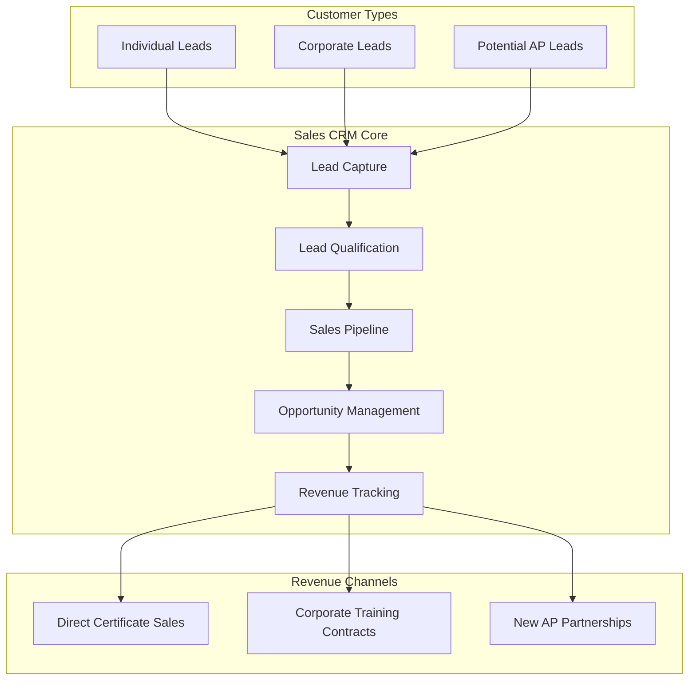

# Assured Response Sales CRM System - Complete Implementation Plan

## Executive Summary

This document outlines the comprehensive implementation of a Sales-focused Customer Relationship Management (CRM) system for Assured Response, designed to drive revenue growth through two primary channels:

1. **Partner Acquisition**: Recruit new Authorized Providers (APs) to expand training network
2. **Direct Sales**: Drive individuals and companies to existing AP locations for certificate training

**Access Control**: Strictly limited to Admin (AD) and System Admin (SA) users only.

## Business Objectives

### Primary Revenue Goals
- **Increase Certificate Sales Volume**: Drive more individuals/companies to AP locations
- **Expand Partner Network**: Recruit high-quality Authorized Providers in strategic locations
- **Maximize Revenue per Customer**: Upsell additional certifications and services
- **Improve Conversion Rates**: Better qualify and nurture leads through sales pipeline

### Target Customers
1. **Individuals**: Workers needing First Aid/CPR certifications
2. **Companies**: Businesses requiring workplace safety training for employees
3. **Potential APs**: Organizations wanting to become authorized training providers

## System Architecture Overview



## Database Schema Design

### Core CRM Tables

```sql
-- CRM Leads (All potential customers)
CREATE TABLE crm_leads (
    id UUID PRIMARY KEY DEFAULT gen_random_uuid(),
    
    -- Lead Classification
    lead_type VARCHAR(50) NOT NULL CHECK (lead_type IN ('individual', 'corporate', 'potential_ap')),
    lead_source VARCHAR(100) NOT NULL,
    lead_status VARCHAR(50) DEFAULT 'new',
    
    -- Contact Information
    first_name VARCHAR(100),
    last_name VARCHAR(100),
    company_name VARCHAR(255),
    job_title VARCHAR(100),
    email VARCHAR(255) NOT NULL,
    phone VARCHAR(50),
    
    -- Address Information
    address_line1 VARCHAR(255),
    address_line2 VARCHAR(255),
    city VARCHAR(100),
    province VARCHAR(50),
    postal_code VARCHAR(20),
    
    -- Business Information (for corporate/AP leads)
    industry VARCHAR(100),
    company_size VARCHAR(50), -- '1-10', '11-50', '51-200', '201-500', '500+'
    annual_revenue_range VARCHAR(50),
    number_of_employees INTEGER,
    
    -- Training Needs
    required_certifications TEXT[],
    training_urgency VARCHAR(50), -- 'immediate', 'within_month', 'within_quarter', 'planning'
    preferred_location VARCHAR(255),
    preferred_training_format VARCHAR(50), -- 'in_person', 'blended', 'flexible'
    estimated_participant_count INTEGER,
    budget_range VARCHAR(50),
    
    -- Lead Scoring
    lead_score INTEGER DEFAULT 0,
    qualification_notes TEXT,
    pain_points TEXT[],
    decision_timeline VARCHAR(50),
    decision_makers JSONB,
    
    -- Assignment and Tracking
    assigned_to UUID REFERENCES profiles(id),
    created_by UUID REFERENCES profiles(id),
    created_at TIMESTAMP WITH TIME ZONE DEFAULT NOW(),
    updated_at TIMESTAMP WITH TIME ZONE DEFAULT NOW(),
    last_contact_date TIMESTAMP WITH TIME ZONE,
    next_follow_up_date TIMESTAMP WITH TIME ZONE,
    
    -- Integration
    converted_to_opportunity_id UUID,
    converted_date TIMESTAMP WITH TIME ZONE,
    
    status VARCHAR(50) DEFAULT 'active'
);

-- CRM Opportunities (Qualified sales opportunities)
CREATE TABLE crm_opportunities (
    id UUID PRIMARY KEY DEFAULT gen_random_uuid(),
    lead_id UUID REFERENCES crm_leads(id),
    
    -- Opportunity Details
    opportunity_name VARCHAR(255) NOT NULL,
    opportunity_type VARCHAR(50) NOT NULL, -- 'individual_training', 'corporate_contract', 'ap_partnership'
    stage VARCHAR(50) NOT NULL,
    
    -- Financial Information
    estimated_value DECIMAL(12,2) NOT NULL,
    probability INTEGER CHECK (probability >= 0 AND probability <= 100),
    expected_close_date DATE,
    actual_close_date DATE,
    
    -- Training Details
    certification_types TEXT[],
    participant_count INTEGER,
    training_location VARCHAR(255),
    preferred_ap_id INTEGER REFERENCES authorized_providers(id),
    training_schedule JSONB,
    
    -- Corporate Contract Details (for corporate opportunities)
    contract_duration_months INTEGER,
    recurring_training BOOLEAN DEFAULT FALSE,
    volume_discount_applicable BOOLEAN DEFAULT FALSE,
    
    -- AP Partnership Details (for potential AP opportunities)
    proposed_service_areas TEXT[],
    expected_monthly_volume INTEGER,
    setup_investment DECIMAL(10,2),
    
    -- Sales Process
    proposal_sent_date DATE,
    proposal_value DECIMAL(12,2),
    competitor_analysis JSONB,
    objections_notes TEXT,
    next_steps TEXT,
    
    -- Management
    assigned_to UUID REFERENCES profiles(id),
    created_by UUID REFERENCES profiles(id),
    created_at TIMESTAMP WITH TIME ZONE DEFAULT NOW(),
    updated_at TIMESTAMP WITH TIME ZONE DEFAULT NOW(),
    
    status VARCHAR(50) DEFAULT 'open'
);

-- CRM Activities (All sales interactions)
CREATE TABLE crm_activities (
    id UUID PRIMARY KEY DEFAULT gen_random_uuid(),
    lead_id UUID REFERENCES crm_leads(id),
    opportunity_id UUID REFERENCES crm_opportunities(id),
    
    -- Activity Details
    activity_type VARCHAR(50) NOT NULL, -- 'call', 'email', 'meeting', 'demo', 'proposal', 'follow_up'
    subject VARCHAR(255) NOT NULL,
    description TEXT,
    
    -- Timing
    activity_date TIMESTAMP WITH TIME ZONE NOT NULL,
    duration_minutes INTEGER,
    
    -- Outcome
    outcome VARCHAR(100), -- 'positive', 'neutral', 'negative', 'no_response'
    outcome_notes TEXT,
    interest_level INTEGER CHECK (interest_level >= 1 AND interest_level <= 10),
    
    -- Follow-up
    follow_up_required BOOLEAN DEFAULT FALSE,
    follow_up_date TIMESTAMP WITH TIME ZONE,
    follow_up_type VARCHAR(50),
    
    -- Participants and Location
    attendees JSONB,
    location VARCHAR(255),
    meeting_type VARCHAR(50), -- 'phone', 'video', 'in_person', 'email'
    
    -- Documents and Attachments
    documents JSONB,
    
    -- Management
    created_by UUID REFERENCES profiles(id),
    created_at TIMESTAMP WITH TIME ZONE DEFAULT NOW(),
    updated_at TIMESTAMP WITH TIME ZONE DEFAULT NOW()
);

-- CRM Sales Pipeline Stages
CREATE TABLE crm_pipeline_stages (
    id UUID PRIMARY KEY DEFAULT gen_random_uuid(),
    pipeline_type VARCHAR(50) NOT NULL, -- 'individual', 'corporate', 'ap_partnership'
    stage_name VARCHAR(100) NOT NULL,
    stage_order INTEGER NOT NULL,
    probability_default INTEGER,
    is_closed_won BOOLEAN DEFAULT FALSE,
    is_closed_lost BOOLEAN DEFAULT FALSE,
    automation_rules JSONB,
    created_at TIMESTAMP WITH TIME ZONE DEFAULT NOW(),
    updated_at TIMESTAMP WITH TIME ZONE DEFAULT NOW()
);

-- CRM Email Campaigns
CREATE TABLE crm_email_campaigns (
    id UUID PRIMARY KEY DEFAULT gen_random_uuid(),
    campaign_name VARCHAR(255) NOT NULL,
    campaign_type VARCHAR(50) NOT NULL, -- 'lead_nurture', 'promotional', 'educational', 'follow_up'
    target_audience VARCHAR(50) NOT NULL, -- 'individuals', 'corporate', 'potential_aps', 'all'
    
    -- Email Content
    subject_line VARCHAR(255) NOT NULL,
    email_template_id UUID,
    personalization_fields JSONB,
    
    -- Targeting
    target_segments JSONB,
    geographic_targeting TEXT[],
    industry_targeting TEXT[],
    
    -- Scheduling
    scheduled_date TIMESTAMP WITH TIME ZONE,
    sent_date TIMESTAMP WITH TIME ZONE,
    
    -- Performance Metrics
    status VARCHAR(50) DEFAULT 'draft',
    total_recipients INTEGER DEFAULT 0,
    delivered_count INTEGER DEFAULT 0,
    opened_count INTEGER DEFAULT 0,
    clicked_count INTEGER DEFAULT 0,
    bounced_count INTEGER DEFAULT 0,
    unsubscribed_count INTEGER DEFAULT 0,
    leads_generated INTEGER DEFAULT 0,
    opportunities_created INTEGER DEFAULT 0,
    revenue_attributed DECIMAL(12,2) DEFAULT 0,
    
    -- Management
    created_by UUID REFERENCES profiles(id),
    created_at TIMESTAMP WITH TIME ZONE DEFAULT NOW(),
    updated_at TIMESTAMP WITH TIME ZONE DEFAULT NOW()
);

-- CRM Tasks and Reminders
CREATE TABLE crm_tasks (
    id UUID PRIMARY KEY DEFAULT gen_random_uuid(),
    lead_id UUID REFERENCES crm_leads(id),
    opportunity_id UUID REFERENCES crm_opportunities(id),
    
    -- Task Details
    task_title VARCHAR(255) NOT NULL,
    description TEXT,
    task_type VARCHAR(50), -- 'follow_up', 'proposal', 'demo', 'contract_review', 'onboarding'
    priority VARCHAR(20) DEFAULT 'medium', -- 'low', 'medium', 'high', 'urgent'
    
    -- Timing
    due_date TIMESTAMP WITH TIME ZONE,
    completed_date TIMESTAMP WITH TIME ZONE,
    reminder_date TIMESTAMP WITH TIME ZONE,
    
    -- Assignment
    assigned_to UUID REFERENCES profiles(id),
    created_by UUID REFERENCES profiles(id),
    
    -- Status
    status VARCHAR(50) DEFAULT 'pending', -- 'pending', 'in_progress', 'completed', 'cancelled'
    completion_notes TEXT,
    
    created_at TIMESTAMP WITH TIME ZONE DEFAULT NOW(),
    updated_at TIMESTAMP WITH TIME ZONE DEFAULT NOW()
);

-- CRM Revenue Tracking
CREATE TABLE crm_revenue_records (
    id UUID PRIMARY KEY DEFAULT gen_random_uuid(),
    opportunity_id UUID REFERENCES crm_opportunities(id),
    
    -- Revenue Details
    revenue_type VARCHAR(50) NOT NULL, -- 'certificate_sale', 'corporate_contract', 'ap_setup_fee', 'recurring_revenue'
    amount DECIMAL(12,2) NOT NULL,
    currency VARCHAR(3) DEFAULT 'CAD',
    
    -- Timing
    revenue_date DATE NOT NULL,
    billing_period_start DATE,
    billing_period_end DATE,
    
    -- Attribution
    ap_location_id INTEGER REFERENCES authorized_providers(id),
    certificate_count INTEGER,
    participant_count INTEGER,
    
    -- Commission and Tracking
    sales_rep_id UUID REFERENCES profiles(id),
    commission_rate DECIMAL(5,2),
    commission_amount DECIMAL(10,2),
    
    -- Integration
    certificate_request_ids TEXT[],
    invoice_reference VARCHAR(100),
    
    created_at TIMESTAMP WITH TIME ZONE DEFAULT NOW(),
    updated_at TIMESTAMP WITH TIME ZONE DEFAULT NOW()
);

-- CRM Analytics Cache
CREATE TABLE crm_analytics_cache (
    id UUID PRIMARY KEY DEFAULT gen_random_uuid(),
    metric_type VARCHAR(100) NOT NULL,
    metric_period VARCHAR(50) NOT NULL, -- 'daily', 'weekly', 'monthly', 'quarterly', 'yearly'
    metric_date DATE NOT NULL,
    metric_data JSONB NOT NULL,
    calculated_at TIMESTAMP WITH TIME ZONE DEFAULT NOW(),
    expires_at TIMESTAMP WITH TIME ZONE NOT NULL
);
```

## Lead Scoring Algorithm

### Individual Leads Scoring
```typescript
export class IndividualLeadScoringService {
  calculateScore(lead: CRMLead): number {
    let score = 0;
    
    // Urgency scoring (40 points max)
    if (lead.training_urgency === 'immediate') score += 40;
    else if (lead.training_urgency === 'within_month') score += 30;
    else if (lead.training_urgency === 'within_quarter') score += 20;
    else if (lead.training_urgency === 'planning') score += 10;
    
    // Location scoring (20 points max)
    if (this.hasNearbyAP(lead.preferred_location)) score += 20;
    else if (this.hasRegionalAP(lead.preferred_location)) score += 10;
    
    // Certification type scoring (20 points max)
    const highDemandCerts = ['Standard First Aid', 'CPR Level C', 'AED'];
    const requestedHighDemand = lead.required_certifications?.filter(cert => 
      highDemandCerts.includes(cert)
    ).length || 0;
    score += Math.min(requestedHighDemand * 7, 20);
    
    // Contact quality scoring (20 points max)
    if (lead.phone && lead.email) score += 10;
    if (lead.company_name) score += 5;
    if (lead.job_title) score += 5;
    
    return Math.min(score, 100);
  }
}
```

### Corporate Leads Scoring
```typescript
export class CorporateLeadScoringService {
  calculateScore(lead: CRMLead): number {
    let score = 0;
    
    // Company size scoring (30 points max)
    if (lead.company_size === '500+') score += 30;
    else if (lead.company_size === '201-500') score += 25;
    else if (lead.company_size === '51-200') score += 20;
    else if (lead.company_size === '11-50') score += 15;
    else if (lead.company_size === '1-10') score += 10;
    
    // Industry scoring (25 points max)
    const highRiskIndustries = ['construction', 'healthcare', 'manufacturing', 'transportation'];
    if (highRiskIndustries.includes(lead.industry)) score += 25;
    else score += 10;
    
    // Training volume scoring (25 points max)
    if (lead.estimated_participant_count >= 100) score += 25;
    else if (lead.estimated_participant_count >= 50) score += 20;
    else if (lead.estimated_participant_count >= 20) score += 15;
    else if (lead.estimated_participant_count >= 10) score += 10;
    else if (lead.estimated_participant_count >= 5) score += 5;
    
    // Budget scoring (20 points max)
    if (lead.budget_range === '$10,000+') score += 20;
    else if (lead.budget_range === '$5,000-$10,000') score += 15;
    else if (lead.budget_range === '$2,000-$5,000') score += 10;
    else if (lead.budget_range === '$500-$2,000') score += 5;
    
    return Math.min(score, 100);
  }
}
```

## Sales Pipeline Stages

### Individual Training Pipeline
1. **New Lead** (0% probability)
2. **Qualified** (20% probability)
3. **Needs Assessment** (40% probability)
4. **Location Matched** (60% probability)
5. **Scheduled** (80% probability)
6. **Closed Won** (100% probability)
7. **Closed Lost** (0% probability)

### Corporate Training Pipeline
1. **Initial Contact** (10% probability)
2. **Needs Discovery** (25% probability)
3. **Proposal Requested** (40% probability)
4. **Proposal Sent** (60% probability)
5. **Negotiation** (75% probability)
6. **Contract Review** (90% probability)
7. **Closed Won** (100% probability)
8. **Closed Lost** (0% probability)

### AP Partnership Pipeline
1. **Inquiry** (15% probability)
2. **Initial Qualification** (30% probability)
3. **Application Submitted** (50% probability)
4. **Application Review** (70% probability)
5. **Site Visit/Interview** (85% probability)
6. **Authorization Approved** (100% probability)
7. **Authorization Declined** (0% probability)

## Service Layer Architecture

### Core CRM Services

```typescript
// Lead Management Service
export class CRMLeadService {
  async createLead(leadData: CRMLeadData): Promise<CRMLead>
  async qualifyLead(leadId: string, qualificationData: LeadQualificationData): Promise<CRMLead>
  async convertToOpportunity(leadId: string, opportunityData: OpportunityData): Promise<CRMOpportunity>
  async assignLead(leadId: string, assignedTo: string): Promise<void>
  async updateLeadScore(leadId: string): Promise<number>
  async getLeadsByScore(minScore: number): Promise<CRMLead[]>
  async getLeadsBySource(source: string): Promise<CRMLead[]>
  async bulkImportLeads(csvData: string): Promise<ImportResult>
}

// Opportunity Management Service
export class CRMOpportunityService {
  async createOpportunity(opportunityData: OpportunityData): Promise<CRMOpportunity>
  async updateStage(opportunityId: string, newStage: string): Promise<CRMOpportunity>
  async calculatePipelineValue(): Promise<PipelineMetrics>
  async getForecast(period: string): Promise<SalesForecast>
  async getConversionRates(): Promise<ConversionMetrics>
  async closeOpportunity(opportunityId: string, outcome: 'won' | 'lost', notes?: string): Promise<void>
  async getOpportunitiesByAP(apId: string): Promise<CRMOpportunity[]>
}

// Activity Tracking Service
export class CRMActivityService {
  async logActivity(activityData: ActivityData): Promise<CRMActivity>
  async scheduleFollowUp(activityId: string, followUpDate: Date, type: string): Promise<CRMTask>
  async getActivityTimeline(leadId?: string, opportunityId?: string): Promise<CRMActivity[]>
  async getActivityMetrics(period: string): Promise<ActivityMetrics>
  async bulkCreateActivities(activities: ActivityData[]): Promise<CRMActivity[]>
}

// Revenue Tracking Service
export class CRMRevenueService {
  async recordRevenue(revenueData: RevenueData): Promise<CRMRevenueRecord>
  async getRevenueByPeriod(startDate: Date, endDate: Date): Promise<RevenueMetrics>
  async getRevenueByAP(apId: string, period: string): Promise<APRevenueMetrics>
  async getCommissionReport(salesRepId: string, period: string): Promise<CommissionReport>
  async getROIAnalysis(campaignId?: string): Promise<ROIMetrics>
}

// Campaign Management Service
export class CRMCampaignService {
  async createCampaign(campaignData: CampaignData): Promise<CRMEmailCampaign>
  async sendCampaign(campaignId: string): Promise<CampaignResult>
  async trackCampaignPerformance(campaignId: string): Promise<CampaignMetrics>
  async segmentAudience(criteria: SegmentationCriteria): Promise<CRMLead[]>
  async createDripCampaign(templateId: string, triggers: TriggerCriteria): Promise<DripCampaign>
}
```

## User Interface Components

### CRM Dashboard
```typescript
// src/pages/CRM.tsx
export default function CRMDashboard() {
  return (
    <div className="space-y-6">
      <CRMHeader />
      
      {/* Key Metrics Row */}
      <div className="grid grid-cols-1 md:grid-cols-4 gap-4">
        <MetricCard title="Monthly Revenue" value="$45,230" change="+12%" />
        <MetricCard title="Active Opportunities" value="23" change="+5" />
        <MetricCard title="Conversion Rate" value="18.5%" change="+2.1%" />
        <MetricCard title="Avg Deal Size" value="$1,965" change="+8%" />
      </div>
      
      {/* Main Content Grid */}
      <div className="grid grid-cols-1 lg:grid-cols-3 gap-6">
        <div className="lg:col-span-2 space-y-6">
          <SalesPipelineWidget />
          <RecentActivitiesWidget />
          <TopPerformingAPsWidget />
        </div>
        
        <div className="space-y-6">
          <LeadSourceAnalyticsWidget />
          <UpcomingTasksWidget />
          <RevenueTargetWidget />
        </div>
      </div>
    </div>
  );
}
```

### Lead Management Interface
```typescript
// src/components/crm/leads/LeadManagement.tsx
export function LeadManagement() {
  return (
    <div className="space-y-6">
      <div className="flex justify-between items-center">
        <h1 className="text-2xl font-bold">Lead Management</h1>
        <div className="flex gap-2">
          <Button onClick={() => setShowImportDialog(true)}>
            <Upload className="w-4 h-4 mr-2" />
            Import Leads
          </Button>
          <Button onClick={() => setShowCreateDialog(true)}>
            <Plus className="w-4 h-4 mr-2" />
            Add Lead
          </Button>
        </div>
      </div>
      
      {/* Filters and Search */}
      <LeadFilters />
      
      {/* Lead List with Scoring */}
      <LeadTable 
        leads={leads}
        onQualify={handleQualifyLead}
        onConvert={handleConvertToOpportunity}
        onAssign={handleAssignLead}
      />
    </div>
  );
}
```

## Integration with Existing System

### AP Location Matching
```typescript
// src/services/crm/apLocationService.ts
export class APLocationService {
  async findNearestAPs(location: string, certificationTypes: string[]): Promise<AuthorizedProvider[]> {
    // Find APs within reasonable distance that offer required certifications
    const aps = await this.authorizedProviderService.getAllProviders();
    
    return aps.filter(ap => {
      const hasRequiredCerts = certificationTypes.every(cert => 
        ap.certification_levels.includes(cert)
      );
      const isInServiceArea = this.isLocationInServiceArea(location, ap);
      const isActive = ap.status === 'APPROVED';
      
      return hasRequiredCerts && isInServiceArea && isActive;
    }).sort((a, b) => {
      // Sort by distance and performance rating
      const distanceA = this.calculateDistance(location, a.address);
      const distanceB = this.calculateDistance(location, b.address);
      
      if (distanceA !== distanceB) return distanceA - distanceB;
      return b.performance_rating - a.performance_rating;
    });
  }
  
  async referToAP(leadId: string, apId: string): Promise<void> {
    // Create referral record and notify AP
    await this.createReferralRecord(leadId, apId);
    await this.notifyAPOfReferral(apId, leadId);
    
    // Update lead status
    await this.crmLeadService.updateLead(leadId, {
      status: 'referred_to_ap',
      preferred_ap_id: apId,
      last_contact_date: new Date().toISOString()
    });
  }
}
```

### Revenue Attribution
```typescript
// src/services/crm/revenueAttributionService.ts
export class RevenueAttributionService {
  async attributeCertificateRevenue(certificateRequestId: string): Promise<void> {
    const certRequest = await this.getCertificateRequest(certificateRequestId);
    
    // Find related CRM opportunity
    const opportunity = await this.findOpportunityByEmail(certRequest.email);
    
    if (opportunity) {
      // Calculate revenue based on certificate type and volume
      const revenue = this.calculateCertificateRevenue(certRequest);
      
      await this.crmRevenueService.recordRevenue({
        opportunity_id: opportunity.id,
        revenue_type: 'certificate_sale',
        amount: revenue,
        revenue_date: new Date().toISOString(),
        ap_location_id: certRequest.location_id,
        certificate_count: 1,
        participant_count: 1,
        sales_rep_id: opportunity.assigned_to,
        certificate_request_ids: [certificateRequestId]
      });
      
      // Update opportunity if still open
      if (opportunity.status === 'open') {
        await this.crmOpportunityService.closeOpportunity(
          opportunity.id, 
          'won', 
          'Certificate issued successfully'
        );
      }
    }
  }
}
```

## Automation and Workflows

### Lead Nurturing Automation
```typescript
// src/services/crm/leadNurturingService.ts
export class LeadNurturingService {
  async processNewLead(leadId: string): Promise<void> {
    const lead = await this.crmLeadService.getLead(leadId);
    
    // Calculate lead score
    const score = await this.crmLeadService.updateLeadScore(leadId);
    
    // Auto-assign based on lead type and territory
    const assignedTo = await this.getAssignedSalesRep(lead);
    await this.crmLeadService.assignLead(leadId, assignedTo);
    
    // Create follow-up tasks based on lead type and score
    if (score >= 70) {
      await this.createHighPriorityFollowUp(leadId, assignedTo);
    } else if (score >= 40) {
      await this.createStandardFollowUp(leadId, assignedTo);
    } else {
      await this.addToNurturingCampaign(leadId);
    }
    
    // Send welcome email based on lead type
    const emailTemplate = this.getWelcomeTemplate(lead.lead_type);
    await this.sendWelcomeEmail(leadId, emailTemplate);
  }
  
  async processOpportunityStageChange(opportunityId: string, newStage: string): Promise<void> {
    const opportunity = await this.crmOpportunityService.getOpportunity(opportunityId);
    
    switch (newStage) {
      case 'proposal_sent':
        await this.scheduleProposalFollowUp(opportunityId);
        break;
      case 'negotiation':
        await this.createNegotiationTasks(opportunityId);
        break;
      case 'closed_won':
        await this.processWonOpportunity(opportunityId);
        break;
      case 'closed_lost':
        await this.processLostOpportunity(opportunityId);
        break;
    }
  }
}
```

## Analytics and Reporting

### Key Performance Indicators (KPIs)

#### Sales Performance Metrics
- **Monthly Recurring Revenue (MRR)**: Track certificate sales revenue
- **Customer Acquisition Cost (CAC)**: Cost to acquire new customers
- **Customer Lifetime Value (CLV)**: Total revenue per customer relationship
- **Conversion Rates**: Lead to opportunity, opportunity to sale
- **Sales Cycle Length**: Average time from lead to closed sale
- **Pipeline Velocity**: Speed of opportunities through pipeline

#### AP Network Growth Metrics
- **New AP Acquisition Rate**: Monthly new authorized providers
- **AP Performance Correlation**: Revenue generated per AP location
- **Geographic Coverage**: Market penetration by region
- **AP Utilization Rate**: Percentage of APs receiving referrals

#### Marketing Effectiveness Metrics
- **Lead Source ROI**: Revenue attributed to each lead source
- **Campaign Performance**: Email open rates, click-through rates, conversions
- **Content Engagement**: Most effective marketing materials
- **Referral Program Success**: Revenue from referral sources

### Custom Reports

```typescript
// src/services/crm/reportingService.ts
export class CRMReportingService {
  async generateSalesPerformanceReport(period: string): Promise<SalesReport> {
    return {
      totalRevenue: await this.getTotalRevenue(period),
      opportunitiesWon: await this.getOpportunitiesWon(period),
      conversionRates: await this.getConversionRates(period),
      topPerformers: await this.getTopSalesReps(period),
      pipelineHealth: await this.getPipelineHealth(),
      forecastAccuracy: await this.getForecastAccuracy(period)
    };
  }
  
  async generateAPNetworkReport(): Promise<APNetworkReport> {
    return {
      totalAPs: await this.getTotalActiveAPs(),
      newAPsThisMonth: await this.getNewAPs('month'),
      apPerformanceRanking: await this.getAPPerformanceRanking(),
      geographicCoverage: await this.getGeographicCoverage(),
      referralVolume: await this.getReferralVolume(),
      revenueByAP: await this.getRevenueByAP()
    };
  }
  
  async generateMarketingROIReport(): Promise<MarketingReport> {
    return {
      leadSourcePerformance: await this.getLeadSourceMetrics(),
      campaignROI: await this.getCampaignROI(),
      contentPerformance: await this.getContentMetrics(),
      costPerLead: await this.getCostPerLead(),
      leadQualityScores: await this.getLeadQualityMetrics()
    };
  }
}
```

## Implementation Timeline

### Phase 1: Foundation (Weeks 1-2)
- Database schema implementation
- Core CRM services development
- Basic CRUD operations
- Role-based access control integration

### Phase 2: Lead Management (Weeks 3-4)
- Lead capture and qualification system
- Lead scoring algorithms
- Basic pipeline management
- Task and activity tracking

### Phase 3: Sales Pipeline (Weeks 5-6)
- Opportunity management
- Pipeline stage automation
- Revenue tracking
- AP location matching

### Phase 4: Marketing & Automation (Weeks 7-8)
- Email campaign management
- Lead nurturing workflows
- Automated follow-up systems
- Integration with existing notification system

### Phase 5: Analytics & Reporting (Weeks 9-10)
- Dashboard development
- KPI tracking and visualization
- Custom report generation
- Performance analytics

### Phase 6: Integration & Testing (Weeks 11-12)
- Full system integration testing
- Data migration and validation
- User training and documentation
- Performance optimization

## Success Metrics

### Revenue Growth Targets
- **25% increase in monthly certificate sales** within 6 months
- **15% improvement in lead conversion rate** within 3 months
- **20% increase in average deal size** through better qualification
- **30% reduction in sales