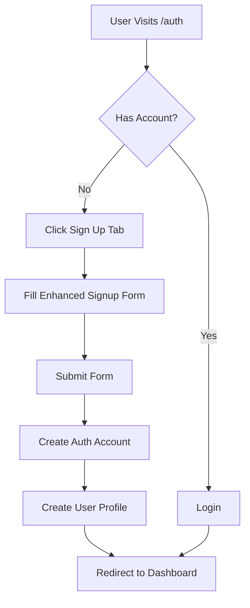
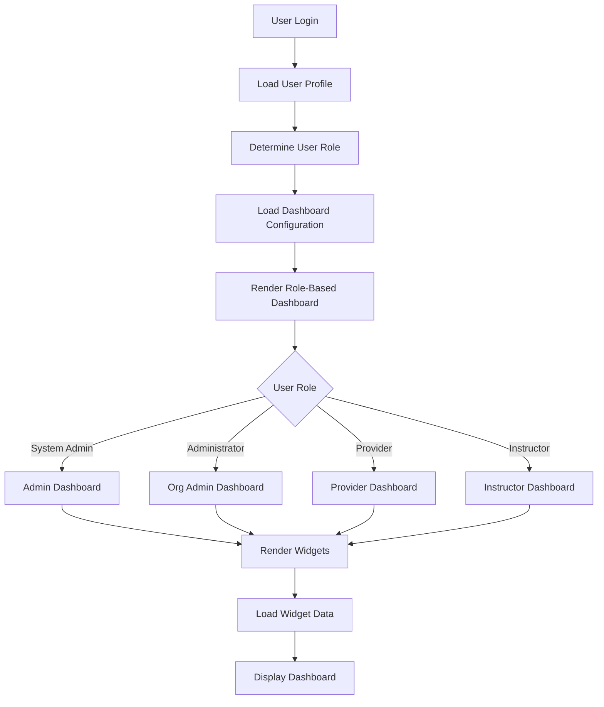
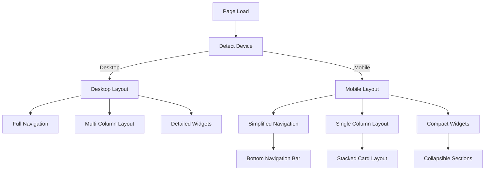

# Role-Based Dashboard Implementation Plan

## Current State Analysis

From my review of the codebase, I've identified the following key issues:

1. **Limited User Profile Data Collection**: The current signup process only collects email and password, missing important user information like display name, phone number, organization/company name, and job title.

2. **Generic Dashboard**: The current dashboard (Index.tsx) shows the same content to all users regardless of their role, with only minor visibility differences based on role permissions.

3. **Limited Mobile Optimization**: While the current implementation has some responsive elements, it's not fully optimized for mobile users who need to view dashboards, check notifications, and perform approvals on the go.

4. **Inconsistent User Experience**: The UI lacks role-specific views that would help users focus on their most relevant tasks and information.

## Implementation Plan

### 1. Enhanced User Signup and Profile Management

#### 1.1 Expand Signup Form
- Modify the SignupForm component to collect additional user information:
  - Display name (required)
  - Email (already implemented)
  - Phone number (optional)
  - Organization/company name (required)
  - Job title (required)

#### 1.2 Update User Profile Types and Database Schema
- Extend the UserProfile interface in auth.ts to include new fields
- Update the Supabase database schema to store the additional profile information
- Modify the profile creation process in useAuthMethods.ts

#### 1.3 Enhanced Profile Management Page
- Redesign the Profile.tsx page to allow users to view and edit all profile fields
- Implement form validation for profile updates
- Add profile completeness indicator to encourage users to fill all information

### 2. Role-Based Dashboard Implementation

#### 2.1 Dashboard Component Architecture
- Create a new DashboardContent component with role-specific rendering
- Implement a dashboard configuration system that maps roles to specific widgets and layouts
- Design a flexible widget system that can be composed based on user role

#### 2.2 Role-Specific Dashboard Views

**System Admin (SA) Dashboard:**
- System-wide analytics and health metrics
- User management overview
- System configuration shortcuts
- Recent activity logs

**Administrator (AD) Dashboard:**
- Organizational metrics and compliance status
- User management for their organization
- Approval queues for role transitions
- Certification status overview

**Authorized Provider (AP) Dashboard:**
- Provider-specific metrics
- Instructor management tools
- Course scheduling interface
- Certification tracking

**Instructor (IC/IP/IT) Dashboards:**
- Teaching schedule and upcoming sessions
- Student progress tracking
- Personal certification status
- Learning resources and progression path

#### 2.3 Dashboard Widgets Library
- Create reusable dashboard widgets for common functionality:
  - Metrics cards with role-appropriate data
  - Approval queues with action buttons
  - Notification center
  - Quick action buttons
  - Status indicators
  - Recent activity timeline

### 3. Mobile-Friendly Enhancements

#### 3.1 Responsive Layout Improvements
- Implement a mobile-first approach for all dashboard components
- Create mobile-specific layouts for dashboard widgets
- Optimize navigation for touch interfaces

#### 3.2 Mobile-Specific Features
- Simplified navigation with bottom tabs for mobile
- Touch-friendly action buttons and controls
- Collapsible sections to manage vertical space
- Pull-to-refresh functionality for dashboard updates

#### 3.3 Performance Optimizations
- Implement lazy loading for dashboard widgets
- Optimize image loading and rendering
- Reduce bundle size for faster mobile loading

### 4. User Experience Improvements

#### 4.1 Personalized Welcome and Onboarding
- Create role-specific welcome messages and onboarding flows
- Implement a guided tour for new users based on their role
- Add contextual help for role-specific features

#### 4.2 Notification System Enhancements
- Implement role-based notification filtering
- Create a notification center with categorization
- Add notification preferences to user settings

#### 4.3 Quick Actions and Shortcuts
- Add role-specific quick action buttons for common tasks
- Implement a favorites or pinned items feature
- Create a recent items section for quick access

## Technical Implementation Details

### Database Schema Updates

```sql
-- Add new columns to profiles table
ALTER TABLE profiles
ADD COLUMN phone VARCHAR(20),
ADD COLUMN organization VARCHAR(255),
ADD COLUMN job_title VARCHAR(255);
```

### Component Structure

```
src/
├── components/
│   ├── dashboard/
│   │   ├── DashboardContent.tsx       # Main dashboard content renderer
│   │   ├── widgets/                   # Reusable dashboard widgets
│   │   │   ├── MetricsCard.tsx
│   │   │   ├── ApprovalQueue.tsx
│   │   │   ├── NotificationCenter.tsx
│   │   │   ├── QuickActions.tsx
│   │   │   └── ...
│   │   └── role-dashboards/           # Role-specific dashboard implementations
│   │       ├── AdminDashboard.tsx
│   │       ├── ProviderDashboard.tsx
│   │       ├── InstructorDashboard.tsx
│   │       └── ...
│   └── auth/
│       └── SignupForm/
│           └── index.tsx              # Enhanced signup form
├── hooks/
│   └── useDashboardConfig.ts          # Hook for role-based dashboard configuration
└── pages/
    ├── Index.tsx                      # Updated main dashboard page
    └── Profile.tsx                    # Enhanced profile management page
```

### Mobile Responsiveness Implementation

We'll use a combination of:
- Tailwind's responsive utility classes
- Custom hooks for detecting mobile devices
- Mobile-specific component variants
- Touch-friendly UI elements

## Implementation Phases

### Phase 1: Enhanced User Signup and Profile
- Update SignupForm component
- Extend UserProfile interface and database schema
- Enhance Profile page

### Phase 2: Dashboard Architecture
- Create dashboard widget system
- Implement role-based dashboard configuration
- Develop core dashboard widgets

### Phase 3: Role-Specific Dashboards
- Implement dashboard views for each role
- Connect to data sources and APIs
- Add role-specific metrics and actions

### Phase 4: Mobile Optimization
- Enhance responsive layouts
- Implement mobile-specific navigation
- Optimize performance for mobile devices

### Phase 5: Testing and Refinement
- User testing with different roles
- Performance testing on various devices
- Refinement based on feedback

## Diagrams

### User Signup Flow



### Dashboard Architecture



### Mobile Responsive Design



## Conclusion

This implementation plan provides a comprehensive approach to creating a professional, role-based dashboard system that addresses the current limitations while focusing on improved user experience and mobile friendliness. The modular architecture allows for future expansion and customization as requirements evolve.