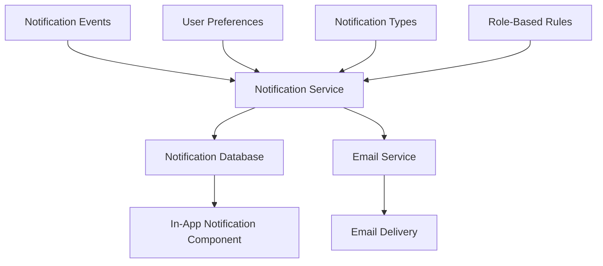
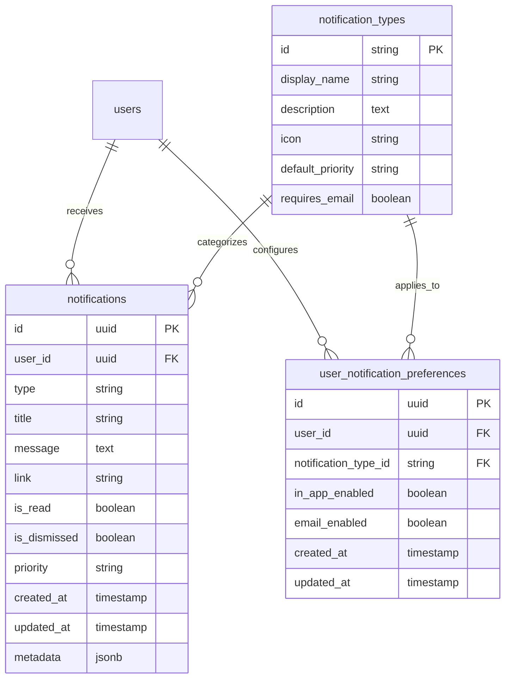

# Comprehensive Notification System Architecture Plan

## 1. Current System Analysis

Based on the information provided, the current notification system has several limitations:

- The Bell notification in the header component fetches notifications but lacks proper styling and organization
- Email functionality exists but is limited to certificate delivery via a Supabase edge function
- No notification prioritization or visual hierarchy
- Poor UI/UX design that lacks polish and professionalism
- No user configuration options for notification preferences
- Limited notification types and triggers
- No real-time updates or clear notification status indicators

## 2. Proposed Notification System Architecture

I propose a comprehensive notification system with the following architecture:



### 2.1 Core Components

#### Notification Database Schema



#### Notification Service

The Notification Service will be the central component responsible for:

1. Creating notifications based on system events
2. Determining notification delivery methods based on:
   - Notification priority
   - User preferences
   - Role-based rules
3. Persisting notifications to the database
4. Triggering email notifications when appropriate
5. Providing APIs for notification management

#### In-App Notification Component

A redesigned notification component that:

1. Displays notifications with proper styling and organization
2. Shows notification count badges
3. Supports real-time updates
4. Allows users to mark notifications as read/unread
5. Provides filtering and sorting options
6. Implements proper pagination for large notification volumes

#### Email Service Integration

Enhanced integration with the existing email service to:

1. Send email notifications for high-priority items
2. Support user-specific email preferences
3. Provide consistent styling between in-app and email notifications
4. Include appropriate action links in emails
5. Implement proper email throttling to conserve resources

## 3. Implementation Plan

### 3.1 Database Implementation

1. Create new tables for notifications, notification types, and user preferences
2. Implement database triggers for notification creation
3. Set up indexes for efficient notification queries
4. Create migration scripts for existing data

```sql
-- Example migration for notifications table
CREATE TABLE IF NOT EXISTS public.notifications (
    id UUID PRIMARY KEY DEFAULT uuid_generate_v4(),
    user_id UUID NOT NULL REFERENCES auth.users(id) ON DELETE CASCADE,
    type VARCHAR(50) NOT NULL,
    title VARCHAR(255) NOT NULL,
    message TEXT NOT NULL,
    link VARCHAR(255),
    is_read BOOLEAN DEFAULT FALSE,
    is_dismissed BOOLEAN DEFAULT FALSE,
    priority VARCHAR(20) DEFAULT 'normal',
    created_at TIMESTAMP WITH TIME ZONE DEFAULT NOW(),
    updated_at TIMESTAMP WITH TIME ZONE DEFAULT NOW(),
    metadata JSONB DEFAULT '{}'::jsonb
);

-- Add indexes for performance
CREATE INDEX IF NOT EXISTS idx_notifications_user_id ON public.notifications(user_id);
CREATE INDEX IF NOT EXISTS idx_notifications_type ON public.notifications(type);
CREATE INDEX IF NOT EXISTS idx_notifications_created_at ON public.notifications(created_at);
CREATE INDEX IF NOT EXISTS idx_notifications_is_read ON public.notifications(is_read);
```

### 3.2 Backend Services

#### Notification API Endpoints

```
GET /api/notifications - Get user notifications with filtering and pagination
PUT /api/notifications/:id/read - Mark notification as read
PUT /api/notifications/:id/unread - Mark notification as unread
DELETE /api/notifications/:id - Dismiss notification
GET /api/notifications/preferences - Get user notification preferences
PUT /api/notifications/preferences - Update user notification preferences
```

#### Notification Creation Service

A service that listens for system events and creates notifications based on predefined rules:

```typescript
// Example notification creation service
export async function createNotification({
  userId,
  type,
  title,
  message,
  link,
  priority = 'normal',
  metadata = {}
}: CreateNotificationParams): Promise<Notification> {
  // Create notification in database
  const notification = await supabase
    .from('notifications')
    .insert({
      user_id: userId,
      type,
      title,
      message,
      link,
      priority,
      metadata
    })
    .select('*')
    .single();
    
  // Check if email should be sent
  const shouldSendEmail = await shouldSendEmailNotification(userId, type, priority);
  
  if (shouldSendEmail) {
    await sendEmailNotification({
      userId,
      notification: notification.data
    });
  }
  
  return notification.data;
}
```

#### Email Integration

Enhance the existing email edge function to support notification emails:

```typescript
// Example email notification function
export async function sendEmailNotification({
  userId,
  notification
}: SendEmailNotificationParams): Promise<void> {
  const user = await getUserById(userId);
  
  if (!user || !user.email) {
    throw new Error('User email not found');
  }
  
  // Use existing batch email function with enhanced templates
  await supabase.functions.invoke('send-batch-certificate-emails', {
    body: {
      template: 'notification',
      recipients: [user.email],
      data: {
        notification,
        actionUrl: `${process.env.NEXT_PUBLIC_APP_URL}${notification.link || '/notifications'}`
      }
    }
  });
}
```

### 3.3 Frontend Components

#### Enhanced Notification Bell Component

```tsx
// Example NotificationBell component
const NotificationBell = () => {
  const { notifications, unreadCount } = useNotifications();
  const [isOpen, setIsOpen] = useState(false);
  
  return (
    <div className="relative">
      <button 
        onClick={() => setIsOpen(!isOpen)}
        className="relative p-2 text-gray-600 hover:text-primary-600 focus:outline-none"
      >
        <BellIcon className="h-6 w-6" />
        {unreadCount > 0 && (
          <span className="absolute top-0 right-0 inline-flex items-center justify-center px-2 py-1 text-xs font-bold leading-none text-white transform translate-x-1/2 -translate-y-1/2 bg-red-600 rounded-full">
            {unreadCount > 99 ? '99+' : unreadCount}
          </span>
        )}
      </button>
      
      {isOpen && (
        <NotificationDropdown 
          notifications={notifications}
          onClose={() => setIsOpen(false)}
        />
      )}
    </div>
  );
};
```

#### Notification Dropdown Component

```tsx
// Example NotificationDropdown component
const NotificationDropdown = ({ notifications, onClose }) => {
  const { markAsRead, dismissNotification } = useNotifications();
  
  return (
    <div className="absolute right-0 mt-2 w-80 bg-white rounded-md shadow-lg overflow-hidden z-50">
      <div className="p-3 border-b border-gray-200 flex justify-between items-center">
        <h3 className="text-lg font-medium">Notifications</h3>
        <Link href="/notifications" className="text-sm text-primary-600 hover:text-primary-800">
          View All
        </Link>
      </div>
      
      <div className="max-h-96 overflow-y-auto">
        {notifications.length === 0 ? (
          <div className="p-4 text-center text-gray-500">
            No notifications
          </div>
        ) : (
          notifications.map((notification) => (
            <NotificationItem 
              key={notification.id}
              notification={notification}
              onMarkAsRead={markAsRead}
              onDismiss={dismissNotification}
            />
          ))
        )}
      </div>
      
      <div className="p-3 border-t border-gray-200">
        <Link 
          href="/notifications/preferences"
          className="text-sm text-gray-600 hover:text-primary-600"
        >
          Manage notification preferences
        </Link>
      </div>
    </div>
  );
};
```

#### Notification Item Component

```tsx
// Example NotificationItem component
const NotificationItem = ({ notification, onMarkAsRead, onDismiss }) => {
  const priorityStyles = {
    high: 'border-l-4 border-red-500',
    normal: 'border-l-4 border-blue-500',
    low: 'border-l-4 border-gray-300'
  };
  
  return (
    <div 
      className={`p-4 border-b border-gray-100 hover:bg-gray-50 ${
        notification.is_read ? 'bg-white' : 'bg-blue-50'
      } ${priorityStyles[notification.priority] || priorityStyles.normal}`}
    >
      <div className="flex justify-between">
        <span className="text-xs text-gray-500">
          {formatDistanceToNow(new Date(notification.created_at))} ago
        </span>
        <div className="flex space-x-2">
          {!notification.is_read && (
            <button 
              onClick={() => onMarkAsRead(notification.id)}
              className="text-xs text-gray-500 hover:text-blue-600"
            >
              Mark as read
            </button>
          )}
          <button 
            onClick={() => onDismiss(notification.id)}
            className="text-xs text-gray-500 hover:text-red-600"
          >
            Dismiss
          </button>
        </div>
      </div>
      
      <Link 
        href={notification.link || '#'}
        className="block mt-1"
        onClick={() => !notification.is_read && onMarkAsRead(notification.id)}
      >
        <h4 className="text-sm font-medium text-gray-900">{notification.title}</h4>
        <p className="text-sm text-gray-600 mt-1">{notification.message}</p>
      </Link>
    </div>
  );
};
```

#### Notification Preferences Page

```tsx
// Example NotificationPreferencesPage component
const NotificationPreferencesPage = () => {
  const { preferences, updatePreferences, notificationTypes } = useNotificationPreferences();
  
  return (
    <div className="container mx-auto py-8">
      <h1 className="text-2xl font-bold mb-6">Notification Preferences</h1>
      
      <div className="bg-white shadow rounded-lg overflow-hidden">
        <table className="min-w-full divide-y divide-gray-200">
          <thead className="bg-gray-50">
            <tr>
              <th className="px-6 py-3 text-left text-xs font-medium text-gray-500 uppercase tracking-wider">
                Notification Type
              </th>
              <th className="px-6 py-3 text-left text-xs font-medium text-gray-500 uppercase tracking-wider">
                In-App
              </th>
              <th className="px-6 py-3 text-left text-xs font-medium text-gray-500 uppercase tracking-wider">
                Email
              </th>
            </tr>
          </thead>
          <tbody className="bg-white divide-y divide-gray-200">
            {notificationTypes.map((type) => {
              const pref = preferences.find(p => p.notification_type_id === type.id);
              
              return (
                <tr key={type.id}>
                  <td className="px-6 py-4 whitespace-nowrap">
                    <div className="flex items-center">
                      <div className="flex-shrink-0 h-10 w-10 flex items-center justify-center">
                        <span className="text-gray-500">{getIconForType(type.icon)}</span>
                      </div>
                      <div className="ml-4">
                        <div className="text-sm font-medium text-gray-900">{type.display_name}</div>
                        <div className="text-sm text-gray-500">{type.description}</div>
                      </div>
                    </div>
                  </td>
                  <td className="px-6 py-4 whitespace-nowrap">
                    <Switch
                      checked={pref?.in_app_enabled ?? true}
                      onChange={(checked) => updatePreferences(type.id, { in_app_enabled: checked })}
                    />
                  </td>
                  <td className="px-6 py-4 whitespace-nowrap">
                    <Switch
                      checked={pref?.email_enabled ?? type.requires_email}
                      onChange={(checked) => updatePreferences(type.id, { email_enabled: checked })}
                    />
                  </td>
                </tr>
              );
            })}
          </tbody>
        </table>
      </div>
    </div>
  );
};
```

### 3.4 Role-Based Notification Rules

Define notification rules based on user roles:

```typescript
// Example role-based notification rules
const notificationRules = {
  // System Admin notifications
  systemAdmin: [
    { type: 'system_alert', priority: 'high', email: true },
    { type: 'new_user_registration', priority: 'normal', email: false },
    { type: 'approval_request', priority: 'normal', email: true }
  ],
  
  // Administrator notifications
  administrator: [
    { type: 'approval_request', priority: 'high', email: true },
    { type: 'user_update', priority: 'normal', email: false },
    { type: 'course_scheduled', priority: 'normal', email: false }
  ],
  
  // Provider notifications
  provider: [
    { type: 'instructor_certification_expiring', priority: 'high', email: true },
    { type: 'course_scheduled', priority: 'normal', email: true },
    { type: 'instructor_availability_update', priority: 'normal', email: false }
  ],
  
  // Instructor notifications
  instructor: [
    { type: 'course_assigned', priority: 'high', email: true },
    { type: 'certification_expiring', priority: 'high', email: true },
    { type: 'schedule_change', priority: 'normal', email: true }
  ]
};
```

## 4. Integration with Existing Components

### 4.1 Dashboard Integration

Add notification badges to relevant dashboard components:

```tsx
// Example dashboard card with notification badge
const DashboardCard = ({ title, count, hasNotification, children }) => {
  return (
    <Card>
      <CardHeader className="flex flex-row items-center justify-between pb-2">
        <CardTitle className="text-sm font-medium">
          {title}
          {hasNotification && (
            <span className="ml-2 inline-flex h-2 w-2 rounded-full bg-red-600"></span>
          )}
        </CardTitle>
        <div className="text-sm font-bold">{count}</div>
      </CardHeader>
      <CardContent>
        {children}
      </CardContent>
    </Card>
  );
};
```

### 4.2 Navigation Integration

Enhance the navigation component with notification indicators:

```tsx
// Example navigation item with notification badge
const NavItem = ({ href, icon, label, notificationCount }) => {
  const router = useRouter();
  const isActive = router.pathname === href;
  
  return (
    <Link
      href={href}
      className={`flex items-center px-4 py-2 text-sm font-medium rounded-md ${
        isActive
          ? 'bg-primary-100 text-primary-900'
          : 'text-gray-600 hover:bg-gray-100 hover:text-gray-900'
      }`}
    >
      <span className="mr-3 h-5 w-5">{icon}</span>
      <span className="flex-1">{label}</span>
      {notificationCount > 0 && (
        <span className="ml-3 inline-flex items-center px-2 py-0.5 rounded-full text-xs font-medium bg-red-100 text-red-800">
          {notificationCount > 99 ? '99+' : notificationCount}
        </span>
      )}
    </Link>
  );
};
```

## 5. Email Notification Strategy

To conserve resources while ensuring critical notifications are delivered:

1. **Prioritization System**:
   - High priority: Always send email (unless user has explicitly opted out)
   - Normal priority: Send email based on user preferences
   - Low priority: In-app only, no emails

2. **Batching Strategy**:
   - Group non-urgent notifications into digest emails
   - Send digest emails on a schedule (daily/weekly) based on user preferences
   - Critical notifications are sent immediately

3. **User-Specific Controls**:
   - Allow users to set their email notification preferences
   - Provide granular control over which notification types trigger emails
   - Allow users to set quiet hours for email notifications

## 6. Implementation Phases

### Phase 1: Core Infrastructure

1. Create database schema for notifications
2. Implement basic notification service
3. Create notification API endpoints
4. Develop enhanced notification bell component

### Phase 2: Email Integration

1. Enhance existing email edge function
2. Implement email notification templates
3. Create email delivery rules and throttling

### Phase 3: User Preferences

1. Create user notification preferences UI
2. Implement preference storage and retrieval
3. Apply preferences to notification delivery

### Phase 4: Role-Based Rules

1. Define notification types and rules per role
2. Implement role-based notification triggers
3. Add notification badges to dashboard components

### Phase 5: Testing and Optimization

1. Test notification delivery across different scenarios
2. Optimize database queries for performance
3. Implement real-time notification updates
4. Conduct user testing and gather feedback

## 7. Technical Considerations

### 7.1 Performance

- Use efficient database queries with proper indexes
- Implement pagination for notification lists
- Consider caching for frequently accessed notification counts
- Use optimistic UI updates for better user experience

### 7.2 Scalability

- Design the notification system to handle high volumes
- Implement proper database partitioning for notifications table
- Consider using a message queue for notification processing
- Implement proper cleanup of old notifications

### 7.3 Security

- Ensure notifications are only visible to intended recipients
- Implement proper authorization checks on all API endpoints
- Sanitize notification content to prevent XSS attacks
- Audit notification access and actions

## 8. Conclusion

This comprehensive notification system will significantly enhance the user experience by providing:

1. Professional, well-designed notification UI
2. Intelligent email delivery that conserves resources
3. User control over notification preferences
4. Role-appropriate notification content
5. Clear visual indicators for actions requiring attention
6. Seamless integration with the existing application

The implementation follows best practices for modern web applications and provides a scalable foundation that can be extended as the application evolves.