# Unified Training Management System Architecture

## Executive Summary

This document presents the comprehensive architectural blueprint for consolidating the ARCCM training management system, replacing 36+ fragmented components with a unified approach based on the proven [`instructor-system.tsx`](src/pages/instructor-system.tsx:1) foundation. The architecture addresses navigation complexity reduction from 17 tabs to 3 main areas, integrates with 25 existing database tables, and maintains all functionality while dramatically simplifying user experience.

## 1. Overall System Architecture

### 1.1 Architectural Foundation

**Core Design Principle**: Single-file unified components with embedded context management, following the [`instructor-system.tsx`](src/pages/instructor-system.tsx:27-1213) pattern.

```mermaid
graph TB
    subgraph "Unified Training System"
        UTS[Unified Training System] --> SM[Session Management]
        UTS --> STM[Student Management] 
        UTS --> IM[Instructor Management]
        
        SM --> SC[Session Calendar]
        SM --> SE[Session Enrollment]
        SM --> SA[Session Analytics]
        
        STM --> SP[Student Profiles]
        STM --> SR[Student Rosters]
        STM --> SS[Student Statistics]
        
        IM --> IP[Instructor Profiles]
        IM --> IA[Instructor Assignment]
        IM --> IC[Instructor Capacity]
    end
    
    subgraph "Database Layer"
        TS[training_sessions]
        SEP[session_enrollments]
        STEP[student_enrollment_profiles]
        INP[instructor_profiles]
        CT[course_templates]
        LOC[locations]
    end
    
    subgraph "Service Layer"
        TSS[Training Session Service]
        ESS[Enrollment Service]
        SPS[Student Profile Service]
        IPS[Instructor Profile Service]
    end
    
    UTS --> TSS
    UTS --> ESS
    UTS --> SPS
    UTS --> IPS
    
    TSS --> TS
    ESS --> SEP
    SPS --> STEP
    IPS --> INP
```



### 1.2 Component Consolidation Strategy

**Replace 36+ Components with 3 Unified Systems:**

| Current Fragmented System | Unified Replacement | Complexity Reduction |
|---------------------------|---------------------|---------------------|
| [`TrainingHubNavigation.tsx`](src/components/training/navigation/TrainingHubNavigation.tsx:1) + 6 cards | `UnifiedTrainingHub` with 3 tabs | 83% reduction |
| [`EnrollmentManagementDashboard.tsx`](src/components/enrollment/EnrollmentManagementDashboard.tsx:1) + 20 components | Embedded in Session Management | 95% reduction |
| [`CalendarSchedulingView.tsx`](src/components/scheduling/CalendarSchedulingView.tsx:1) + 13 components | Unified Calendar Interface | 92% reduction |

## 2. Database Integration Architecture

### 2.1 Core Database Tables (25 tables)

**Primary Training Tables:**
```typescript
// Core training workflow tables
training_sessions: {
  id: uuid,
  title: string,
  instructor_id: uuid -> instructor_profiles.id,
  location_id: uuid -> locations.id,
  session_date: date,
  start_time: time,
  end_time: time,
  max_capacity: number,
  course_template: string -> course_templates.code
}

session_enrollments: {
  id: uuid,
  session_id: uuid -> training_sessions.id,
  student_id: uuid -> student_enrollment_profiles.id,
  attendance_status: 'REGISTERED' | 'PRESENT' | 'ABSENT' | 'LATE',
  completion_status: 'NOT_STARTED' | 'IN_PROGRESS' | 'COMPLETED'
}

student_enrollment_profiles: {
  id: uuid,
  email: string (unique),
  display_name: string,
  first_aid_level: 'Emergency' | 'Standard',
  cpr_level: 'A' | 'C' | 'BLS',
  location_id: uuid -> locations.id
}

instructor_profiles: {
  id: uuid,
  email: string (unique),
  display_name: string,
  specialties: string[],
  max_students_per_session: number,
  location_id: uuid -> locations.id
}
```

**Certificate Integration Tables:**
```typescript
certificates: {
  id: uuid,
  certificate_request_id: uuid,
  recipient_name: string,
  course_name: string,
  verification_code: string,
  location_id: uuid -> locations.id
}

rosters: {
  id: uuid,
  name: string,
  location_id: uuid -> locations.id,
  course_id: uuid,
  instructor_name: string
}
```

### 2.2 Data Flow Architecture

Following the [`instructor-system.tsx`](src/pages/instructor-system.tsx:106-225) pattern for centralized data loading:

```typescript
// Unified data loading strategy
const loadInitialData = async () => {
  await Promise.all([
    loadInstructors(),    // instructor_profiles table
    loadStudents(),       // student_enrollment_profiles table  
    loadCourseTemplates(), // course_templates table
    loadTrainingSessions() // training_sessions + session_enrollments
  ]);
};
```

## 3. Component Hierarchy and Data Flow

### 3.1 Unified Component Structure

```typescript
// Primary component following instructor-system.tsx pattern
UnifiedTrainingManagementSystem {
  // State Management (consolidated)
  state: {
    trainingSessions: TrainingSession[],
    students: StudentProfile[],
    instructors: InstructorProfile[],
    selectedSession: TrainingSession | null,
    activeTab: 'sessions' | 'students' | 'instructors'
  },
  
  // Unified Operations
  operations: {
    createTrainingSession(),
    enrollStudentInSession(),
    updateStudentAttendance(),
    loadSessionsForDate()
  },
  
  // Three-Tab Interface
  interface: {
    SessionsTab: CalendarView + SessionDetails + InlineEnrollment,
    StudentsTab: StudentList + StudentCreation + EnrollmentHistory,
    InstructorsTab: InstructorList + ScheduleView + CapacityManagement
  }
}
```

### 3.2 Data Flow Patterns

**Session-Centric Design** (following [`instructor-system.tsx:877-923`](src/pages/instructor-system.tsx:877-923)):

```typescript
// Embedded student enrollment within session context
<SessionCard>
  <SessionHeader />
  <StudentEnrollmentSection>
    <EnrollmentCount>{session.session_enrollments?.length}/{session.max_capacity}</EnrollmentCount>
    <InlineEnrollmentButton />
    <AttendanceTracking />
  </StudentEnrollmentSection>
</SessionCard>
```

**Progressive Disclosure Pattern**:
- Calendar view shows session overview
- Day selection reveals session details
- Session selection shows embedded student management
- No navigation between separate interfaces

### 3.3 Component Replacement Mapping

| Current Component | Unified Replacement | Location in Architecture |
|-------------------|---------------------|-------------------------|
| `TrainingHubNavigation` | `SessionsTab` | Primary tab interface |
| `EnrollmentManagementDashboard` | Embedded in `SessionCard` | Session details section |
| `CalendarSchedulingView` | `UnifiedCalendarView` | Sessions tab calendar |
| `StudentManagement` | `StudentsTab` | Secondary tab interface |
| `InstructorAvailability` | `InstructorsTab` | Tertiary tab interface |

## 4. Navigation Structure and URL Routing

### 4.1 Simplified URL Structure

**Current Complex Navigation** (17 different paths):
```
/training-hub
/training-hub/sessions
/training-hub/rosters
/enrollment
/enrollment/analytics
/enrollment/manual
/enrollment/waitlist
/scheduling
/scheduling/calendar
/scheduling/availability
```

**Unified Navigation** (3 primary paths):
```
/training                    # Default to sessions view
/training?tab=sessions      # Session management
/training?tab=students      # Student management  
/training?tab=instructors   # Instructor management (role-restricted)
```

### 4.2 Deep Linking Strategy

```typescript
// URL state management
const useTrainingNavigation = () => {
  const [searchParams, setSearchParams] = useSearchParams();
  
  return {
    activeTab: searchParams.get('tab') || 'sessions',
    selectedDate: searchParams.get('date'),
    selectedSession: searchParams.get('session'),
    
    navigateToSession: (sessionId: string, date: string) => {
      setSearchParams({ tab: 'sessions', date, session: sessionId });
    }
  };
};
```

### 4.3 Integration with Dashboard Navigation

Following [`DASHBOARD_MIGRATION_STRATEGY.md`](DASHBOARD_MIGRATION_STRATEGY.md:42-73) unified navigation:

```typescript
// Sidebar integration
<SidebarNavigation>
  <NavItem href="/" icon="Dashboard">Dashboard</NavItem>
  <NavItem href="/training" icon="Calendar">Training</NavItem>
  <NavItem href="/certifications" icon="Award">Certificates</NavItem>
  <NavItem href="/teams" icon="Users">Teams</NavItem>
</SidebarNavigation>
```

## 5. Service Layer Integration Strategy

### 5.1 Centralized Service Architecture

Following the [`instructor-system.tsx`](src/pages/instructor-system.tsx:123-287) database operation pattern:

```typescript
// Unified training service
class UnifiedTrainingService {
  // Session Management
  async createTrainingSession(sessionData: CreateSessionRequest): Promise<TrainingSession> {
    const { data, error } = await supabase
      .from('training_sessions')
      .insert([sessionData])
      .select(`
        *,
        instructor_profiles(display_name, email),
        locations(name),
        session_enrollments(
          id, student_id, attendance_status,
          student_enrollment_profiles(display_name, email)
        )
      `)
      .single();
    
    if (error) throw error;
    return data;
  }

  // Student Enrollment
  async enrollStudentInSession(sessionId: string, studentId: string): Promise<void> {
    // Check capacity
    const session = await this.getSession(sessionId);
    if (session.session_enrollments.length >= session.max_capacity) {
      throw new Error('Session at capacity');
    }
    
    // Create enrollment
    await supabase.from('session_enrollments').insert([{
      session_id: sessionId,
      student_id: studentId,
      enrollment_date: new Date().toISOString()
    }]);
  }

  // Real-time subscriptions
  subscribeToSessionUpdates(sessionId: string, callback: (session: TrainingSession) => void) {
    return supabase
      .channel(`session:${sessionId}`)
      .on('postgres_changes', 
        { event: '*', schema: 'public', table: 'session_enrollments' },
        callback
      )
      .subscribe();
  }
}
```

### 5.2 Service Layer Abstraction

**Database Operation Patterns:**
```typescript
// Following instructor-system.tsx error handling pattern
const withErrorHandling = async <T>(
  operation: () => Promise<T>,
  errorMessage: string
): Promise<T> => {
  try {
    const result = await operation();
    toast.success('Operation completed successfully');
    return result;
  } catch (error: any) {
    console.error(errorMessage, error);
    toast.error(errorMessage);
    throw error;
  }
};
```

### 5.3 Certificate Generation Integration

**Service Integration Points:**
```typescript
// Certificate service integration
class CertificateIntegrationService {
  async generateCertificatesForSession(sessionId: string): Promise<Certificate[]> {
    // Get completed enrollments
    const completedEnrollments = await supabase
      .from('session_enrollments')
      .select(`
        *,
        student_enrollment_profiles(*),
        training_sessions(*)
      `)
      .eq('session_id', sessionId)
      .eq('completion_status', 'COMPLETED');

    // Generate certificates for each completed student
    return Promise.all(
      completedEnrollments.data?.map(enrollment => 
        this.createCertificate({
          recipient_name: enrollment.student_enrollment_profiles.display_name,
          course_name: enrollment.training_sessions.title,
          completion_date: new Date().toISOString()
        })
      ) || []
    );
  }
}
```

## 6. Role-Based Access Control Architecture

### 6.1 Role Definitions

The system supports six distinct roles with clear hierarchical permissions:

```typescript
// Core role definitions
enum SystemRoles {
  SA = 'SA',  // System Admin - Full system access
  AD = 'AD',  // Admin - Administrative access with location restrictions
  AP = 'AP',  // Authorized Provider - Provider-level access
  IC = 'IC',  // Instructor - Certified (independent instruction)
  IP = 'IP',  // Instructor - Provisional (supervised instruction)
  IT = 'IT'   // Instructor - Trainee (learning/observation only)
}

// Role hierarchy and capabilities
interface RoleCapabilities {
  SA: {
    description: 'System Admin - Complete system control',
    scope: 'All locations, all teams, all functions',
    restrictions: 'None'
  };
  AD: {
    description: 'Admin - Location/team administrative access',
    scope: 'Assigned locations and teams',
    restrictions: 'Location and team boundaries'
  };
  AP: {
    description: 'Authorized Provider - Training provider operations',
    scope: 'Provider-level training management',
    restrictions: 'Cannot manage instructors or system settings'
  };
  IC: {
    description: 'Instructor - Certified - Independent instruction',
    scope: 'Full instruction capabilities',
    restrictions: 'Cannot manage other instructors'
  };
  IP: {
    description: 'Instructor - Provisional - Supervised instruction',
    scope: 'Instruction with supervision requirements',
    restrictions: 'Session creation requires approval'
  };
  IT: {
    description: 'Instructor - Trainee - Learning/observation',
    scope: 'Attendance tracking and basic enrollment',
    restrictions: 'Cannot create sessions or submit certificate requests'
  };
}
```

### 6.2 Permission System Design

Following [`instructor-system.tsx:89-93`](src/pages/instructor-system.tsx:89-93) permission patterns:

```typescript
// Role-based permission checks
interface UnifiedPermissions {
  canManageInstructors: boolean;    // SA, AD, Enterprise roles
  canManageSessions: boolean;       // SA, AD, AP, IC, IP, Enterprise roles
  canViewAllLocations: boolean;     // SA, Enterprise roles
  canEnrollStudents: boolean;       // SA, AD, AP, IC, IP, IT roles
  canSubmitCertificateRequests: boolean; // SA, AD, IC, IP roles (submit batch upload requests)
  canCreateSessions: boolean;       // SA, AD, AP, IC roles (IP/IT need supervision)
  canManageAttendance: boolean;     // SA, AD, AP, IC, IP roles
}

const useTrainingPermissions = (profile: UserProfile): UnifiedPermissions => {
  const instructorRoles = ['IC', 'IP', 'IT']; // Certified, Provisional, Trainee
  const certifiedInstructors = ['IC']; // Only certified can work independently
  const supervisedInstructors = ['IP', 'IT']; // Need supervision for session creation
  
  return {
    canManageInstructors: ['SA', 'AD'].includes(profile.role) || hasEnterpriseAccess(profile.role),
    canManageSessions: ['SA', 'AD', 'AP', 'IC', 'IP'].includes(profile.role) || hasEnterpriseAccess(profile.role),
    canViewAllLocations: profile.role === 'SA' || hasEnterpriseAccess(profile.role),
    canEnrollStudents: ['SA', 'AD', 'AP', 'IC', 'IP', 'IT'].includes(profile.role),
    canSubmitCertificateRequests: ['SA', 'AD', 'IC', 'IP' ].includes(profile.role), // Submit to existing approval process
    canCreateSessions: ['SA', 'AD', 'AP', 'IC'].includes(profile.role),
    canManageAttendance: ['SA', 'AD', 'AP', 'IC', 'IP'].includes(profile.role)
  };
};
```

### 6.2 Interface Restrictions

```typescript
// Conditional tab rendering based on permissions
<TabsList className="grid w-full grid-cols-3">
  <TabsTrigger value="sessions">Sessions</TabsTrigger>
  <TabsTrigger value="students">Students</TabsTrigger>
  {permissions.canManageInstructors && (
    <TabsTrigger value="instructors">Instructors</TabsTrigger>
  )}
</TabsList>
```

### 6.3 Data Filtering by Role

```typescript
// Location and team restrictions
const applyDataFilters = (query: any, restrictions: DataRestrictions) => {
  if (restrictions.restrictToTeam && restrictions.teamId) {
    query = query.eq('team_id', restrictions.teamId);
  }
  
  if (restrictions.restrictToLocation && restrictions.locationId) {
    query = query.eq('location_id', restrictions.locationId);
  }
  
  return query;
};
```

## 7. Mobile-Responsive Design Patterns

### 7.1 Touch-Optimized Calendar

Following [`instructor-system.tsx:772-814`](src/pages/instructor-system.tsx:772-814) responsive calendar:

```typescript
// Mobile-first calendar design
<div className="grid grid-cols-7 gap-1 mb-6">
  {days.map((day, index) => (
    <div
      key={day}
      onClick={() => handleDayClick(day)}
      className={`p-2 h-20 border rounded-md cursor-pointer transition-colors 
                  hover:bg-muted touch-target-large
                  ${isSelected ? 'ring-2 ring-primary' : ''}
                  ${daySessions.length > 0 ? 'bg-blue-50' : ''}`}
    >
      {/* Touch-friendly session indicators */}
    </div>
  ))}
</div>
```

### 7.2 Progressive Disclosure

**Mobile Navigation Pattern:**
```typescript
// Collapsible session details for mobile
<SessionCard className="mobile:border-none mobile:shadow-none">
  <CollapsibleHeader>
    <SessionTitle />
    <ExpandIcon />
  </CollapsibleHeader>
  
  <CollapsibleContent>
    <StudentEnrollmentSection />
    <AttendanceTracking />
  </CollapsibleContent>
</SessionCard>
```

### 7.3 Touch-Friendly Forms

```typescript
// Mobile-optimized form inputs
<FormSection className="space-y-4 mobile:space-y-6">
  <Input 
    className="mobile:h-12 mobile:text-16px" // Prevents zoom on iOS
    type="email"
    placeholder="Student email..."
  />
  <Button 
    className="mobile:h-12 mobile:text-16px w-full mobile:sticky mobile:bottom-4"
    type="submit"
  >
    Enroll Student
  </Button>
</FormSection>
```

## 8. Migration Strategy

### 8.1 Phased Replacement Plan

**Phase 1: Core Session Management (Week 1-2)**
- Replace [`TrainingHubNavigation.tsx`](src/components/training/navigation/TrainingHubNavigation.tsx:1) with unified interface
- Implement [`instructor-system.tsx`](src/pages/instructor-system.tsx:1) pattern for session management
- Migrate session creation and calendar functionality

**Phase 2: Student Enrollment Integration (Week 3-4)**
- Replace [`EnrollmentManagementDashboard.tsx`](src/components/enrollment/EnrollmentManagementDashboard.tsx:1) 
- Embed student enrollment within session context
- Migrate attendance tracking and student management

**Phase 3: Instructor Management (Week 5-6)**
- Consolidate instructor assignment and availability
- Replace scheduling complexity with unified instructor tab
- Integrate instructor capacity management

**Phase 4: Legacy Component Removal (Week 7-8)**
- Remove fragmented components after validation
- Update routing and navigation
- Performance optimization and testing

### 8.2 Data Migration Strategy

**Zero-Downtime Migration:**
```typescript
// Gradual component replacement strategy
const useProgressiveMigration = () => {
  const [useUnifiedSystem] = useFeatureFlag('unified-training-system');
  
  if (useUnifiedSystem) {
    return <UnifiedTrainingManagementSystem />;
  }
  
  return <LegacyTrainingHub />; // Fallback during migration
};
```

### 8.3 Compatibility Bridge

```typescript
// Temporary compatibility layer
class MigrationCompatibilityService {
  // Bridge legacy enrollment calls to unified system
  async legacyEnrollStudent(sessionId: string, studentData: any) {
    // Convert legacy data format to unified format
    const unifiedData = this.transformLegacyStudentData(studentData);
    return this.unifiedService.enrollStudentInSession(sessionId, unifiedData);
  }
}
```

## 9. Performance Optimization and Caching

### 9.1 Data Loading Optimization

**Centralized Loading Strategy:**
```typescript
// Following instructor-system.tsx Promise.all pattern
const useOptimizedDataLoading = () => {
  const [loading, setLoading] = useState(false);
  const [cache, setCache] = useState<DataCache>({});

  const loadWithCaching = async (cacheKey: string, loader: () => Promise<any>) => {
    if (cache[cacheKey]) {
      return cache[cacheKey];
    }
    
    const data = await loader();
    setCache(prev => ({ ...prev, [cacheKey]: data }));
    return data;
  };

  return { loadWithCaching, loading };
};
```

### 9.2 Real-Time Updates

**Selective Subscription Strategy:**
```typescript
// Real-time updates for active sessions only
const useSessionSubscriptions = (activeSessionIds: string[]) => {
  useEffect(() => {
    const subscriptions = activeSessionIds.map(sessionId => 
      supabase
        .channel(`session:${sessionId}`)
        .on('postgres_changes', 
          { event: '*', schema: 'public', table: 'session_enrollments' },
          (payload) => updateSessionInCache(sessionId, payload)
        )
        .subscribe()
    );

    return () => subscriptions.forEach(sub => sub.unsubscribe());
  }, [activeSessionIds]);
};
```

### 9.3 Component Optimization

```typescript
// Memoized session components
const SessionCard = memo(({ session }: { session: TrainingSession }) => {
  return (
    <Card>
      <SessionHeader session={session} />
      <EnrollmentSection 
        enrollments={session.session_enrollments}
        maxCapacity={session.max_capacity}
      />
    </Card>
  );
}, (prevProps, nextProps) => 
  prevProps.session.id === nextProps.session.id &&
  prevProps.session.session_enrollments?.length === nextProps.session.session_enrollments?.length
);
```

## 10. Integration Points

### 10.1 Certificate Request Integration

**Seamless Certificate Request Workflow:**
```typescript
// Integrated certificate request submission (follows existing approval process)
const useSessionCertificateRequests = (sessionId: string) => {
  const permissions = useTrainingPermissions(userProfile);
  
  const submitCertificateRequest = async () => {
    // Check permissions first - only SA, AD, IC, IP can submit requests
    if (!permissions.canSubmitCertificateRequests) {
      throw new Error('Insufficient permissions to submit certificate requests');
    }
    
    // Get session with completed enrollments
    const session = await trainingService.getSessionWithEnrollments(sessionId);
    
    // Create certificate batch upload request for completed students
    const certificateRequest = await certificateService.submitBatchRequest({
      sessionId,
      completedStudents: session.session_enrollments
        .filter(e => e.completion_status === 'COMPLETED'),
      submittedBy: userProfile.id,
      requiresApproval: !['SA', 'AD'].includes(userProfile.role) // IC, IP need approval
    });
    
    // Update session with certificate request reference
    await trainingService.updateSessionCertificateRequest(sessionId, certificateRequest.id);
    
    return certificateRequest;
  };

  return {
    submitCertificateRequest,
    canSubmitRequest: permissions.canSubmitCertificateRequests
  };
};
```

### 10.2 CRM System Integration

**Contact Management Bridge:**
```typescript
// CRM integration for student profiles
const useCRMIntegration = () => {
  const syncStudentToCRM = async (studentProfile: StudentProfile) => {
    // Create CRM contact from student data
    const crmContact = await crmService.createContact({
      email: studentProfile.email,
      firstName: studentProfile.first_name,
      lastName: studentProfile.last_name,
      company: studentProfile.company,
      tags: [`first-aid-${studentProfile.first_aid_level}`, `cpr-${studentProfile.cpr_level}`]
    });
    
    // Link CRM contact to student profile
    await trainingService.updateStudentCRMReference(
      studentProfile.id, 
      crmContact.id
    );
  };

  return { syncStudentToCRM };
};
```

### 10.3 Team Management Integration

**Team-Restricted Access:**
```typescript
// Team-based data filtering
const useTeamRestrictions = (teamId?: string) => {
  const applyTeamFilters = (query: any) => {
    if (teamId) {
      return query.eq('team_members.team_id', teamId);
    }
    return query;
  };

  return { applyTeamFilters };
};
```

## 11. Success Metrics and Validation

### 11.1 Complexity Reduction Metrics

| Metric | Current State | Target State | Expected Improvement |
|--------|---------------|--------------|---------------------|
| Component Count | 36+ files | 1 unified file | 97% reduction |
| Navigation Tabs | 17 total tabs | 3 primary tabs | 82% reduction |
| User Task Steps | 9 steps for session+enrollment | 3 steps unified | 66% reduction |
| Loading States | 15+ separate states | 8 centralized states | 47% reduction |
| Mobile Touch Targets | Inadequate | Optimized | 300% improvement |

### 11.2 Performance Benchmarks

```typescript
// Performance monitoring
const usePerformanceTracking = () => {
  const trackLoadTime = (operation: string, startTime: number) => {
    const endTime = performance.now();
    const duration = endTime - startTime;
    
    // Target: Session loading < 500ms, Student enrollment < 200ms
    analytics.track('training_operation_performance', {
      operation,
      duration,
      target_met: duration < getOperationTarget(operation)
    });
  };

  return { trackLoadTime };
};
```

### 11.3 User Experience Validation

**Unified Task Completion:**
```typescript
// Task completion tracking
const trackUnifiedWorkflow = () => {
  // Measure: Create session → Enroll students → Track attendance
  // Target: Complete workflow in single interface without navigation
  // Success: 0 context switches, < 3 minutes total time
};
```

## 12. Implementation Guidelines

### 12.1 Development Standards

**Component Structure:**
```typescript
// Follow instructor-system.tsx patterns for all unified components
const UnifiedComponent: React.FC<Props> = ({ teamId, locationId }) => {
  // 1. State management (consolidated)
  const [state, setState] = useState(initialState);
  
  // 2. Permission checks
  const permissions = usePermissions();
  
  // 3. Data loading (Promise.all pattern)
  useEffect(() => {
    loadAllData();
  }, [teamId, locationId]);
  
  // 4. Database operations with error handling
  const handleOperation = async () => {
    try {
      setLoading(true);
      await operation();
      toast.success('Success');
    } catch (error) {
      toast.error('Error');
    } finally {
      setLoading(false);
    }
  };
  
  // 5. Three-tab interface
  return (
    <Tabs>
      <TabsList className="grid w-full grid-cols-3">
        {/* Three primary tabs */}
      </TabsList>
      <TabsContent>{/* Unified content */}</TabsContent>
    </Tabs>
  );
};
```

### 12.2 Testing Strategy

**Integration Testing:**
```typescript
// Test unified workflows end-to-end
describe('Unified Training Workflow', () => {
  it('should create session and enroll students in single interface', async () => {
    // 1. Create session
    await createSession(sessionData);
    
    // 2. Verify session appears in calendar
    expect(screen.getByText(sessionData.title)).toBeInTheDocument();
    
    // 3. Enroll student from within session card
    await enrollStudent(sessionId, studentId);
    
    // 4. Verify enrollment appears inline
    expect(screen.getByText(studentName)).toBeInTheDocument();
    
    // 5. Update attendance without navigation
    await updateAttendance(enrollmentId, 'PRESENT');
  });
});
```

## Conclusion

This unified system architecture eliminates the 97% component overhead identified in the [`UI_UX_ANALYSIS.md`](src/docs/UI_UX_ANALYSIS.md:303-310) while preserving all business functionality. The [`instructor-system.tsx`](src/pages/instructor-system.tsx:1) foundation proves that significant consolidation is achievable without feature loss.

**Key Architectural Benefits:**
- **Single-Source-of-Truth**: Unified state management eliminates synchronization issues
- **Context-Preserving**: Students managed within session context, not separate interfaces  
- **Mobile-Optimized**: Touch-friendly calendar with progressive disclosure
- **Performance-Focused**: Centralized loading with selective real-time updates
- **Migration-Safe**: Phased replacement with compatibility bridges

The implementation follows proven patterns from the existing [`instructor-system.tsx`](src/pages/instructor-system.tsx:1) while scaling to handle the full complexity of the training management domain. This architecture will transform the user experience from fragmented complexity to unified simplicity.